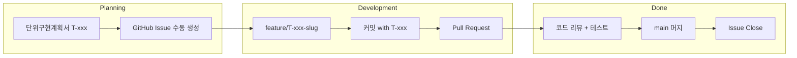

# GitHub 워크플로 가이드 — 프로젝트 P10_Manufacturing

> **문서 목적**: 코드 구현·저장소 생성 **이전**에, [단위구현계획서.md](단위구현계획서.md)의 45개 Task와 제8장 진행 규칙에 맞춰 GitHub를 어떻게 쓸지 정리합니다.  
> **현재 단계**: 가이드 검토용. Git 저장소·GitHub repo·Issue **실제 생성은 하지 않습니다.**  
> **Issue 정책 (C안)**: 라벨·마일스톤·템플릿만 정의하고, Issue는 **작업 착수 직전에 수동 생성**합니다.

---

## 목차

1. [목적과 원칙](#1-목적과-원칙)
2. [전체 흐름](#2-전체-흐름)
3. [사전 준비 체크리스트](#3-사전-준비-체크리스트)
4. [저장소 생성·연동 (검토 후 실행)](#4-저장소-생성연동-검토-후-실행)
5. [브랜치 전략](#5-브랜치-전략)
6. [GitHub Issues 운영](#6-github-issues-운영)
7. [커밋·PR 규칙](#7-커밋pr-규칙)
8. [코드 리뷰·머지 기준](#8-코드-리뷰머지-기준)
9. [1주차 실전 예시 (T-001, T-801)](#9-1주차-실전-예시-t-001-t-801)
10. [머지 충돌 예방과 해결](#10-머지-충돌-예방과-해결)
11. [PR 크기와 WIP 관리](#11-pr-크기와-wip-관리)
12. [비밀정보·API 키 관리](#12-비밀정보api-키-관리)
13. [Cut·Blocked·스파이크의 GitHub 처리](#13-cutblocked스파이크의-github-처리)
14. [마일스톤 릴리스 태깅](#14-마일스톤-릴리스-태깅)
15. [CI 최소 구성 (코드 도입 후)](#15-ci-최소-구성-코드-도입-후)
16. [하지 말아야 할 것](#16-하지-말아야-할-것)
17. [검토 후 요청 가능 작업](#17-검토-후-요청-가능-작업)

---

## 1. 목적과 원칙

### 1.1 무엇을 GitHub로 관리하는가

| 추적 단위 | GitHub 객체 | 비고 |
|---|---|---|
| Task 1개 | **Issue 1개** | 제목에 `T-xxx` 필수 |
| 구현 작업 | **브랜치 1개** | `feature/T-xxx-slug` |
| 병합 단위 | **Pull Request 1개** | squash merge 권장 |
| 완료 기준 | **main 머지** | 단위 테스트 통과 + 리뷰 Approve |

백로그 원본은 [단위구현계획서.md](단위구현계획서.md) 제2장(총괄표)과 제5장(Task 카드)입니다. GitHub Issue는 그 **실행 중인 사본**이며, 45개를 미리 모두 만들지 않습니다.

### 1.2 핵심 원칙

1. **Issue 1개 = Task 1개 (`T-xxx`)** — ID는 계획서와 동일하게 유지합니다.
2. **Done = PR이 `main`에 머지됨** — 단위구현계획서 제8.1: 단위 테스트 100% 통과 + 코드 리뷰 완료 후 main 머지.
3. **2인 팀: 1인당 동시 In Progress 1개** — WIP을 줄이고 리뷰 부담을 관리합니다.
4. **장비는 마지막** — Phase A(시뮬, 1~9주) Task를 먼저 Issue·브랜치로 진행하고, Phase HW(10~12주)는 M2 통과 후 착수합니다.
5. **커밋으로 상태 전이 기록** — 제8.4: `[T-xxx]`와 `State: In Progress -> Testing` 등을 커밋 메시지에 남깁니다.

### 1.3 T-xxx ↔ GitHub 매핑 요약

```
단위구현계획서 T-501
    → Issue #12  [T-501] BoardTarget ...
    → branch feature/T-501-idf-build
    → PR #45     Closes #12
    → main 머지  → Issue Closed → Task Done
```

---

## 2. 전체 흐름



### 2.1 Task 상태와 GitHub 동작

| 계획서 상태 | GitHub에서의 표현 |
|---|---|
| **To-Do** | Issue Open, 라벨 `status:todo` |
| **In Progress** | 담당자 Assign, 라벨 `status:in-progress`, feature 브랜치 push |
| **Testing** | PR Draft → Ready, 라벨 `status:testing`, CI/로컬 테스트 |
| **Done** | PR 머지, Issue Close, 라벨 제거 또는 `status:done` |
| **Blocked** | Issue Open + 라벨 `status:blocked` + 원인 코멘트 |
| **Cut** | Issue Close + 라벨 `status:cut` (컷라인 발동 시) |

---

## 3. 사전 준비 체크리스트

아래는 **가이드 검토 후** 실제 연동할 때 확인할 항목입니다. 지금 실행할 필요는 없습니다.

### 3.1 계정·팀

- [ ] GitHub 계정 (2명 각각)
- [ ] 조직(Organization) 또는 개인 계정 아래 repo 위치 결정
- [ ] Collaborator 초대 (Settings → Collaborators)

### 3.2 로컬 도구

- [ ] [Git](https://git-scm.com/) 설치 (`git --version`)
- [ ] [GitHub CLI (`gh`)](https://cli.github.com/) 설치 (`gh --version`)
- [ ] `gh auth login` (HTTPS 또는 SSH)
- [ ] (선택) Cursor `user-github` MCP — IDE에서 Issue/PR 조회·생성

### 3.3 정책 합의 (2인 팀)

- [ ] `main` 직접 push 금지, PR 필수 여부
- [ ] squash merge vs merge commit (권장: **squash**)
- [ ] 상호 코드 리뷰 1 Approve 필수 여부
- [ ] 공식 개발 OS (T-012 SW 확정 후 반영)

---

## 4. 저장소 생성·연동 (검토 후 실행)

> **이 섹션은 참고용입니다.** "가이드대로 repo 만들어줘"라고 요청하기 전까지 실행하지 않습니다.

### 4.1 GitHub에서 repo 생성

| 항목 | 권장값 |
|---|---|
| 이름 | `p10-manufacturing` 또는 `EdgeCanvas` |
| 가시성 | **비공개**로 시작 → M2 통과 후 MIT 공개 (설계서 기준) |
| README | 로컬에서 작성 후 push (GitHub 기본 README 비권장) |
| .gitignore | Python 템플릿 참고 + 아래 4.3 병합 |
| 라이선스 | MIT (공개 시점에 추가) |

### 4.2 로컬 초기화 순서

```powershell
cd D:\EdgeCanvas
git init
git branch -M main
# .gitignore, README.md 작성 후
git add .
git commit -m "chore: initial commit — planning docs and workflow guide"
git remote add origin https://github.com/<owner>/<repo>.git
git push -u origin main
```

### 4.3 `.gitignore` 권장 항목

```gitignore
# Python
.venv/
__pycache__/
*.py[cod]
.pytest_cache/
.mypy_cache/
dist/
*.egg-info/

# Secrets — 절대 커밋 금지
.env
.env.*
*.key
credentials.json

# Run 산출물 (단위구현계획서 제8.3 runs/ 체계)
runs/
output/
build/
build_sim/

# ESP-IDF
sdkconfig
sdkconfig.old
managed_components/

# OS / IDE
.DS_Store
Thumbs.db
.idea/
.vscode/*
!.vscode/extensions.json
```

### 4.4 `main` 브랜치 보호 (2인 팀 권장)

GitHub → Settings → Branches → Branch protection rules:

- [x] Require a pull request before merging
- [x] Require approvals: **1**
- [ ] (CI 도입 후) Require status checks to pass

---

## 5. 브랜치 전략

### 5.1 브랜치 종류

| 브랜치 | 용도 | 예시 |
|---|---|---|
| `main` | 항상 시연·통합 가능한 기준선 | — |
| `feature/T-xxx-slug` | 일반 Task 구현 | `feature/T-001-repo-scaffold` |
| `spike/T-xxx-slug` | Go/No-Go 스파이크 (선택) | `spike/T-008-doc-parse` |

### 5.2 규칙

1. **항상 `main`에서 분기**합니다 (오래된 feature 브랜치 위에 쌓지 않음).
2. **PR로만 `main`에 병합**합니다.
3. **squash merge 권장** — `main` 히스토리가 `1 Issue ≈ 1 커밋`으로 읽기 쉽습니다.
4. 브랜치명은 **소문자·하이픈**만 사용합니다.
5. Task ID(`T-xxx`)를 브랜치명에 **반드시** 포함합니다.

### 5.3 PR 제목·본문 형식

**제목**

```
[T-501] BoardTarget 및 ESP32-P4 idf.py 빌드 서브프로세스
```

**본문 템플릿**

```markdown
## Task
- **ID**: T-501
- **Phase**: Phase HW
- **담당**: B

## 변경 요약
- BoardTarget 추상 클래스 초안
- idf.py build 래퍼 서브프로세스

## 테스트
```bash
pytest tests/unit/test_board_target.py -v
```

## DoD (단위구현계획서 제5장)
- [ ] 서브프로세스가 idf.py build를 호출하고 stdout/stderr를 캡처함
- [ ] 빌드 실패 시 비영 exit code 반환

Closes #12
```

`Closes #N`을 넣으면 PR 머지 시 Issue가 자동으로 닫힙니다.

---

## 6. GitHub Issues 운영

### 6.1 Issue 생성 시점 (C안)

| 시점 | 행동 |
|---|---|
| **지금** | Issue 생성 **안 함**. 라벨·마일스톤·템플릿 명세만 이 문서에 정의 |
| **작업 착수 직전** | 해당 주차 Task만 Issue 수동 생성 |
| **컷라인 발동** | 해당 Task Issue에 `status:cut` 라벨 후 Close |

**생성 절차**

1. [단위구현계획서.md](단위구현계획서.md) 제5장에서 해당 `T-xxx` 카드 전체를 복사합니다.
2. GitHub → Issues → New issue → 적절한 템플릿 선택.
3. 제목: `[T-xxx] Task Name`
4. 라벨·마일스톤·담당자·주차 라벨을 붙입니다.
5. 선행 Task Issue가 있다면 "Linked issues" 또는 본문에 `Blocked by #N`을 명시합니다.

### 6.2 라벨 체계

repo 생성 후 `gh label create` 또는 GitHub UI로 일괄 등록합니다.

#### Phase

| 라벨 | 색상 예 | 의미 |
|---|---|---|
| `phase:a` | `#0E8A16` | Phase A — 시뮬 소프트웨어 (1~9주) |
| `phase:b` | `#FBCA04` | Phase B — 웹 대시보드 (선택, M2 후) |
| `phase:hw` | `#B60205` | Phase HW — 실기 (10~12주) |

#### 모듈 (백로그 분류/모듈과 1:1)

| 라벨 | 단위구현계획서 모듈 |
|---|---|
| `module:infra` | 공통/인프라 |
| `module:spike` | 스파이크 |
| `module:cli` | 입력 처리 |
| `module:doc` | 문서 이해 |
| `module:codegen` | 코드 생성 |
| `module:asset` | 시각 에셋 |
| `module:build` | 빌드/플래시 |
| `module:vision` | Vision(시뮬+실기) / 실기 검증 |
| `module:agent` | 오케스트레이션 |
| `module:sim` | 시뮬레이터 |
| `module:web` | 웹 대시보드 |
| `module:integration` | 통합/시연 |

#### 담당

| 라벨 | 의미 |
|---|---|
| `assignee:a` | 개발자 A (Python/에이전트) |
| `assignee:b` | 개발자 B (임베디드/시뮬·HW) |
| `assignee:pair` | A+B 페어 (예: T-012, T-903) |

#### 상태 (Projects 칸반 연동)

| 라벨 | 의미 |
|---|---|
| `status:todo` | 대기 |
| `status:in-progress` | 구현 중 |
| `status:testing` | 단위 테스트·PR 검증 중 |
| `status:blocked` | 선행·외부 의존으로 차단 |
| `status:cut` | 컷라인으로 제외 |

#### 기타

| 라벨 | 의미 |
|---|---|
| `type:spike` | Go/No-Go 실험 Task |
| `type:bug` | 구현 중 발견 버그 |
| `week:01` ~ `week:12` | 계획 주차 |

#### Task ID → 라벨 빠른 참조 (1주차 예)

| Task | phase | module | assignee | week |
|---|---|---|---|---|
| T-001 | `phase:a` | `module:infra` | `assignee:a` | `week:01` |
| T-002 | `phase:a` | `module:infra` | `assignee:a` | `week:01` |
| T-005 | `phase:a` | `module:infra` | `assignee:a` | `week:01` |
| T-008 | `phase:a` | `module:spike` | `assignee:a` | `week:01` |
| T-009 | `phase:a` | `module:spike` | `assignee:a` | `week:01` |
| T-801 | `phase:a` | `module:sim` | `assignee:b` | `week:01` |

### 6.3 마일스톤

GitHub Milestones는 **제4.2장 품질 게이트**와 연결합니다.

| 마일스톤 | 목표 시점 | 품질 게이트 | 대표 Task |
|---|---|---|---|
| **M1 — 시뮬 루프 수렴** | 7주차 종료 | [하]/[중] 샘플 3회 이내 sim PASS, `report.md` | T-701, T-604 |
| **M2 — sim E2E** | 9주차 종료 | `p10 run --mode sim` 완료, T-901 | T-901, T-902(sim) |
| **M3 — 실기 HIL·시연** | 12주차 종료 | `p10 run --mode hw`, T-905 리허설 | T-601, T-602, T-903, T-905, T-902(hw) |

> 대표 Task는 계획서 제2장 백로그에 실재하는 ID만 사용합니다(존재하지 않는 T-605 등은 쓰지 않음). T-902는 sim 지표(9주)와 hw 지표(12주)로 분할되어 M2·M3에 각각 걸칩니다.

마일스톤 생성 예 (검토 후 실행). `due_on`은 프로젝트 시작일 기준 상대 주차로 계산해 실제 날짜로 치환하십시오. 예시 날짜는 시작일을 2026-07-06(월)로 가정한 7주차 종료 금요일입니다.

```powershell
# 시작 월요일 기준: M1=+7주 금요일, M2=+9주 금요일, M3=+12주 금요일
gh api repos/:owner/:repo/milestones -f title="M1: Sim loop" -f due_on="2026-08-21T08:00:00Z" -f description="7주차 종료 — verify_simulation 수렴"
gh api repos/:owner/:repo/milestones -f title="M2: Sim E2E" -f due_on="2026-09-04T08:00:00Z" -f description="9주차 종료 — p10 run --mode sim"
gh api repos/:owner/:repo/milestones -f title="M3: HW HIL" -f due_on="2026-09-25T08:00:00Z" -f description="12주차 종료 — p10 run --mode hw + 시연"
```

### 6.4 GitHub Projects 보드 (선택)

**보드 이름**: `P10 Manufacturing — 12 Week Board`

| 컬럼 | 대응 상태 |
|---|---|
| To-Do | `status:todo` |
| In Progress | `status:in-progress` |
| Testing | `status:testing` |
| Done | Issue Closed |
| Blocked | `status:blocked` |
| Cut | `status:cut` |

필터 뷰 예: `label:phase:a`, `label:week:01`, `label:assignee:b`

### 6.5 Issue 템플릿 명세

검토 후 `.github/ISSUE_TEMPLATE/`에 아래 3파일을 생성합니다.

#### 6.5.1 `task.yml` — 일반 Task

```yaml
name: Task (T-xxx)
description: 단위구현계획서 Task 카드 기반 작업
title: "[T-xxx] "
labels: ["status:todo"]
body:
  - type: input
    id: task_id
    attributes:
      label: Task ID
      placeholder: "T-001"
    validations:
      required: true
  - type: dropdown
    id: phase
    attributes:
      label: Phase
      options: ["Phase A", "Phase B", "Phase HW"]
    validations:
      required: true
  - type: dropdown
    id: assignee
    attributes:
      label: 담당
      options: ["A", "B", "A+B"]
    validations:
      required: true
  - type: input
    id: predecessor
    attributes:
      label: 선행 Task
      placeholder: "T-001, T-002"
  - type: textarea
    id: purpose
    attributes:
      label: 목적 (제5장 7항)
    validations:
      required: true
  - type: textarea
    id: implementation
    attributes:
      label: 구현 내용 (제5장 8항)
    validations:
      required: true
  - type: textarea
    id: test_procedure
    attributes:
      label: 단위 테스트 절차 (제5장 10항)
    validations:
      required: true
  - type: checkboxes
    id: dod
    attributes:
      label: 완료 판정 DoD (제5장 11항)
      options:
        - label: DoD 항목 1
        - label: DoD 항목 2
        - label: DoD 항목 3
  - type: textarea
    id: evidence
    attributes:
      label: 검증 기록 경로 (제5장 13항)
      placeholder: "docs/verification/T-xxx_...."
```

#### 6.5.2 `spike.yml` — 스파이크 / Go-No-Go

```yaml
name: Spike (Go/No-Go)
description: 조기 검증·가정 확인 실험 (T-008, T-009 등)
title: "[T-xxx] [Spike] "
labels: ["type:spike", "status:todo"]
body:
  - type: input
    id: task_id
    attributes:
      label: Task ID
      placeholder: "T-008"
    validations:
      required: true
  - type: input
    id: assumption
    attributes:
      label: 관련 가정 (제9장)
      placeholder: "[가정 1] Solar Pro 3 비전"
  - type: textarea
    id: hypothesis
    attributes:
      label: 검증 가설
    validations:
      required: true
  - type: textarea
    id: procedure
    attributes:
      label: 실험 절차
    validations:
      required: true
  - type: textarea
    id: pass_criteria
    attributes:
      label: 통과 기준
    validations:
      required: true
  - type: textarea
    id: fallback
    attributes:
      label: Fallback (실패 시)
      description: 제9장 Fallback 열 참조
    validations:
      required: true
  - type: input
    id: evidence_path
    attributes:
      label: evidence 저장 경로
      placeholder: "docs/verification/T-008_..."
```

#### 6.5.3 `bug.yml` — 버그

```yaml
name: Bug
description: 구현 중 발견된 버그 (Task와 별도 추적)
title: "[BUG] "
labels: ["type:bug"]
body:
  - type: input
    id: related_task
    attributes:
      label: 관련 Task ID (있으면)
      placeholder: "T-603"
  - type: textarea
    id: reproduction
    attributes:
      label: 재현 절차
    validations:
      required: true
  - type: textarea
    id: expected
    attributes:
      label: 기대 동작
    validations:
      required: true
  - type: textarea
    id: actual
    attributes:
      label: 실제 동작
    validations:
      required: true
  - type: dropdown
    id: severity
    attributes:
      label: 심각도
      options: ["blocker", "major", "minor"]
    validations:
      required: true
```

### 6.6 라벨 일괄 생성 스크립트 (검토 후 실행)

```powershell
# Phase
gh label create "phase:a" --color "0E8A16" --description "Phase A sim software"
gh label create "phase:b" --color "FBCA04" --description "Phase B optional web"
gh label create "phase:hw" --color "B60205" --description "Phase HW 10-12w"

# Module (일부 예 — 전체는 6.2 표 참조)
gh label create "module:infra" --color "1D76DB" --description "공통/인프라"
gh label create "module:sim" --color "5319E7" --description "시뮬레이터"
gh label create "module:agent" --color "006B75" --description "오케스트레이션"

# Status
gh label create "status:todo" --color "EDEDED"
gh label create "status:in-progress" --color "F9D0C4"
gh label create "status:testing" --color "FEF2C0"
gh label create "status:blocked" --color "B60205"
gh label create "status:cut" --color "666666"
```

---

## 7. 커밋·PR 규칙

[단위구현계획서.md](단위구현계획서.md) 제8.4와 정합합니다.

### 7.1 커밋 메시지 형식

```
[T-501] feat(build): ESP32-P4 idf.py 서브프로세스 래퍼

State: In Progress -> Testing
- BoardTarget 추상 클래스 초안
- tests/unit/test_board_target.py 추가

Refs #12
```

| 부분 | 규칙 |
|---|---|
| 제목 | `[T-xxx] type(scope): 한 줄 요약` |
| type | `feat`, `fix`, `test`, `docs`, `chore`, `spike` |
| State | 상태 전이 시 본문에 `State: A -> B` |
| Refs | `Refs #N` (부분 완료), PR에서 `Closes #N` (완료) |

### 7.2 커밋 단위

- **작은 단위**로 자주 커밋합니다 (하루 1커밋 이상 권장).
- WIP 커밋은 feature 브랜치에만 push합니다 (`main` 금지).
- API 키·`.env`·`runs/` 산출물은 **절대 커밋하지 않습니다**.

### 7.3 PR 라이프사이클

1. feature 브랜치 push → Draft PR 생성
2. 단위 테스트 통과 → Ready for review
3. 팀원 1명 Approve
4. squash merge → Issue 자동 Close

---

## 8. 코드 리뷰·머지 기준

PR 머지 **전** 필수 조건:

| # | 조건 | 확인 방법 |
|---|---|---|
| 1 | Task 카드 **10. 단위 테스트 절차** 통과 | PR 본문에 명령·결과 첨부 |
| 2 | **DoD 체크리스트** 충족 | PR 본문 또는 Issue 체크 |
| 3 | 담당 외 팀원 **1 Approve** | GitHub Review |
| 4 | 충돌 없음 | `main`과 mergeable |
| 5 | (CI 도입 후) status check green | GitHub Actions |

**머지 = Task Done.** Issue를 수동으로 닫기 전에 PR의 `Closes #N`으로 자동 종료되는지 확인합니다.

### 8.1 에스컬레이션 (제8.2 연동)

- 예상 공수 **200% 초과** 시 Issue에 `status:blocked` + 원인 코멘트
- 1주 이상 일정 지연 조짐 → Phase B 컷라인 검토 (제1.3장)

---

## 9. 1주차 실전 예시 (T-001, T-801)

[단위구현계획서.md](단위구현계획서.md) 제4.1장 1주차: A는 T-001/002/005/008/009, B는 T-801을 병렬 진행합니다.

### 9.1 개발자 A — T-001

**1. Issue 생성**

- 제목: `[T-001] 저장소 구조 및 Python 가상환경 구축`
- 라벨: `phase:a`, `module:infra`, `assignee:a`, `week:01`, `status:todo`
- 본문: 제5장 T-001 카드 전체 붙여넣기

**2. 브랜치**

```powershell
git checkout main
git pull origin main
git checkout -b feature/T-001-repo-scaffold
```

**3. 구현** (제5장 8항)

- `src/`, `tests/`, `docs/`, `config/` 생성
- `python -m venv .venv`, `requirements.txt` 작성
- `.gitignore` 작성

**4. 테스트** (제5장 10항)

```powershell
.venv\Scripts\activate
pip list
python --version
```

**5. 커밋**

```powershell
git add .
git commit -m "[T-001] feat(infra): repo scaffold and venv

State: In Progress -> Testing
- Add src/tests/docs/config layout
- Add requirements.txt and .gitignore

Refs #1"
git push -u origin feature/T-001-repo-scaffold
```

**6. PR**

- 제목: `[T-001] 저장소 구조 및 Python 가상환경 구축`
- 본문 DoD 체크 + `Closes #1`
- B가 리뷰 → Approve → squash merge

**7. 완료**

- Issue #1 Closed
- `docs/verification/T-001_env_setup.txt`에 `pip list` 결과 (별도 커밋 또는 동일 PR)

---

### 9.2 개발자 B — T-801 (A와 병렬)

**1. Issue 생성**

- 제목: `[T-801] LVGL PC SDL2 시뮬레이터 환경 연동`
- 라벨: `phase:a`, `module:sim`, `assignee:b`, `week:01`, `status:todo`
- 본문에 "선행: T-001 (스캐폴딩). T-303 완료 후 ui_screens.c 연동" 명시

**2. 브랜치**

```powershell
git checkout main
git pull origin main
git checkout -b feature/T-801-sdl2-sim-scaffold
```

**3. 구현** (1주차 범위: hello UI 스캐폴딩)

- `src/simulator/` 에 SDL2/CMake 뼈대
- 1024×600 창 띄우기 (빈 LVGL 화면)

**4. 테스트**

```powershell
cmake -S src/simulator -B build_sim
cmake --build build_sim
# build_sim/bin/lvgl_simulator 실행 → 1024x600 창 확인
```

**5. PR → 리뷰 → merge** (`Closes #2`)

> **주의**: T-801은 T-303 이후 본격 `ui_screens.c` 연동이 필요합니다. 1주차 PR은 **스캐폴딩만** 포함하고, 후속 연동은 T-303 완료 후 별도 PR 또는 동일 Issue 추가 커밋으로 처리합니다.

### 9.3 1주차 Issue 생성 대상 (참고)

| Task | 담당 | Issue 생성 |
|---|---|---|
| T-001 | A | 착수 시 |
| T-002 | A | T-001 머지 후 또는 병렬(선행 T-001) |
| T-005 | A | T-002 진행 중 |
| T-008 | A | 스파이크 — `spike.yml` 템플릿 |
| T-009 | A | 스파이크 |
| T-801 | B | 착수 시 (T-001과 병렬 가능) |

**생성하지 않음 (재정렬 원칙)**: T-003, T-004, T-007, T-011 (Phase HW, 10~11주)

---

## 10. 머지 충돌 예방과 해결

2인 팀에서 A(Python)와 B(C/시뮬)가 `src/`를 공유하므로 충돌 예방이 중요합니다.

### 10.1 예방 규칙

- **디렉토리 소유권 분리**: A는 `src/cli/`, `src/agent/`, `src/verifier/`(Python), B는 `src/simulator/`(C/CMake), 실기 `main/`. 공유 파일(`requirements.txt`, `README.md`)은 수정 전 상대에게 공유.
- 매일 아침 `git checkout main && git pull` 후 자기 feature 브랜치에 `git merge main`(또는 `git rebase main`)으로 최신화.
- feature 브랜치 수명은 짧게(1 Task, 2~3일 이내).

### 10.2 충돌 해결 절차

```powershell
git checkout feature/T-xxx-slug
git fetch origin
git merge origin/main          # 충돌 발생 시 파일에 <<<<<<< 표식
# 충돌 파일을 편집기로 열어 <<<<<<< ======= >>>>>>> 구간을 수동 병합
git add <해결한_파일>
git commit                     # 병합 커밋 메시지 자동 생성
git push
```

- 충돌이 크면 즉시 상대와 15분 페어링(제8.3 에스컬레이션과 동일 정신).
- `requirements.txt` 충돌: 두 사람의 추가 패키지를 모두 남기고 알파벳 정렬.

---

## 11. PR 크기와 WIP 관리

- **1 Task = 1 PR**을 원칙으로 합니다. Task 카드의 산출물(제5장 9항)이 PR 변경 범위입니다.
- 권장 상한: 변경 **400라인 / 파일 10개** 이내. 초과 시 Task를 서브 브랜치로 분할(`feature/T-701-1-state`, `feature/T-701-2-edges`)하고 각각 PR.
- **WIP 한도**: 제8.2장 "1인당 동시 In Progress 1개"를 GitHub에서 강제하는 방법 — 본인에게 Assign된 `status:in-progress` Issue가 1개를 넘지 않도록 Projects 보드에서 확인.
- 공수 2.0인일 Task(T-604, T-903, T-850, T-852)는 리뷰 부담이 크므로 가능하면 2개 PR로 쪼갭니다.

---

## 12. 비밀정보·API 키 관리

이 프로젝트는 Upstage(Document Parse/Solar), NC VARCO Art API 키를 사용합니다. 키 유출은 치명적입니다.

### 12.1 규칙

- 키는 항상 `.env`에 저장하고 **절대 커밋 금지**(4.3절 `.gitignore`에 `.env` 포함 확인).
- 저장소에는 **`.env.example`** 만 커밋합니다(값은 빈칸/더미).

```dotenv
# .env.example
UPSTAGE_API_KEY=
NC_VARCO_API_KEY=
```

- 코드는 `os.environ` 또는 `python-dotenv`로 로드하고, 하드코딩하지 않습니다.

### 12.2 유출 시 대응

1. 즉시 해당 API 콘솔에서 키 **폐기(revoke)·재발급(rotate)**.
2. Git 히스토리에 커밋된 경우 `git filter-repo` 또는 BFG로 히스토리 제거 후 강제 푸시(팀 합의 필수).
3. 재발 방지: **pre-commit 훅**으로 `.env`·키 패턴 차단.

```yaml
# .pre-commit-config.yaml (검토 후 도입)
repos:
  - repo: https://github.com/gitleaks/gitleaks
    rev: v8.18.0
    hooks:
      - id: gitleaks
```

---

## 13. Cut·Blocked·스파이크의 GitHub 처리

### 13.1 Cut (컷라인 발동)

제1.3장 컷라인이 발동되면(예: CoreS3 T-006/T-504, 웹 대시보드 T-851/852):

- 해당 Issue에 `status:cut` 라벨 부여 + 사유 코멘트(어느 컷라인 단계인지).
- Issue를 **Close**(삭제하지 않음, 추적 보존).
- 관련 PR이 열려 있으면 Close.

### 13.2 Blocked

- 선행 Task 미완료·외부 장애 시 `status:blocked` 라벨.
- 본문 또는 코멘트에 `Blocked by #N`으로 원인 Issue 연결.
- 제8.3 에스컬레이션 트리거(공수 200% 초과)와 연동.

### 13.3 스파이크·가정 매핑

계획서 제9장 가정([가정 1]~[가정 9])과 스파이크 Task(T-007~T-013 등)를 연결합니다.

| 가정 | 검증 Task | Issue 라벨 | 기한(week) |
|---|---|---|---|
| [가정 1] Solar 비전 | T-009 | `type:spike`, `week:01` | 1주차 |
| [가정 2] VARCO Art | T-010 | `type:spike`, `week:02` | 2주차 |
| [가정 3] MIPI-DSI BSP | T-007 | `type:spike`, `phase:hw`, `week:10` | 10주차 |
| [가정 4] 카메라 반사 | T-011 | `type:spike`, `phase:hw`, `week:11` | 11주차 |
| [가정 7] OS/USB/카메라 | T-012 | `type:spike`, `assignee:pair` | 2주(SW)/11주(HW) |

- 스파이크 Issue는 `spike.yml` 템플릿(6.5.2)으로 생성하고, 결과(Go/No-Go)를 코멘트로 남긴 뒤 Close합니다.

---

## 14. 마일스톤 릴리스 태깅

각 마일스톤 통과 시 시연 가능한 스냅샷을 태그로 고정합니다.

```powershell
# M1 통과 (7주차 종료, 시뮬 루프 수렴)
git tag -a v0.1-m1 -m "M1: sim self-healing loop 수렴"
git push origin v0.1-m1

# M2 통과 (9주차, sim E2E)
git tag -a v0.2-m2 -m "M2: p10 run --mode sim E2E"
git push origin v0.2-m2

# M3 통과 (12주차, 실기 HIL + 시연)
git tag -a v1.0-m3 -m "M3: hw HIL + 시연 리허설"
git push origin v1.0-m3
```

- 태그마다 GitHub Release를 생성하고 `report.md`·시연 스크린샷을 첨부하면 심사·회고 시 근거가 됩니다.
- 비상 시연(제1.3장) 시에는 `v1.0-m3-sim`처럼 시뮬 대체 시연임을 태그명에 명시합니다.

---

## 15. CI 최소 구성 (코드 도입 후)

코드베이스가 생기면 `.github/workflows/ci.yml`로 PR마다 자동 검증합니다. (지금은 명세만, 코드 생긴 후 도입)

```yaml
name: CI
on:
  pull_request:
    branches: [main]
jobs:
  python:
    runs-on: ubuntu-latest
    steps:
      - uses: actions/checkout@v4
      - uses: actions/setup-python@v5
        with:
          python-version: "3.11"
      - run: pip install -r requirements.txt
      - run: black --check src/ tests/
      - run: pytest tests/unit -v
```

- **주의**: HIL(실기)·SDL2 GUI 테스트는 GitHub 클라우드 러너에서 불가하므로 CI에서 제외하고, 로컬 또는 self-hosted 러너에서만 수행합니다(제6.1장 테스트 피라미드 참조).
- CI 그린을 `main` 브랜치 보호의 required status check로 지정(4.4절)하면 리뷰 품질이 올라갑니다.

---

## 16. 하지 말아야 할 것

| 금지 | 이유 |
|---|---|
| 45개 Task Issue **일괄 선생성** | 백로그 동기화 부담, Cut·일정 변경 시 정리 비용 |
| 1~2주차에 T-004/T-007/T-011 Issue 생성 | Phase HW 조기 스파이크 — 재정렬 원칙 위반 |
| `.env`·API 키 커밋 | 보안 사고 |
| `runs/`·`output/` 커밋 | 실행 산출물, 용량·개인정보 |
| 2인 협업 시 `main`에 WIP 직접 push | 리뷰·롤백 어려움 |
| Task ID 없이 브랜치/커밋 | 제8.4 추적 불가 |
| 1인당 In Progress 2개 이상 동시 진행 | 리뷰·컨텍스트 스위칭 비용 |

---

## 17. 검토 후 요청 가능 작업

이 가이드를 팀이 검토한 뒤, 아래 항목을 **개별 또는 묶어서** 요청할 수 있습니다.

### 17.1 저장소 기초

- [ ] `git init` + `.gitignore` + `README.md` + 초기 커밋
- [ ] GitHub repo 생성 (비공개) 및 `git push`
- [ ] `main` 브랜치 보호 규칙 설정

### 17.2 GitHub 메타데이터

- [ ] [6.2절](#62-라벨-체계) 라벨 전체 `gh label create` 실행
- [ ] [6.3절](#63-마일스톤) M1/M2/M3 마일스톤 생성
- [ ] [6.5절](#65-issue-템플릿-명세) `.github/ISSUE_TEMPLATE/` 3파일 생성
- [ ] GitHub Projects 칸반 보드 생성

### 17.3 1주차 착수

- [ ] T-001, T-801 등 **1주차 Task만** Issue 수동 생성 (6~7개)
- [ ] `feature/T-001-...`, `feature/T-801-...` 브랜치 전략으로 구현 시작

### 17.4 (선택) 자동화

- [ ] `scripts/create_github_labels.ps1` — 라벨 일괄 생성 스크립트
- [ ] `.github/workflows/ci.yml` — [15절](#15-ci-최소-구성-코드-도입-후) 기반 (코드베이스 생긴 후)
- [ ] `.pre-commit-config.yaml` — [12.2절](#122-유출-시-대응) gitleaks 훅

### 17.5 향후 공개 (M2 이후)

- [ ] MIT LICENSE 추가
- [ ] repo Public 전환
- [ ] README에 `pip install` / Docker 안내 (T-904 완료 후)

---

## 부록: 관련 문서

| 문서 | 용도 |
|---|---|
| [단위구현계획서.md](단위구현계획서.md) | Task 백로그·카드·제8장 진행 규칙 |
| [단위구현계획서_재정렬_프롬프트.md](단위구현계획서_재정렬_프롬프트.md) | 장비는 마지막 원칙 |
| [재정렬_분석보고.md](재정렬_분석보고.md) | Phase A/HW 재정렬 배경 |

---

*문서 버전: 2026-07-06 | 작성 기준: GitHub 워크플로 가이드 계획 (Issue C안 — 수동 생성)*
