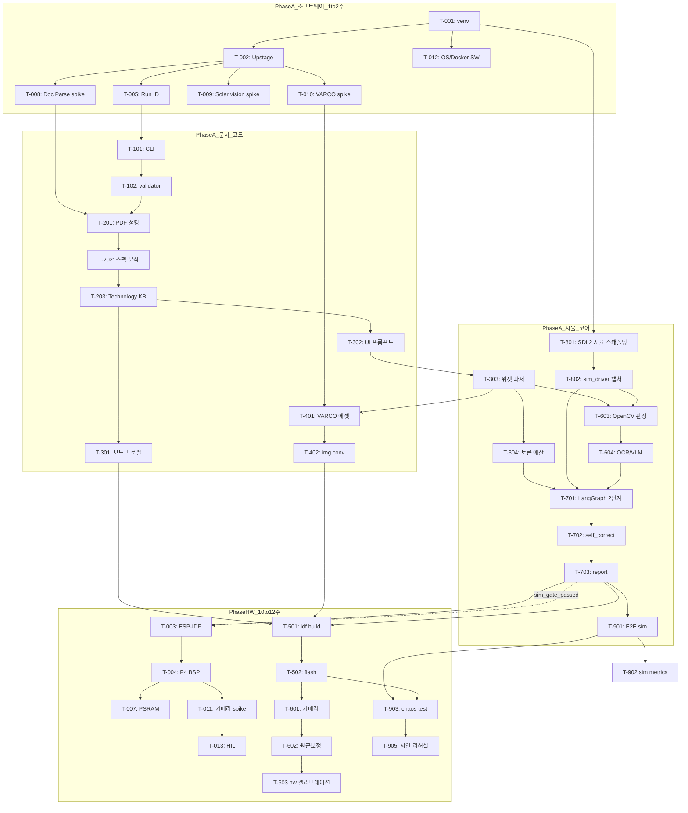

# 단위구현계획서 - 프로젝트 P10_Manufacturing

> **재정렬 버전**: `단위구현계획서_재정렬_프롬프트.md` 원칙 적용 — 실물 장비 작업은 PC 시뮬레이터 기반 자가수정 루프가 안정화된 후 **Phase HW(10~12주차)** 에서만 착수합니다. 상세 분석은 [재정렬_분석보고.md](재정렬_분석보고.md)를 참조하십시오.
> 오픈소스 필수/선택 판정은 [오픈소스_필수선별_결과.md](오픈소스_필수선별_결과.md)를 참조하십시오.

## 제1장: 계획 총괄

### 1.1 개발 인원 및 가용 공수 계산
* **참여 인원**: 2명
  * **개발자 A (Python/에이전트 개발)**: Python 백엔드, AI API 연동, LangGraph 오케스트레이션 및 웹 대시보드 담당.
  * **개발자 B (임베디드/하드웨어 개발)**: Phase A 기간 — PC SDL2 시뮬레이터, LVGL/C 파서 지원, OpenCV Vision 모듈. Phase HW 기간 — ESP-IDF, 보드 플래시, USB 카메라 HIL.
* **전체 기간**: 12주 (총 60영업일)
* **총 가용 공수**: $2 \text{인} \times 12 \text{주} \times 5 \text{일} = 120 \text{인-일}$
* **실제 가용 공수 (20% 버퍼 차감)**: $120 \text{일} \times 0.8 = 96 \text{인-일}$
  * *차감 사유*: 주간 회의, 스크럼 스탠드업, 문서 작업 및 **Phase HW 집중 구간(10~12주)** 트러블슈팅/캘리브레이션 시간을 대비한 안전 마진.
* **WBS 계획 공수**: 총 55.5인-일 (개발자 A 단독: 25.5인일, 개발자 B 단독: 26.0인일, A+B 페어: 4.0인일 = T-012 2.0 + T-903 2.0)
  * *공수 계산 원칙*: 모든 공수는 인일 기준으로 계산한다. A+B 페어 작업을 1일 수행하면 2인일로 계산한다.
  * *실행 공수 vs 총계*: 합계 55.5인일에는 기본 컷 대상 CoreS3(T-006/T-504, 2.0인일)가 포함되어 있으므로, **실제 실행 공수는 53.5인일**이다. 상세 집계는 제1.8장 참조.
  * *여유 버퍼*: $96 \text{일} - 55.5 \text{일} = 40.5 \text{일}$ (가용 공수 대비 약 42%의 안전 버퍼. Phase HW 막판 리스크 대응에 우선 투입).
  * *주차별 과부하 기준*: A와 B 각각 주 4인일을 넘기지 않는 것을 원칙으로 하며, 초과 시 Phase B 또는 CoreS3(T-006/T-504)를 컷한다.

### 1.2 Phase별 공수 배분표
| Phase | 주요 과업 범위 | 목표 비율 | 계획 공수 (일) |
|---|---|---|---|
| **Phase A** | 시뮬레이션 기반 소프트웨어 파이프라인 필수 코어 (CLI, AI, SDL2 시뮬, Sim LangGraph, Vision 판정) | 필수 | 32.5인일 |
| **Phase B** | WebAssembly, FastAPI, Streamlit/React 등 선택형 웹 대시보드 확장 | 선택 확장 | 5.5인일 |
| **Phase HW** | ESP-IDF·보드 플래시·카메라 HIL·실기 자가수정·시연 리허설 (10~12주차) | 필수(최종) | 15.5인일 |
| **Cut 보류** | CoreS3 보조 타깃 T-006/T-504 기본 컷 | 범위 축소 | 2.0인일 |
| **합계** | - | - | 55.5인일 |

*Phase A에 T-801/T-802(2.5인일)가 포함되어 기존 "Phase B 시뮬레이터" 역할을 흡수합니다.*

### 1.3 일정 지연 시 컷라인(Cut-line) 시나리오
일정 지연 및 기술적 병목 발생 시 프로젝트 성패를 담보하기 위한 단계적 과업 축소 정책을 다음과 같이 정의합니다.

1. **1단계 컷라인 (FastAPI 및 웹 대시보드 포기)**:
   * *영향*: T-851, T-852 과업 생략.
   * *이유*: CLI + 시뮬 E2E 리포트만으로도 M2(소프트웨어 MVP) 요건을 충족하기 때문입니다.
2. **2단계 컷라인 (M5Stack CoreS3 보조 타깃 지원 포기)** — **기본 적용**:
   * *영향*: T-006, T-504 과업 생략.
   * *이유*: Phase HW 3주(10~12주) 공수 압축. ESP32-P4 단일 타깃에 집중합니다.
3. **3단계 컷라인 (Emscripten WebAssembly 브라우저 렌더링 포기)**:
   * *영향*: T-850 과업 생략.
   * *이유*: PC SDL2 시뮬레이터(T-801, T-802)만으로 UI 검증이 충분합니다.
4. **절대 포기 불가 과업 (Core MVP)**:
   * **Phase A**: `p10 run --mode sim` — 문서 파싱 → 코드 생성 → SDL2 시뮬 → OpenCV/OCR Vision 판정 → 자가수정 루프 → `report.md`.
   * **Phase HW**: ESP32-P4 플래시 + USB 카메라 HIL 최종 검증 1회 이상 성공 (M3). 실패 시 시뮬 E2E + 시뮬 스크린샷 리포트로 시연 대체(실기 기동률 "미측정" 명시).

### 1.4 입력 문서 충돌 처리 로그

| 충돌 항목 | 채택한 기준 | 버린 기준 | 이유 |
|---|---|---|---|
| 실기 vs 시뮬 우선순위 | `단위구현계획서_재정렬_프롬프트.md` — 장비는 마지막 | `Gemini_단위구현계획서_프롬프트.md` 1~2주차 조기 HW 스파이크 | 팀 확정 원칙. 조기 Go/No-Go 스파이크 리스크는 위험 로그로만 관리 |
| Phase B 시뮬레이터 | Phase A 필수 코어로 격상 (T-801/802, 1~2주차) | 기존 Phase B "실용 확장" | 시뮬이 자가수정 루프의 검증 엔진이므로 코어에 포함 |
| 웹 대시보드 | Phase B 선택 확장 | Phase A 필수 | M2 미통과 시 즉시 컷 |
| Solar Pro 3 비전 | [가정] 및 T-009 (fixture 이미지) | 실기 촬영 전제 조기 검증 | 장비 없이 1주차 검증 가능 |
| 개발·시연 OS | T-012 SW 부분 2주차 | T-012 HW(USB/카메라) 1주차 일괄 | HW 접근 검증은 11주차 Phase HW로 분리 |

### 1.5 계획 품질 자체 점검 요약

| 점검 항목 | 현재 값 | 판정 |
|---|---:|---|
| Task 총개수 | 45개 | 적정 |
| 총 공수 | 55.5인일 (실행 53.5 + 컷 보류 2.0) | 96인일 상한 이내 |
| 2인일 초과 task | 0개 | 적정 |
| 개발자별 공수 | A 25.5 / B 26.0 / 페어 4.0 | 제1.8장 재집계 일치 |
| Phase HW 10~12주차 실행 공수 | 15.5인일(컷 2.0 제외) | 조건부 적합(A 지원+버퍼 1일 사용) |
| 시뮬→실기 2단계 LangGraph | T-701/702 반영 | 완료 |
| [가정] 검증 기한 | HW 가정 10~11주차로 갱신 | 완료 |

### 1.6 위험 로그 (조기 HW 스파이크 제거)

| 리스크 ID | 설명 | 완화책 |
|---|---|---|
| R-HW-01 | 10주차 BSP/PSRAM 치명 실패 발견 | M2에서 Phase B 즉시 컷; Waveshare 고정 BSP 버전 문서 사전 조사; Phase HW 3주 전담 |
| R-HW-02 | 카메라 반사/지그 실패 | T-603 시뮬 검증 로직 재사용; T-011/T-013 11주차 집중; 암막 후드 |
| R-HW-03 | Phase HW 일정 압박 | CoreS3(T-006/T-504) 기본 컷; T-603/604 핵심은 6~7주차 시뮬 완료; 12주차 T-903/T-905는 A+B 페어와 버퍼 1일로 압축 |
| R-HW-04 | 시뮬≠실기 렌더링 차이 | M3 실기 캘리브레이션; `self_correct_hw` 최대 2라운드 |
| R-HW-05 | 11주차 말 플래시 실패 | 비상 시연: 시뮬 E2E + 스크린샷 리포트 |

### 1.7 오픈소스 필수/선택 판정 요약

`오픈소스_필수선별_결과.md` 기준으로 `related_open_sources.md` 후보 13종을 `단위구현계획서.md` 제1.2장·제1.3장·제2장과 교차 대조한 결과, Tier 1 무조건 필수 OSS는 10종, Tier 2 조건부 필수는 0종, Tier 3 선택 확장은 3종입니다.

| Tier | 프로젝트 | 계획서 반영 요약 |
|---|---|---|
| Tier 1 — 무조건 필수(Core MVP) | LVGL, lv_port_pc_vscode, esp-idf, esp-bsp, esptool, LangGraph, OpenCV, EasyOCR, Typer, Pydantic | `p10 run --mode sim` 전 과정 또는 컷 없는 ESP32-P4/Waveshare Phase HW 검증에 직접 매핑됩니다. |
| Tier 2 — 조건부 필수(컷 가능) | 없음 | 현재 후보 중 CoreS3 컷 task에만 단독 매핑된 OSS는 없습니다. |
| Tier 3 — 선택 확장(Phase B) | FastAPI, Streamlit, Emscripten | 전부 Phase B 웹 대시보드 task에만 매핑되며, 제1.2장의 "Phase B 선택 확장" 및 제1.3장의 "FastAPI 및 웹 대시보드 포기"·"Emscripten WebAssembly 브라우저 렌더링 포기" 컷라인과 일치합니다. |

대체 가능성 메모: T-604의 OCR 기능은 Tier 1이지만, `오픈소스_필수선별_결과.md` 제5절에 따라 EasyOCR 구현체 자체는 Tesseract 엔진으로 대체 가능합니다.

### 1.8 공수 재집계 검증표

제2장 백로그 45개 Task 공수를 담당·Phase 기준으로 재집계한 결과입니다. 페어 작업(T-012, T-903)은 2인일로 환산합니다.

**담당별 합계**

| 담당 | 계산 근거 | 합계(인일) |
|---|---|---|
| 개발자 A 단독 | Phase A/통합 Python·에이전트 Task | 25.5 |
| 개발자 B 단독 | 시뮬·Vision·빌드·플래시·HIL Task | 26.0 |
| A+B 페어 | T-012(2.0) + T-903(2.0) | 4.0 |
| **합계** | - | **55.5** |

**Phase별 합계**

| Phase | 계산 근거 | 합계(인일) |
|---|---|---|
| Phase A | 시뮬 소프트웨어 코어(T-801/802 포함) | 32.5 |
| Phase B | T-850/851/852 선택 확장 | 5.5 |
| Phase HW | 실행 대상(T-003/004/007/011/012HW/013/501/502/601/602/903/905/902hw) | 15.5 |
| Cut 보류 | T-006(1.0) + T-504(1.0) 기본 컷 | 2.0 |
| **합계(컷 포함)** | - | **55.5** |
| **실제 실행 공수** | 합계 − Cut 보류 | **53.5** |

*주의*: T-006/T-504는 기본 컷이므로 실행 계획·주차 로드 산정에서는 제외한다. 컷 해제 시에만 +2.0인일을 Phase HW에 가산한다.

---

## 제2장: Task 백로그 총괄표

| Task ID | Task Name | 분류/모듈 | Phase | 담당 | 공수(일) | 선행 태스크 | 주차 | 핵심 OSS(Tier) |
|---|---|---|---|---|---|---|---|---|
| **T-001** | 저장소 구조 및 Python 가상환경 구축 | 공통/인프라 | Phase A | A | 0.5 | 없음 | 1주차 | - |
| **T-002** | Upstage API 연동 및 공통 모듈 구현 | 공통/인프라 | Phase A | A | 0.5 | T-001 | 1주차 | - |
| **T-003** | ESP-IDF v5.3+ 개발 환경 구축 | 공통/인프라 | Phase HW | B | 1.0 | T-703 | 10주차 | esp-idf (Tier 1) |
| **T-004** | ESP32-P4 BSP 공식 예제 빌드 및 플래시 검증 | 공통/인프라 | Phase HW | B | 1.5 | T-003 | 10주차 | LVGL (Tier 1), esp-idf (Tier 1), esp-bsp (Tier 1) |
| **T-005** | 로깅 모듈 및 Run ID 기반 산출물 체계 구현 | 공통/인프라 | Phase A | A | 0.5 | T-002 | 1주차 | - |
| **T-006** | M5Stack CoreS3 개발 환경 및 예제 검증 | 공통/인프라 | Phase HW(컷) | B | 1.0 | T-003 | 컷(2단계) | - |
| **T-007** | **[Spike]** ESP32-P4 LCD/터치 PSRAM 메모리 최적화 검증 | 스파이크 | Phase HW | B | 1.0 | T-004 | 10주차 | LVGL (Tier 1), esp-idf (Tier 1) |
| **T-008** | **[Spike]** Upstage Document Parse 표 추출 성능 검증 | 스파이크 | Phase A | A | 1.0 | T-002 | 1주차 | - |
| **T-009** | **[Spike]** Solar Pro 3 비전 멀티모달 입력 및 판정 실험 | 스파이크 | Phase A | A | 1.0 | T-002 | 1주차 | - |
| **T-010** | **[Spike]** NC AI VARCO Art 이미지 생성 API 접속 검증 | 스파이크 | Phase A | A | 1.0 | T-002 | 2주차 | - |
| **T-011** | **[Spike]** USB 카메라 LCD 촬영 화질 및 반사 제어 전처리 실험 | 스파이크 | Phase HW | B | 1.0 | T-004 | 11주차 | OpenCV (Tier 1) |
| **T-012** | **[Spike]** 개발·시연 OS 및 Docker/USB/카메라 접근 범위 결정 | 스파이크 | Phase A/HW | A+B | 2.0 | T-001 | 2주차(SW)·11주차(HW) | - |
| **T-013** | **[Spike]** HIL 물리 환경 최소 구성 및 시리얼 포트 매핑 검증 | 스파이크 | Phase HW | B | 1.0 | T-011, T-012 | 11주차 | - |
| **T-101** | Typer CLI 명령어 엔트리포인트 구현 | 입력 처리 | Phase A | A | 1.0 | T-005 | 2주차 | Typer (Tier 1) |
| **T-102** | 사용자 UI 요구사항 및 PDF 파일 검증 모듈 구현 | 입력 처리 | Phase A | A | 0.5 | T-101 | 2주차 | Typer (Tier 1), Pydantic (Tier 1) |
| **T-201** | Upstage Document Parse 데이터 파싱 및 텍스트 청킹 | 문서 이해 | Phase A | A | 1.0 | T-008, T-102 | 3주차 | - |
| **T-202** | 데이터시트 핵심 스펙(디스플레이, 레지스터, 터치) 분석기 | 문서 이해 | Phase A | A | 1.5 | T-201 | 3주차 | - |
| **T-203** | 기술 지식 베이스(Technology KB) JSON 스키마 변환기 | 문서 이해 | Phase A | A | 1.0 | T-202 | 4주차 | Pydantic (Tier 1) |
| **T-301** | 보드 프로필 매퍼 및 BSP 고정 템플릿 연동 모듈 | 코드 생성 | Phase A | B | 1.0 | T-203 | 4주차 | esp-bsp (Tier 1) |
| **T-302** | Solar Pro 3 LVGL UI 레이아웃 프롬프트 설계 | 코드 생성 | Phase A | A | 1.5 | T-203, T-009 | 4주차 | LVGL (Tier 1) |
| **T-303** | LLM 생성 코드 위젯 트리 및 이벤트 핸들러 파서 구현 | 코드 생성 | Phase A | A | 1.5 | T-302 | 5주차 | LVGL (Tier 1) |
| **T-304** | 에이전트 컨텍스트 토큰 예산 관리 모듈 구현 | 코드 생성 | Phase A | A | 1.0 | T-303 | 5주차 | - |
| **T-401** | VARCO Art API 연동 HMI 이미지 생성기 구현 | 시각 에셋 | Phase A | A | 1.5 | T-010, T-303 | 5주차 | - |
| **T-402** | GUI 이미지 에셋 LVGL C 배열 변환기(lv_img_conv 연동) | 시각 에셋 | Phase A | B | 1.0 | T-401 | 6주차 | LVGL (Tier 1) |
| **T-501** | BoardTarget 추상클래스 설계 및 ESP32-P4 컴파일 서브프로세스 구현 | 빌드/플래시 | Phase HW | B | 1.5 | T-301, T-402, T-703 | 11주차 | LVGL (Tier 1), esp-idf (Tier 1) |
| **T-502** | esptool 연동 타깃 보드 펌웨어 플래시 제어 모듈 | 빌드/플래시 | Phase HW | B | 1.0 | T-501 | 11주차 | esptool (Tier 1) |
| **T-503** | GCC/Clang 컴파일러 에러 로그 구문 분석기 구현 | 빌드/플래시 | Phase A | B | 1.0 | 없음(모의 로그) | 8주차 | - |
| **T-504** | ESP32-S3(M5Stack CoreS3) 빌드 및 플래시 드라이버 포팅 | 빌드/플래시 | Phase HW(컷) | B | 1.0 | T-006, T-502 | 컷(2단계) | esp-bsp (Tier 1), esptool (Tier 1) |
| **T-601** | USB 카메라 기동 및 물리적 촬영 프레임 캡처 모듈 | 실기 검증 | Phase HW | B | 1.0 | T-011, T-502 | 12주차 | OpenCV (Tier 1) |
| **T-602** | 촬영 이미지 원근 보정 및 UI 영역 전처리 모듈 | 실기 검증 | Phase HW | B | 1.5 | T-601 | 12주차 | OpenCV (Tier 1) |
| **T-603** | OpenCV 기반 위젯 크기/위치 정량 PASS/FAIL 판정기 | Vision(시뮬+실기) | Phase A | B | 1.5 | T-802, T-303 | 6주차 | lv_port_pc_vscode (Tier 1), OpenCV (Tier 1) |
| **T-604** | OCR 및 Solar Pro 3 비전 기반 텍스트/의미 일치 분석기 | Vision(시뮬+실기) | Phase A | B | 2.0 | T-603, T-009 | 7주차 | EasyOCR (Tier 1) |
| **T-701** | LangGraph 2단계 상태머신 (Sim + HW) 그래프 구축 | 오케스트레이션 | Phase A | A | 1.5 | T-304, T-802, T-603, T-604 | 7주차 | LangGraph (Tier 1) |
| **T-702** | 자가 수정 루프 재진입 및 라운드 제어기 (sim 5회 / hw 2회) | 오케스트레이션 | Phase A | A | 1.5 | T-701 | 8주차 | LangGraph (Tier 1) |
| **T-703** | 체크포인트 세션 저장소 및 최종 검증 보고서 생성기 | 오케스트레이션 | Phase A | A | 1.0 | T-702 | 8주차 | LangGraph (Tier 1) |
| **T-801** | LVGL PC VSCode 시뮬레이터(SDL2) 환경 연동 모듈 | 시뮬레이터 | Phase A | B | 1.5 | T-001 | 1주차 | LVGL (Tier 1), lv_port_pc_vscode (Tier 1) |
| **T-802** | PC 시뮬레이터 드라이버·스크린샷 캡처 및 자동 구동 | 시뮬레이터 | Phase A | B | 1.0 | T-801 | 2주차 | lv_port_pc_vscode (Tier 1) |
| **T-850** | Emscripten WebAssembly 기반 브라우저 렌더링 파이프라인 | 웹 대시보드 | Phase B | B | 2.0 | T-802, M2통과 | 10주차(선택) | LVGL (Tier 1), Emscripten (Tier 3) |
| **T-851** | 에이전트 통합 제어용 FastAPI 백엔드 서버 구축 | 웹 대시보드 | Phase B | A | 1.5 | T-703 | 10주차(선택) | FastAPI (Tier 3) |
| **T-852** | Streamlit/React 기반 UI 대시보드 및 웹 HMI 캔버스 프론트엔드 | 웹 대시보드 | Phase B | A | 2.0 | T-850, T-851 | 11주차(선택) | FastAPI (Tier 3), Streamlit (Tier 3) |
| **T-901** | Typer CLI 기반 시뮬 E2E 파이프라인 통합 테스트 (`--mode sim`) | 통합/시연 | Phase A | A | 1.5 | T-703 | 9주차 | Typer (Tier 1) |
| **T-902** | 평가 지표 4종 자동 정량 측정 (sim 9주 / hw 12주) | 통합/시연 | Phase A/HW | A | 1.5 (sim 1.0 / hw 0.5) | T-901 | 9주차·12주차 | - |
| **T-903** | 파이프라인 극한 테스트(예외 입력, 타임아웃, 케이블 단선) | 통합/시연 | Phase HW | A+B | 2.0 (페어) | T-901, T-502 | 12주차 | esptool (Tier 1) |
| **T-904** | README 문서, 설치 스크립트 작성 및 비원 개발자 검증 | 통합/시연 | Phase A | B | 1.0 | T-802 | 8주차 | - |
| **T-905** | 시연 부스 설치용 하드웨어 물리 결선 및 최종 시연 리허설 | 통합/시연 | Phase HW | B | 1.5 | T-903, T-904 | 12주차 | - |

---

### 2.2 Task 재배치 로그

| Task ID | 기존 주차 | 신규 주차 | 재배치 사유 |
|---|---|---|---|
| T-003 | 1주차 | 10주차 | ESP-IDF 툴체인은 Phase HW 실기 착수 시점으로 이동 |
| T-004 | 1주차 | 10주차 | BSP 빌드/플래시 조기 Go/No-Go 스파이크 제거 |
| T-006 | 2주차 | 컷(2단계) | CoreS3 보조 타깃, 실기 공수 압축을 위해 기본 컷 |
| T-007 | 1주차 | 10주차 | PSRAM 실측은 보드 확보 후 Phase HW에서 수행 |
| T-011 | 2주차 | 11주차 | 카메라 반사 실험은 HIL 구성과 함께 후반 이동 |
| T-012 | 1주차 | 2주차(SW)·11주차(HW) | OS/Docker는 초반, USB/카메라/플래시는 HW 분리 |
| T-013 | 2주차 | 11주차 | HIL 물리 환경은 실기 트랙 전용 |
| T-301 | 4주차 | 4주차 | 선행 T-007 제거, 데이터시트 기반 프로필만 사용 |
| T-402 | 6주차 | 6주차 | 담당 B 지원, T-401 완료 후 진행 |
| T-501 | 6주차 | 11주차 | 빌드 서브프로세스는 시뮬 E2E(M2) 완료 후 |
| T-502 | 6주차 | 11주차 | 플래시는 Phase HW |
| T-503 | 7주차 | 8주차 | 모의 컴파일 로그로 시뮬 루프 선행 개발 |
| T-504 | 7주차 | 컷(2단계) | CoreS3 포팅 기본 컷 |
| T-601~602 | 7~8주차 | 12주차 | 실카메라 캡처/원근보정은 최종 HIL |
| T-603 | 8주차 | 6주차 | 시뮬 스크린샷 입력으로 Vision 로직 선개발 |
| T-604 | 8주차 | 7주차 | 시뮬 이미지 OCR/VLM 선개발 |
| T-701 | 9주차 | 7주차 | 시뮬 2단계 그래프, T-802/603/604 선행 |
| T-702~703 | 9주차 | 8주차 | 시뮬 자가수정 루프 완성을 앞당김 |
| T-801 | 10주차 | 1주차 | PC SDL2 시뮬레이터를 Phase A 코어로 격상 |
| T-802 | 10주차 | 2주차 | 시뮬 드라이버·스크린샷 캡처 조기 구축 |
| T-850~852 | 10~11주차 | 10~11주차(선택) | M2 통과 시에만 Phase B 착수 |
| T-901 | 12주차 | 9주차 | `p10 run --mode sim` 소프트웨어 E2E |
| T-902 | 12주차 | 9주차·12주차 | sim 지표(9주)·hw 지표(12주) 분리 |
| T-903~905 | 12주차 | 12주차 | 실기 극한 테스트·시연은 최종 주차 유지 |


### 2.1 설계 요구사항-Task 추적표

| 요구사항 ID | 요구사항 내용 | 출처 문서 | 관련 Task ID | 검증 방법 | 누락 여부 |
|---|---|---|---|---|---|
| REQ-CORE-01 | 사용자는 단일 CLI 진입점으로 파이프라인을 실행한다. | 통합프로그램 설계 방향 | T-101, T-901 | `p10 run --mode sim` 또는 `p10 run --mode hw` | 없음 |
| REQ-CORE-02 | 실행마다 run ID 기반 산출물 폴더에 로그, 코드, 이미지, 리포트를 모은다. | 통합프로그램 설계 방향 | T-005, T-703, T-901 | run 폴더에 `report.md`, 시뮬/실기 캡처 PNG 존재 | 없음 |
| REQ-AI-01 | Upstage Document Parse로 PDF 일부를 파싱하고 결과 품질을 검증한다. | Gemini 프롬프트 | T-008, T-201, T-202 | 테스트 PDF 표/텍스트 추출 | 없음 |
| REQ-AI-02 | Solar Pro 3 이미지 입력은 fixture로 조기 검증한다. | 보강 프롬프트 | T-009, T-604 | fixture 이미지 실험 evidence | 없음 |
| REQ-AI-03 | VARCO Art API 접근 실패 시 정적 에셋 폴백. | 보강 프롬프트 | T-010, T-401, T-402 | 폴백 경로 동작 확인 | 없음 |
| REQ-SIM-01 | PC SDL2 시뮬레이터로 UI 1차 검증 및 자가수정 루프를 수행한다. | 재정렬 프롬프트 | T-801, T-802, T-701 | 시뮬 스크린샷 + PASS/FAIL 리포트 | **신규** |
| REQ-HW-01 | ESP32-P4에서 LVGL 화면 표시 (Phase HW). | 구현설계서 | T-004, T-007, T-501, T-502 | 플래시 로그 + 화면 사진 | 없음 |
| REQ-HW-02 | OS/Docker(SW) 초기 확정, USB/카메라(HW) Phase HW 확정. | 재정렬 프롬프트 | T-012 | 2주차 SW matrix + 11주차 HW matrix | 없음 |
| REQ-HW-03 | HIL 물리 환경 (Phase HW). | 보강 프롬프트 | T-011, T-013, T-905 | 지그·포트 매핑 evidence | 없음 |
| REQ-VISION-01 | OpenCV 정량 비교 (시뮬 PNG 우선, 실기 캡처 후순위). | 통합프로그램 설계 | T-603, T-602 | sim/hw 모드 비교 리포트 | 없음 |
| REQ-AGENT-01 | LangGraph 자가수정: sim 최대 5회, hw 최대 2회. | 구현설계서 | T-701, T-702 | 라운드 상한 테스트 | 없음 |
| REQ-EVAL-01 | 4종 지표 (sim 9주, hw 12주 분리 측정). | 제안서 | T-902 | `metrics_sim.json`, `metrics_hw.json` | 없음 |
| REQ-DEMO-01 | README 기반 60분 내 sim 환경 구축. | 제품성 | T-904 | 제3자 설치 테스트 | 없음 |

## 제3장: 의존성 그래프



*점선: M2(9주차) 시뮬 게이트 통과 후 Phase HW 착수. T-701 내부에 `verify_simulation` → (게이트) → `build_and_flash` → `verify_physical` 2단계 그래프가 구현됩니다.*

---

## 제4장: 주차별 실행 계획 (12주)

### 4.1 주차별 세부 계획

#### 1주차
* **주간 목표**: Python 환경 + API 스파이크 + **PC SDL2 시뮬레이터 착수**.
* **배정 Task**: T-001, T-002, T-005, T-008, T-009 (A) | T-801 (B, 빈 템플릿 UI로 SDL2/CMake 스캐폴딩 검증)
* **주말 체크포인트**:
  * Q1. Upstage Document Parse가 PDF 표를 추출하는가?
  * Q2. Solar Pro 3 fixture 이미지 3종 실험이 완료되었는가?
  * Q3. SDL2 + CMake 시뮬레이터 빌드가 1024×600 창을 띄우는가? (hello UI)

#### 2주차
* **주간 목표**: CLI 입력 + VARCO 스파이크 + **시뮬 드라이버** + OS/Docker(SW) 확정.
* **배정 Task**: T-010, T-101, T-102, T-012(SW부분) (A/A+B) | T-802 (B)
* **주말 체크포인트**:
  * Q1. `sim_driver`가 시뮬 창을 5초 기동 후 스크린샷 PNG를 저장하는가?
  * Q2. Typer CLI가 PDF/요구사항을 접수하는가?
  * Q3. `docs/environment_decision.md`에 Python/Docker 범위가 기록되었는가? (HW 검증은 아직 미수행)

#### 3주차
* **주간 목표**: 데이터시트 파싱 고도화.
* **배정 Task**: T-201, T-202 (A) | T-303 C/LVGL 파서 지원 (B)
* **주말 체크포인트**:
  * Q1. MCU/디스플레이 스펙이 청킹되는가?
  * Q2. 위젯 파서 프로토타입이 샘플 `ui_screens.c`를 파싱하는가?

#### 4주차
* **주간 목표**: Technology KB + 보드 프로필(데이터시트 기반) + UI 프롬프트.
* **배정 Task**: T-203, T-302 (A) | T-301 (B)
* **주말 체크포인트**:
  * Q1. JSON KB 스키마가 생성되는가?
  * Q2. `board_config.h`가 1024×600으로 합성되는가? (실기 없이)

#### 5주차
* **주간 목표**: 위젯 파서·토큰 예산·VARCO 에셋.
* **배정 Task**: T-303, T-304, T-401 (A)
* **주말 체크포인트**:
  * Q1. 위젯 트리 JSON이 복원되는가?
  * Q2. VARCO/폴백 PNG가 준비되는가?

#### 6주차
* **주간 목표**: 이미지 C변환 + **시뮬 스크린샷 Vision 판정**.
* **배정 Task**: T-402 (B) | T-603 (B, T-802 PNG와 T-303 위젯 매니페스트 입력)
* **주말 체크포인트**:
  * Q1. T-603이 시뮬 PNG에서 위젯 PASS/FAIL을 반환하는가?

#### 7주차 — **마일스톤 M1**
* **주간 목표**: OCR/VLM + **LangGraph 시뮬 루프** 통합.
* **배정 Task**: T-604 (B) | T-701 (A)
* **주말 체크포인트 (M1)**:
  * Q1. [하]/[중] 샘플 각 1건이 3회 이내 sim PASS로 수렴하는가?
  * Q2. `report.md`에 sim Vision 결과가 기록되는가?

#### 8주차
* **주간 목표**: 자가수정·리포트·컴파일 에러 파서·README 초안.
* **배정 Task**: T-702, T-703 (A) | T-503, T-904 (B)
* **주말 체크포인트**:
  * Q1. sim `self_correct` 5회 상한이 동작하는가?

#### 9주차 — **마일스톤 M2**
* **주간 목표**: **시뮬 E2E** + 평가지표(sim).
* **배정 Task**: T-901, T-902(sim) (A) | 버퍼 / Phase B 준비 (B)
* **주말 체크포인트 (M2)**:
  * Q1. `p10 run --mode sim` 전체가 완료되는가?
  * Q2. M2 통과 시에만 Phase B 또는 Phase HW 착수 결정이 문서화되었는가?

#### 10주차 — **Phase HW 착수**
* **주간 목표**: ESP-IDF + P4 BSP + PSRAM. (선택) Phase B.
* **배정 Task**: T-003, T-004, T-007 (B) | T-851, T-850(선택) (A/B)
* **주말 체크포인트**:
  * Q1. `idf.py flash` 1회 이상 성공하는가?
  * Q2. PSRAM 할당 로그가 evidence에 저장되었는가?

#### 11주차
* **주간 목표**: 카메라/HIL + 빌드/플래시 파이프라인 + (선택) 웹 대시보드.
* **배정 Task**: T-011, T-012(HW), T-013, T-501, T-502 (B) | T-852(선택) (A)
* **주말 체크포인트**:
  * Q1. HIL 포트 매핑·지그 사진이 evidence에 있는가?
  * Q2. Python에서 `idf.py build` 서브프로세스가 성공하는가?

#### 12주차 — **마일스톤 M3**
* **주간 목표**: 실기 카메라 HIL + 극한 테스트 + 시연 리허설.
* **배정 Task**: T-601, T-602 (B) | T-903 (A+B 페어), T-905 (B) | T-902(hw), `p10 run --mode hw` (A)
* **주차 로드**: B 단독 = T-601(1.0)+T-602(1.5)+T-905(1.5) = 4.0인일 + T-903 페어 참여. A = T-902hw(0.5)+T-903 페어. B가 4.0인일 상한에 도달하므로 T-903은 A+B 페어로 처리하고, 초과분은 제1.1장 버퍼(40.5인일 중 1일)로 흡수한다.
* **주말 체크포인트 (M3)**:
  * Q1. 실기 Vision HIL 1회 이상 PASS하는가?
  * Q2. 실기 기동률 70%+, Vision 일치율 75%+ (또는 비상 시뮬 시연 시나리오)?

### 4.2 마일스톤 및 품질 게이트 정의

* **마일스톤 1 (M1 - 7주차 종료): 시뮬레이션 자가수정 루프 수렴**
  * *품질 게이트*:
    1. `verify_simulation` 경로: SDL2 스크린샷 → T-603/604 PASS/FAIL.
    2. 난이도 [하]/[중] 샘플 각 1건, **3회 이내** sim PASS.
    3. `output/<run_id>/report.md` 생성.
    4. `self_correct` sim 라운드 **최대 5회** 안전 종료.
  * *미통과 시*: 8주차 전반 T-701~703 튜닝, Phase B 착수 연기.

* **마일스톤 2 (M2 - 9주차 종료): 소프트웨어 E2E 완성**
  * *품질 게이트*:
    1. `p10 run --mode sim` 샘플 1건 완료.
    2. `metrics_sim.json`에 sim 컴파일(시뮬 빌드) 성공률, Vision 일치율, 수렴 라운드 기록.
    3. T-901 통과.
  * *미통과 시*: Phase B(선택 확장) 즉시 컷, 10주차 전면 디버깅.
  * *통과 시*: Phase HW(10주차) 착수 + Phase B 선택 착수.

* **마일스톤 3 (M3 - 12주차 종료): 실기 HIL 및 시연**
  * *품질 게이트*:
    1. `p10 run --mode hw` 1건 이상 완료 (플래시+카메라+Vision).
    2. 컴파일 성공률 70%+, 실기 기동률 70%+, Vision 일치율 75%+.
    3. T-905 리허설 5회 또는 비상 시뮬 시연 스크립트 준비.
  * *미통과 시*: Phase B 폐기, 시뮬 E2E 시연으로 대체.

### 4.3 개발자 B 인력 재배치 (1~9주차, 실기 제외)

| 주차 | B 담당 Task | 내용 |
|---|---|---|
| 1 | T-801 | SDL2 시뮬 환경 스캐폴딩 |
| 2 | T-802, T-012(SW 지원) | sim_driver, 스크린샷 캡처 |
| 3 | T-303 지원 | LVGL C 파서 협업 |
| 4 | T-301 | 데이터시트 기반 보드 프로필 |
| 5 | (T-303 협업) | 파서·템플릿 연동 |
| 6 | T-402, T-603 | img conv(1.0) + OpenCV sim Vision(1.5) = 2.5인일 |
| 7 | T-604 | OCR/VLM sim 판정 |
| 8 | T-503, T-904 | 컴파일 에러 파서(모의 로그), README |
| 9 | Phase B 보조 / 버퍼 | M2 대비 |

*주차별 로드 점검*: B의 최대 부하 주차는 6주차(2.5인일)로 주 4인일 원칙 이내이다. Phase HW 구간(10~12주)은 제4.1장 각 주차의 주차 로드 항목을 참조한다.

---

## 제5장: Task 카드 전체

### [T-001] 저장소 구조 및 Python 가상환경 구축
* **1. Task ID**: T-001
* **2. Task Name**: 저장소 구조 및 Python 가상환경 구축
* **3. 모듈/Phase**: 공통/인프라, Phase A
* **4. 담당**: A (Python/에이전트 개발자)
* **5. 예상 공수**: 0.5일 (개발 환경 구성 학습 및 .gitignore 설정 포함)
* **6. 선행 task**: 없음
* **7. 목적**: 프로젝트의 디렉토리 구조를 잡고 의존성 관리를 위한 Python 가상환경(venv)을 구축한다.
* **8. 구현 내용**:
  1. 루트 디렉토리에 `src/`, `tests/`, `docs/`, `config/` 디렉토리를 생성한다.
  2. `python -m venv .venv` 명령으로 가상환경을 구축한다.
  3. 가상환경 활성화 후 `pip install --upgrade pip` 및 `pip install typer pydantic langchain-upstage opencv-python requests pytest black flake8`을 설치한다.
  4. `.gitignore` 파일을 작성하여 `.venv/`, `__pycache__/`, `build/`, `*.bin` 등을 등록한다.
* **9. 산출물**: `.gitignore`, `requirements.txt`
* **10. 단위 테스트 절차**:
  - 준비: 가상환경 비활성화 상태.
  - 실행: `.venv\Scripts\activate` 실행 후 `pip list` 및 `python --version` 실행.
  - 통과 기준: Python 3.10+ 버전이 실행되고, requirements.txt에 지정된 라이브러리 목록이 출력된다.
* **11. 완료 판정(DoD)**:
  - [ ] 가상환경 정상 설치 및 활성화 성공.
  - [ ] requirements.txt에 명시된 필수 패키지 설치 완료.
  - [ ] .gitignore 파일이 루트 디렉토리에 정상 반영됨.
* **12. 실패 시 대처**:
  - *실패*: Windows execution policy 권한 에러로 `activate.ps1` 실행 불가. *대처*: PowerShell에서 `Set-ExecutionPolicy -ExecutionPolicy RemoteSigned -Scope Process` 실행 후 재시도.
* **13. 검증 기록**: `docs/verification/T-001_env_setup.txt`에 `pip list` 결과 기록 저장.

---

### [T-002] Upstage API 연동 및 공통 모듈 구현
* **1. Task ID**: T-002
* **2. Task Name**: Upstage API 연동 및 공통 모듈 구현
* **3. 모듈/Phase**: 공통/인프라, Phase A
* **4. 담당**: A (Python/에이전트 개발자)
* **5. 예상 공수**: 0.5일 (Upstage Python SDK 및 API 키 설정 학습 포함)
* **6. 선행 task**: T-001
* **7. 목적**: Upstage API 호출을 담당하는 공통 클라이언트 클래스를 작성하고 API 키 로딩을 보증한다.
* **8. 구현 내용**:
  1. `.env` 파일에 `UPSTAGE_API_KEY` 환경 변수를 정의한다.
  2. `src/common/upstage_client.py` 파일을 생성한다.
  3. `UpstageClient` 클래스를 구현하고 `langchain_upstage` 라이브러리를 통해 Solar Pro 및 Document Parse 호출을 위한 기본 클라이언트 인터페이스를 작성한다.
* **9. 산출물**: `src/common/upstage_client.py`, `.env.example`
* **10. 단위 테스트 절차**:
  - 준비: `.env` 파일에 유효한 `UPSTAGE_API_KEY` 설정.
  - 실행: `python -m pytest tests/test_upstage_client.py` 실행.
  - 통과 기준: `UpstageClient` 인스턴스화가 정상 수행되고, 모킹되지 않은 간단한 Hello World 텍스트에 대한 Solar API 응답 상태가 200으로 회신된다.
* **11. 완료 판정(DoD)**:
  - [ ] 환경변수 로더가 `.env` 파일을 정상 파싱함.
  - [ ] Upstage API 클라이언트가 인스턴스화 시 예외를 발생시키지 않음.
  - [ ] 테스트를 통해 기본적인 API 통신 성공 확인.
* **12. 실패 시 대처**:
  - *실패*: API 키 오류 혹은 통신 오류 (HTTP 401). *대처*: `.env` 파일의 API 키 값에 공백이 포함되었는지 확인하고, Upstage 콘솔에서 API 키 상태 재확인.
* **13. 검증 기록**: `docs/verification/T-002_api_test.txt`에 Upstage API 호출 성공 로그 및 응답 저장.

---

### [T-003] ESP-IDF v5.3+ 개발 환경 구축
* **1. Task ID**: T-003
* **2. Task Name**: ESP-IDF v5.3+ 개발 환경 구축
* **핵심 오픈소스**: esp-idf (Tier 1) — esp-idf: ESP32-P4 빌드/플래시 Phase HW 필수 툴체인.
* **3. 모듈/Phase**: 공통/인프라, **Phase HW**
* **4. 담당**: B (임베디드/하드웨어 개발자)
* **5. 예상 공수**: 1.0일 (ESP-IDF 윈도우 설치 툴 및 환경변수 셋업 학습 포함)
* **6. 선행 task**: T-703
* **7. 목적**: ESP32-P4 및 S3 칩의 컴파일과 플래싱을 수행할 수 있도록 ESP-IDF 툴체인을 셋업한다. **Phase HW(10주차) 전용.** M2 시뮬 게이트 통과 후 ESP-IDF 툴체인을 구축한다.
* **8. 구현 내용**:
  1. Espressif 공식 홈페이지에서 ESP-IDF v5.3 Windows Installer를 다운로드하여 실행한다.
  2. 설치 경로를 `C:\Espressif\frameworks\esp-idf-v5.3`으로 고정한다.
  3. 환경 설정 스크립트(`export.bat` 혹은 `export.ps1`)가 정상 구동되도록 쉘 프로필에 추가한다.
  4. `xtensa-esp32-elf-gcc` 및 `riscv32-esp-elf-gcc` 컴파일러가 PATH에 바인딩되는지 검증한다.
* **9. 산출물**: 개발 환경 셋업 매뉴얼 및 환경변수 내보내기 스크립트.
* **10. 단위 테스트 절차**:
  - 준비: 터미널 신규 기동.
  - 실행: `idf.py --version` 명령어 입력.
  - 통과 기준: `ESP-IDF v5.3` 또는 그 이상의 버전 정보 텍스트가 정상 출력된다.
* **11. 완료 판정(DoD)**:
  - [ ] idf.py가 전역 또는 특정 터미널 세션 환경에서 호출 가능함.
  - [ ] RISC-V 및 Xtensa용 크로스 컴파일러 바이너리가 시스템 PATH에 정상 연동됨.
* **12. 실패 시 대처**:
  - *실패*: 파이썬 가상환경 충돌로 `idf.py` 실행 시 모듈 누락 에러 발생. *대처*: ESP-IDF 설치 디렉토리 내 `install.bat`을 재실행하여 전용 파이썬 환경 복구.
* **13. 검증 기록**: `docs/verification/T-003_idf_env_log.txt`에 `idf.py --version` 로그 저장.

---

### [T-004] ESP32-P4 BSP 공식 예제 빌드 및 플래시 검증
* **1. Task ID**: T-004
* **2. Task Name**: ESP32-P4 BSP 공식 예제 빌드 및 플래시 검증
* **핵심 오픈소스**: LVGL (Tier 1), esp-idf (Tier 1), esp-bsp (Tier 1) — LVGL: Phase A 시뮬 UI와 Phase HW ESP32-P4 렌더링 양쪽에 걸친 그래픽 핵심.; esp-idf: ESP32-P4 빌드/플래시 Phase HW 필수 툴체인.; esp-bsp: 주력 보드 프로필과 ESP32-P4 BSP 경로에 포함.
* **3. 모듈/Phase**: 공통/인프라, Phase HW
* **4. 담당**: B (임베디드/하드웨어 개발자)
* **5. 예상 공수**: 1.5일 (MIPI-DSI 디스플레이 및 esptool 사용법 학습 포함)
* **6. 선행 task**: T-003
* **7. 목적**: Waveshare ESP32-P4 보드의 기본 BSP(Board Support Package)를 활용하여 디스플레이에 공식 예제 화면을 빌드 및 업로드하고 정상 작동을 확인한다.
* **8. 구현 내용**:
  1. `esp-bsp` 오픈소스 레포지토리 또는 Waveshare 공식 깃허브에서 ESP32-P4 LCD 예제 코드를 클론한다.
  2. `idf.py set-target esp32p4` 명령으로 빌드 타깃을 설정한다.
  3. Waveshare 보드를 USB 케이블로 PC와 물리 연결한다.
  4. `idf.py build` 및 `idf.py -p COM_PORT flash` 명령으로 보드에 코드를 다운로드한다.
* **9. 산출물**: ESP32-P4 빌드 테스트 프로젝트 바이너리.
* **10. 단위 테스트 절차**:
  - 준비: 보드가 PC USB 포트에 인식되어 연결 확인.
  - 실행: 빌드 성공 후 플래싱 동작 모니터링 및 화면 확인.
  - 통과 기준: esptool 플래싱 로그가 100% 완료되며, 보드 재부팅 후 LCD 화면에 테스트 GUI(예: LVGL 데모)가 깨짐 없이 정상 출력된다.
* **11. 완료 판정(DoD)**:
  - [ ] ESP32-P4 프로젝트 빌드 에러 없이 컴파일 완수.
  - [ ] 보드에 펌웨어 업로드 후 텍스트/이미지 LCD 출력 확인.
* **12. 실패 시 대처**:
  - *실패*: 보드 COM 포트 인식 불가. *대처*: 장치 관리자에서 CP210x 또는 CH34x 드라이버 정상 설치 유무 확인 후 USB 케이블 교체.
* **13. 검증 기록**: `docs/verification/T-004_flash_success.txt`에 esptool 전송 로그 저장.

---

### [T-005] 로깅 모듈 및 Run ID 기반 산출물 체계 구현
* **1. Task ID**: T-005
* **2. Task Name**: 로깅 모듈 및 Run ID 기반 산출물 체계 구현
* **3. 모듈/Phase**: 공통/인프라, Phase A
* **4. 담당**: A (Python/에이전트 개발자)
* **5. 예상 공수**: 0.5일 (Python logger 커스텀 포맷 및 디렉터리 자동 동기화 설계 포함)
* **6. 선행 task**: T-002
* **7. 목적**: 각 실행(Run)별로 유일한 Run ID를 발급하고 관련 실행 로그 및 펌웨어, 이미지 에셋 등을 저장할 파일 시스템 디렉토리 체계를 구현한다.
* **8. 구현 내용**:
  1. `src/common/logger.py`에 콘솔 및 파일 쓰기를 동시 지원하는 로깅 프레임워크를 작성한다.
  2. `src/common/run_manager.py`에 타임스탬프와 해시 기반의 Run ID(예: `run_20260703_abcd`) 생성기를 작성한다.
  3. 새로운 실행 마다 `output/<run_id>/` 하위에 `logs/`, `assets/`, `build/` 폴더를 생성하는 헬퍼 함수를 개발한다.
* **9. 산출물**: `src/common/logger.py`, `src/common/run_manager.py`
* **10. 단위 테스트 절차**:
  - 준비: output 디렉토리가 비어 있는 상태.
  - 실행: `python -m pytest tests/test_run_manager.py`
  - 통과 기준: 실행 시 새 폴더 구조가 자동으로 생성되고, 에러 없이 로그 텍스트 파일에 지정된 문구가 누적 저장된다.
* **11. 완료 판정(DoD)**:
  - [ ] Run ID 생성 시 중복성이 없고 고유성이 확인됨.
  - [ ] 하위 폴더 3종(logs, assets, build)이 예외 발생 없이 OS 폴더 상에 물리 생성됨.
* **12. 실패 시 대처**:
  - *실패*: 디렉토리 생성 시 OS 권한 문제(Access Denied). *대처*: 사용자 쓰기 권한이 허용된 루트 디렉토리 내부 경로로 output 위치를 상대 경로 설정.
* **13. 검증 기록**: 생성된 `output/run_*/logs/app.log` 파일의 샘플 로깅 포맷 확인 결과 저장.

---

### [T-006] M5Stack CoreS3 개발 환경 및 예제 검증
* **1. Task ID**: T-006
* **2. Task Name**: M5Stack CoreS3 개발 환경 및 예제 검증
* **3. 모듈/Phase**: 공통/인프라, Phase HW
* **4. 담당**: B (임베디드/하드웨어 개발자)
* **5. 예상 공수**: 1.0일 (M5Stack CoreS3 하드웨어 사양 및 전용 드라이버 학습 포함)
* **6. 선행 task**: T-003
* **7. 목적**: 보조 타깃인 M5Stack CoreS3(ESP32-S3 기반) 장비에 대해 컴파일 및 기초 스크린 출력 예제를 업로드하여 개발 가용성을 확보한다.
* **8. 구현 내용**:
  1. M5Stack 공식 BSP 레포지토리를 참조하여 ESP-IDF 기반 CoreS3 LCD 드라이버 예제를 로드한다.
  2. `idf.py set-target esp32s3` 명령을 통해 컴파일 타깃을 분기 설정한다.
  3. 보드를 PC에 연결하고 `idf.py build flash monitor` 명령을 통해 업로드를 수행한다.
* **9. 산출물**: M5Stack CoreS3용 테스트 펌웨어 빌드 산출물.
* **10. 단위 테스트 절차**:
  - 준비: M5Stack CoreS3 물리 연결 완료.
  - 실행: 펌웨어 플래시 실행 및 리부트 수행.
  - 통과 기준: 보드 LCD 액정에 기본 그래픽 UI나 텍스트 로그가 정상 구동된다.
* **11. 완료 판정(DoD)**:
  - [ ] target esp32s3 컴파일 에러 없는 완수.
  - [ ] 보드 LCD 디스플레이 기동 성공.
* **12. 실패 시 대처**:
  - *실패*: 플래싱 성공했으나 디스플레이가 검은 화면으로 먹통 상태. *대처*: AXP2101 PMIC 전원 관리 칩 초기화 코드 누락 여부를 확인하고 BSP 초기화 순서 수정.
* **13. 검증 기록**: `docs/verification/T-006_s3_screen.png`에 보드 액정 화면 사진 촬영본 저장.

---

### [T-007] [Spike] ESP32-P4 LCD/터치 PSRAM 메모리 최적화 검증
* **1. Task ID**: T-007
* **2. Task Name**: ESP32-P4 LCD/터치 PSRAM 메모리 최적화 검증
* **핵심 오픈소스**: LVGL (Tier 1), esp-idf (Tier 1) — LVGL: Phase A 시뮬 UI와 Phase HW ESP32-P4 렌더링 양쪽에 걸친 그래픽 핵심.; esp-idf: ESP32-P4 빌드/플래시 Phase HW 필수 툴체인.
* **3. 모듈/Phase**: 스파이크, Phase HW
* **4. 담당**: B (임베디드/하드웨어 개발자)
* **5. 예상 공수**: 1.0일 (ESP-IDF `esp_lcd` 컴포넌트 및 PSRAM 속도 트레이드오프 분석 0.5일 포함)
* **6. 선행 task**: T-004
* **7. 목적**: 1024x600 해상도의 프레임버퍼가 SRAM에 전부 탑재 불가함을 감안, 32MB PSRAM 배치 전략 및 tearing 방지를 위한 부분 버퍼링 성능을 검증한다.
* **8. 구현 내용**:
  1. `sdkconfig`에서 `CONFIG_SPIRAM_SUPPORT=y` 설정을 활성화하여 PSRAM을 셋업한다.
  2. LVGL 초기화 코드에서 $1024 \times 600 \times 2 \approx 1.23 \text{ MB}$ 버퍼 공간을 PSRAM 힙 영역에 할당하는 테스트 코드를 구현한다.
  3. 부분 렌더링용 내부 SRAM 버퍼(약 120KB)와 MIPI-DSI DMA 인터페이스 연계 성능을 측정한다.
* **9. 산출물**: `main/lv_port_memory_test.c`, `sdkconfig.defaults.esp32p4`
* **10. 단위 테스트 절차**:
  - 준비: Waveshare ESP32-P4 실기 보드 연결.
  - 실행: `idf.py -p COM_PORT flash monitor` 실행 후 부팅 모니터링 로그 확인.
  - 통과 기준: OOM(Out of Memory) 에러가 발생하지 않으며, Heap 정보 로그에 PSRAM 메모리가 정상 검출(가용 공간 32MB 상당 표시)되고 GUI 프레임레이트가 시각적으로 수용 가능한 수준을 달성한다.
* **11. 완료 판정(DoD)**:
  - [ ] PSRAM 초기화가 정상 완료되어 가용 공간이 로그에 출력됨.
  - [ ] 부분 버퍼링 구조를 통한 LVGL 프레임 렌더링이 빌드 통과.
  - [ ] 1시간 동안 화면 갱신 수행 시 메모리 누수가 나타나지 않음.
* **12. 실패 시 대처**:
  - *실패*: PSRAM 속도가 느려 렌더링 왜곡 발생. *대처*: SPI 버스 주파수를 기존 80MHz에서 120MHz로 강제 튜닝 및 `sdkconfig` 컴파일러 최적화 옵션을 `-O2`로 격상.
* **13. 검증 기록**: `docs/verification/T-007_memory_log.txt`에 SPIRAM 할당량 검증 로그 보관.

---

### [T-008] [Spike] Upstage Document Parse 표 추출 성능 검증
* **1. Task ID**: T-008
* **2. Task Name**: Upstage Document Parse 표 추출 성능 검증
* **3. 모듈/Phase**: 스파이크, Phase A
* **4. 담당**: A (Python/에이전트 개발자)
* **5. 예상 공수**: 1.0일 (Upstage Document Parse API 파라미터 및 HTML 테이블 구문 파싱 학습 0.3일 포함)
* **6. 선행 task**: T-002
* **7. 목적**: ESP32-P4 데이터시트 내의 핀맵, 레지스터 테이블 등의 복잡한 표를 Upstage Document Parse가 누락 없이 마크다운이나 HTML 테이블 구조로 추출해내는지 확인한다.
* **8. 구현 내용**:
  1. `src/agent/document_parser.py` 파일 내에 `UpstageDocumentParseLoader`를 인스턴스화하는 테스트 루틴을 개발한다.
  2. 디스플레이 핀 구성 및 레지스터 맵이 명시된 데이터시트 예시 페이지 5장을 테스트 셋으로 저장한다.
  3. API 호출 후 반환되는 JSON에서 표(Table) 요소 객체를 파싱하여 마크다운 포맷 텍스트로 복원하는 함수를 구현한다.
* **9. 산출물**: `tests/test_document_parser.py`, `tests/data/p4_datasheet_sample.pdf`
* **10. 단위 테스트 절차**:
  - 준비: 유효한 `UPSTAGE_API_KEY` 탑재 및 데이터시트 파일 준비.
  - 실행: `pytest tests/test_document_parser.py -k "test_table_extraction" -v -s`
  - 통과 기준: 반환된 결과물에 테이블 정보가 정상 누적되고, 마크다운 표 구문(`|---|---|`)으로 정교하게 포맷팅되어 셀 텍스트 손실율이 5% 미만을 만족한다.
* **11. 완료 판정(DoD)**:
  - [ ] Upstage API 응답 상태코드 200 회신 완료.
  - [ ] 데이터시트 내 주요 데이터가 마크다운 텍스트 상에 정렬 구조를 유지한 채 안착됨.
* **12. 실패 시 대처**:
  - *실패*: 표 셀 병합으로 인해 텍스트 열이 어긋남. *대처*: Upstage Information Extract API를 동시 연동하여 키-밸브 형태로 중요한 사양 파라미터(해상도, 핀 번호 등)를 이중 검증 추출.
* **13. 검증 기록**: `docs/verification/T-008_extracted_tables.md`에 파싱 완료된 표 마크다운 구조 저장.

---

### [T-009] [Spike] Solar Pro 3 비전 멀티모달 입력 및 판정 실험
* **1. Task ID**: T-009
* **2. Task Name**: Solar Pro 3 비전 멀티모달 입력 및 판정 실험
* **3. 모듈/Phase**: 스파이크, Phase A
* **4. 담당**: A (Python/에이전트 개발자)
* **5. 예상 공수**: 1.0일 (Solar Pro 3 멀티모달 프롬프트 사양 분석 및 이미지 인코딩 학습 포함)
* **6. 선행 task**: T-002
* **7. 목적**: **[가정: Solar Pro 3가 멀티모달 비전 인풋을 정식 지원하고, LCD 캡처 이미지 상의 텍스트 및 UI 구조를 인식할 수 있는가]**를 실측 검증하여, 보조 판정 수단으로서의 가용 여부를 진단한다.
* **8. 구현 내용**:
  1. `langchain_upstage` 패키지의 `ChatUpstage` 모듈을 로드한다.
  2. 샘플 LCD 스크린샷 이미지 3종(정상화면, 텍스트가 잘린 화면, 버튼 배치 오류 화면)을 베이스64로 인코딩하여 Solar Pro 3 모델에 질문 프롬프트와 함께 전송하는 스크립트를 구현한다.
  3. 반환된 분석 텍스트가 정상화면 유무를 정확하게 구별해내는지 성능을 판별한다.
* **9. 산출물**: `tests/test_solar_vision.py`, 테스트 모의용 스크린샷 3종.
* **10. 단위 테스트 절차**:
  - 준비: 베이스64 이미지 인코딩 로직 준비.
  - 실행: `python -m pytest tests/test_solar_vision.py`
  - 통과 기준: LLM의 응답 메세지가 각 이미지(정상/비정상)의 차이점을 구별하여 UI 레이아웃의 결격 사항을 언어적으로 올바르게 지적한다.
* **11. 완료 판정(DoD)**:
  - [ ] Solar Pro 3가 이미지 입력을 받아 에러 없이 텍스트 응답을 처리 완료함.
  - [ ] UI 결격 상태에 대해 논리적으로 정합성 있는 지적이 답변에 포함됨.
* **12. 실패 시 대처**:
  - *실패*: Solar Pro 3가 비전 모델 미지원 에러를 발생시킬 경우. *대처*: **[가정]을 기각**하고, 1차 OpenCV 이미지 픽셀 매칭 및 로컬 OCR 판정을 메인 검증 경로로 삼고 Solar Pro 3는 오직 컴파일러 오류 수정 등의 텍스트 기반 자가 치유용으로 범위를 축소하여 우회함.
* **13. 검증 기록**: `docs/verification/T-009_mm_eval.txt`에 Solar Pro 3 비전 처리 피드백 응답 텍스트 보관.

---

### [T-010] [Spike] NC AI VARCO Art 이미지 생성 API 접속 검증
* **1. Task ID**: T-010
* **2. Task Name**: NC AI VARCO Art 이미지 생성 API 접속 검증
* **3. 모듈/Phase**: 스파이크, Phase A
* **4. 담당**: A (Python/에이전트 개발자)
* **5. 예상 공수**: 1.0일 (VARCO Art API 명세 및 requests 기반 HTTP 통신 패턴 학습 포함)
* **6. 선행 task**: T-002
* **7. 목적**: **[가정: VARCO Art 이미지 생성 API가 외부 서비스 접근을 완전히 허용하고 REST API 호출 규격을 신뢰성 있게 준수하는가]**를 점검한다.
* **8. 구현 내용**:
  1. NC AI 콘솔을 통해 획득한 API 명세와 엔드포인트 URL, 인증 토큰 정보를 확보한다.
  2. `requests` 패키지를 사용하여 "100x50 크기의 파란색 사각형 전송 버튼 이미지"를 프롬프트로 전송하는 HTTP POST 요청 모듈을 작성한다.
  3. 전달받은 JSON 내의 이미지 링크 또는 바이너리 데이터를 로컬 디렉토리에 PNG 파일로 저장한다.
* **9. 산출물**: `tests/test_varco_api.py`, 수신용 임시 이미지 에셋 폴더.
* **10. 단위 테스트 절차**:
  - 준비: API 키 및 엔드포인트 URL이 기재된 `.env` 로딩.
  - 실행: `python -m pytest tests/test_varco_api.py`
  - 통과 기준: 정상적인 이미지 바이너리를 응답받아 깨지지 않는 PNG 파일 형태로 로컬 디스크 저장이 성공한다.
* **11. 완료 판정(DoD)**:
  - [ ] VARCO Art API 호출 성공 상태코드 200 또는 201 수신.
  - [ ] 수신한 바이너리가 온전한 PNG 파일 구조(매직 넘버 89 50 4E 47 확인)를 지님.
* **12. 실패 시 대처**:
  - *실패*: 권한 미획득이나 API 서비스 가동 중단으로 네트워크 에러. *대처*: **[가정] 기각** 처리 후, 에이전트 내부에 로컬 에셋(미리 정적으로 마련된 UI PNG 모음) 또는 단순 색상 채우기 플레이스홀더를 제공하는 **Placeholder Fallback** 메커니즘을 적용하도록 리팩토링 경로 수립.
* **13. 검증 기록**: `docs/verification/T-010_varco_art.png`에 성공적으로 저장된 테스트 생성 이미지 저장.

---

### [T-011] [Spike] USB 카메라 LCD 촬영 화질 및 반사 제어 전처리 실험
* **1. Task ID**: T-011
* **2. Task Name**: USB 카메라 LCD 촬영 화질 및 반사 제어 전처리 실험
* **핵심 오픈소스**: OpenCV (Tier 1) — OpenCV: 시뮬·실기 Vision PASS/FAIL 판정 핵심.
* **3. 모듈/Phase**: 스파이크, Phase HW
* **4. 담당**: B (임베디드/하드웨어 개발자)
* **5. 예상 공수**: 1.0일 (OpenCV 조도 보정 및 반사 억제 전처리 필터링 학습 포함)
* **6. 선행 task**: T-004
* **7. 목적**: 물리 웹캠 카메라로 LCD를 조명 상태에서 촬영할 때 7인치 화면 표면 반사 및 모아레 현상을 억제할 수 있는 최적의 원근 왜곡 보정과 그레이스케일 전처리 파라미터를 탐색한다.
* **8. 구현 내용**:
  1. USB 웹캠을 보드 정면에 대향하도록 임시 지그로 수평 고정한다.
  2. OpenCV를 이용하여 프레임을 주기적으로 스트리밍 캡처한다.
  3. `cv2.GaussianBlur`와 `cv2.adaptiveThreshold`를 사용해 반사 노이즈를 배제하고 LCD 픽셀 경계와 가독 텍스트를 선명하게 복구하는 이진화 필터를 튜닝한다.
* **9. 산출물**: `tests/test_camera_noise_filter.py`, 실험 캡처된 전처리 이미지.
* **10. 단위 테스트 절차**:
  - 준비: 실물 USB 카메라 연동 완료, 조명 전원 켠 상태.
  - 실행: `python tests/test_camera_noise_filter.py`
  - 통과 기준: 수신된 그레이스케일 전처리 이미지에서 LCD 내 각 위젯(버튼 등) 테두리가 에지 검출 필터에 의해 또렷하게 분리 관측된다.
* **11. 완료 판정(DoD)**:
  - [ ] 반사광 노이즈 영역의 70% 이상을 전처리 필터로 감쇄 완료.
  - [ ] 텍스트 및 사각형 UI 버튼 경계면이 에러 없이 이진화 도출됨.
* **12. 실패 시 대처**:
  - *실패*: 빛반사가 심해 렌더링 영역이 하얗게 뭉개짐(Saturated). *대처*: 물리적 카메라 각도를 15도 경사지게 변경하여 반사 경로를 우회하고 소프트웨어 이진화 임계값을 동적 보정하는 적응형 알고리즘 도입.
* **13. 검증 기록**: `docs/verification/T-011_preprocessed_lcd.png`에 보정 완료된 LCD 캡처 이미지 저장.

---

### [T-012] [Spike] 개발·시연 OS 및 Docker/USB/카메라 접근 범위 결정
* **1. Task ID**: T-012
* **2. Task Name**: 개발·시연 OS 및 Docker/USB/카메라 접근 범위 결정
* **3. 모듈/Phase**: 스파이크, **Phase A(2주차 SW) / Phase HW(11주차 HW)**
* **4. 담당**: A+B 페어
* **5. 예상 공수**: 2.0인일 (A+B가 1일 페어로 수행, OpenCV 카메라 캡처와 ESP-IDF 장치 접근 실험 포함)
* **6. 선행 task**: T-001
* **7. 목적**: 입문자가 환경 차이로 막히지 않도록 개발·시연 기준 OS와 Docker 범위를 **2주차에(SW)** 확정하고, USB 플래시·카메라 접근은 **11주차(HW)**에 검증한다.
* **8. 구현 내용**:
  1. Windows 네이티브, WSL2, Linux 중 공식 개발·시연 OS 후보를 비교한다.
  2. 각 후보에서 `python -c "import cv2; print(cv2.__version__)"`, `idf.py --version`, 카메라 장치 열기, 보드 포트 인식을 확인한다.
  3. Docker 컨테이너에서 USB 시리얼 포트와 카메라 장치 접근이 가능한지 확인하고, 하드웨어 접근이 불안정하면 Docker는 문서 빌드·테스트 전용으로 제한한다.
  4. `docs/environment_decision.md`에 공식 OS, 비지원 환경, Docker 사용 범위, 설치 순서를 기록한다.
  5. **2주차(SW)**: Python, Docker, 문서 빌드만 검증. **11주차(HW)**: 카메라·시리얼·플래시 검증을 `docs/verification/T-012_hw_matrix.md`에 추가 기록.
* **9. 산출물**: `docs/environment_decision.md`, `docs/verification/T-012_environment_matrix.md`
* **10. 단위 테스트 절차**:
  - **2주차 SW 테스트**: `python -c "import cv2"`, Docker 문서 빌드만 확인 (ESP-IDF·보드 불필요).
  - **11주차 HW 테스트**: `idf.py --version`, `list_serial_ports`, 카메라 프레임 획득.
  - 실행: `python tests/test_camera_open.py`, `idf.py --version`, `python scripts/list_serial_ports.py`
  - 통과 기준: 공식 OS 1개에서 카메라 프레임 획득, ESP-IDF 버전 출력, 보드 시리얼 포트 인식이 모두 확인된다.
* **11. 완료 판정(DoD)**:
  - [ ] 공식 개발·시연 OS 1개가 문서로 확정됨.
  - [ ] Docker 사용 범위가 하드웨어 접근 포함/제외로 명확히 정리됨.
  - [ ] 카메라와 보드 포트 확인 로그가 evidence로 저장됨.
* **12. 실패 시 대처**:
  - *실패*: Windows/WSL2에서 카메라 또는 USB 포트 접근이 불안정함. *대처*: 공식 시연 OS를 Linux 네이티브로 고정하고 Windows는 비지원 또는 개발 보조 환경으로만 명시.
  - *실패*: Docker에서 USB 장치 접근이 불안정함. *대처*: Docker는 문서 빌드와 순수 Python 테스트 전용으로 제한하고, 플래시·카메라 검증은 호스트 OS에서 실행.
* **13. 검증 기록**: `docs/verification/T-012_environment_matrix.md`에 OS별 성공/실패 표와 실제 명령 출력 저장.

---

### [T-013] [Spike] HIL 물리 환경 최소 구성 및 시리얼 포트 매핑 검증
* **1. Task ID**: T-013
* **2. Task Name**: HIL 물리 환경 최소 구성 및 시리얼 포트 매핑 검증
* **3. 모듈/Phase**: 스파이크, Phase HW
* **4. 담당**: B (임베디드/하드웨어 개발자)
* **5. 예상 공수**: 1.0일 (USB 허브, 전원, 조명, 카메라 지그 구성 실험 포함)
* **6. 선행 task**: T-011, T-012
* **7. 목적**: 실기 검증과 시연 리허설에서 반복 가능한 물리 환경을 확보하기 위해 카메라 지그, 조명, 전원, USB 허브, 시리얼 포트 매핑을 조기에 고정한다.
* **8. 구현 내용**:
  1. ESP32-P4 보드, USB 카메라, 조명, 외부 5V 전원, USB 허브의 결선 순서를 정한다.
  2. 보드 시리얼 포트와 카메라 장치 ID를 `docs/hil_port_map.md`에 기록한다.
  3. 같은 배치에서 LCD 화면을 3회 촬영해 프레임 밝기, 반사, 화면 영역 좌표가 안정적인지 확인한다.
  4. 시연 부스에서 재현 가능한 카메라-보드 거리, 각도, 조명 위치를 사진으로 남긴다.
* **9. 산출물**: `docs/hil_port_map.md`, `docs/verification/T-013_hil_setup/`
* **10. 단위 테스트 절차**:
  - 준비: ESP32-P4 보드, USB 카메라, 조명, 외부 전원, USB 허브.
  - 실행: `python scripts/capture_lcd_sample.py --frames 3 --out docs/verification/T-013_hil_setup`
  - 통과 기준: 3장 모두에서 LCD 화면 영역이 검출되고, 장치 포트명이 `docs/hil_port_map.md`에 기록된다.
* **11. 완료 판정(DoD)**:
  - [ ] 장치 포트 매핑표가 작성됨.
  - [ ] 카메라 지그와 조명 배치 사진이 저장됨.
  - [ ] 동일 조건 3회 촬영 이미지가 evidence로 저장됨.
* **12. 실패 시 대처**:
  - *실패*: USB 허브 연결 시 보드 플래시가 불안정함. *대처*: 보드는 노트북 직접 연결, 카메라는 별도 허브 연결로 분리.
  - *실패*: 조명 반사가 심해 화면 영역 검출 실패. *대처*: 카메라를 15도 사선 배치하고 검은 차광 후드를 추가.
* **13. 검증 기록**: `docs/verification/T-013_hil_setup/`에 촬영 이미지, 결선 사진, 포트 매핑표 저장.

---

### [T-101] Typer CLI 명령어 엔트리포인트 구현
* **1. Task ID**: T-101
* **2. Task Name**: Typer CLI 명령어 엔트리포인트 구현
* **핵심 오픈소스**: Typer (Tier 1) — Typer: 단일 CLI 진입점과 시뮬 E2E 실행 경로 핵심.
* **3. 모듈/Phase**: 입력 처리, Phase A
* **4. 담당**: A (Python/에이전트 개발자)
* **5. 예상 공수**: 1.0일 (Typer 모듈 데코레이터 및 서브커맨드 구조 학습 포함)
* **6. 선행 task**: T-005
* **7. 목적**: 사용자가 터미널 환경에서 HMI 자동 생성 및 검증 명령어를 기동할 수 있도록 Typer 패키지를 이용해 일관된 CLI 인터페이스를 설계한다.
* **8. 구현 내용**:
  1. `src/cli/main.py` 파일을 생성하여 Typer 엔트리포인트를 구성한다.
  2. 주요 명령어 3종을 매핑한다: `run` (E2E 파이프라인 기동), `evaluate` (지표 측정), `cleanup` (임시 run ID 정리).
  3. 명령어 실행 시 파라미터(데이터시트 PDF 경로, 요구사항 텍스트 파일 경로, 타깃 보드명)를 접수할 수 있도록 구현한다.
* **9. 산출물**: `src/cli/main.py`, `src/cli/__init__.py`
* **10. 단위 테스트 절차**:
  - 준비: 가상환경 실행 상태.
  - 실행: `python src/cli/main.py run --help`
  - 통과 기준: Typer가 제공하는 자동 헬프 메세지 및 옵션(pdf-path, spec-path, target)이 정상 구조로 화면에 표출된다.
* **11. 완료 판정(DoD)**:
  - [ ] Typer 기반 CLI 쉘 엔트리 구조 구축 완료.
  - [ ] 지정 매개변수 유효성 검사 루틴 반영.
* **12. 실패 시 대처**:
  - *실패*: CLI 실행 시 인코딩 오류 또는 윈도우 경로 인식 문제. *대처*: 파일 입력 값을 받기 전에 `os.path.abspath`를 통해 정규화된 절대경로 형식을 확보하도록 로직 제어.
* **13. 검증 기록**: `docs/verification/T-101_cli_help.txt`에 `--help` 실행 CLI 터미널 출력 텍스트 저장.

---

### [T-102] 사용자 UI 요구사항 및 PDF 파일 검증 모듈 구현
* **1. Task ID**: T-102
* **2. Task Name**: 사용자 UI 요구사항 및 PDF 파일 검증 모듈 구현
* **핵심 오픈소스**: Typer (Tier 1), Pydantic (Tier 1) — Typer: 단일 CLI 진입점과 시뮬 E2E 실행 경로 핵심.; Pydantic: 입력 검증과 Technology KB 스키마 검증 핵심.
* **3. 모듈/Phase**: 입력 처리, Phase A
* **4. 담당**: A (Python/에이전트 개발자)
* **5. 예상 공수**: 0.5일 (정규표현식 및 파일 헤더 매직 넘버 검사 요령 포함)
* **6. 선행 task**: T-101
* **7. 목적**: 입력받은 데이터시트가 올바른 PDF 포맷인지, 요구사항 파일이 비어 있지 않은 비스크립트 파일인지 사전 검증하여 예외적인 런타임 OOM이나 파이프라인 충돌을 방지한다.
* **8. 구현 내용**:
  1. `src/cli/validator.py`에 `InputValidator` 클래스를 정의한다.
  2. PDF 파일의 헤더 `%PDF-` 매직 바이트 검출 로직을 작성한다.
  3. 요구사항 파일의 용량 크기 및 특수 제어문자 포함 여부 필터링 함수를 구현한다.
* **9. 산출물**: `src/cli/validator.py`
* **10. 단위 테스트 절차**:
  - 준비: 정상 PDF 파일, 빈 텍스트 파일, 가짜 PDF 확장자 텍스트 파일 준비.
  - 실행: `pytest tests/test_cli_validator.py`
  - 통과 기준: 정상 입력은 `True`를, 결격 입력 파일 검증에 대해서는 기획서에서 약속된 예외(예: `InvalidFileException`)를 일관되게 반환하며 동작한다.
* **11. 완료 판정(DoD)**:
  - [ ] 헤더 바이트 검사로 확장자 위조 파일 검증 완료.
  - [ ] 빈 요구사항 텍스트 파일에 대한 차단 예외 처리 동작 성공.
* **12. 실패 시 대처**:
  - *실패*: 대용량 PDF 로드 시 메모리 지연 발생. *대처*: 파일 전체를 로드하지 않고 파일의 첫 1024바이트 영역만 스트림으로 읽어 헤더 검증을 처리하는 구조 채택.
* **13. 검증 기록**: `docs/verification/T-102_validator_test.txt`에 유효성 검사 성공/실패 로그 기록 보관.

---

### [T-201] Upstage Document Parse 데이터 파싱 및 텍스트 청킹
* **1. Task ID**: T-201
* **2. Task Name**: Upstage Document Parse 데이터 파싱 및 텍스트 청킹
* **3. 모듈/Phase**: 문서 이해, Phase A
* **4. 담당**: A (Python/에이전트 개발자)
* **5. 예상 공수**: 1.0일 (Upstage Layout Analyzer 데이터 구조 및 청크 오버랩 로직 학습 포함)
* **6. 선행 task**: T-008, T-102
* **7. 목적**: Upstage Document Parse API를 호출해 PDF 원본 데이터를 구조화된 텍스트 블록으로 변환하고 의미 단위로 분할(청킹)한다.
* **8. 구현 내용**:
  1. `src/parser/document_parser.py` 모듈에 PDF 파일을 Upstage API에 던지는 로직을 통합한다.
  2. 리턴받은 JSON 내부 구조(layout, text, table)를 분리하고, 각 레이아웃 요소 간 물리 좌표 및 순서를 파악해 청크 사이즈 1000자, 오버랩 100자 기준으로 텍스트를 파쇄/병합하는 청킹 알고리즘을 개발한다.
* **9. 산출물**: `src/parser/document_parser.py`
* **10. 단위 테스트 절차**:
  - 준비: 샘플 PDF 데이터 준비.
  - 실행: `pytest tests/test_parser_chunking.py`
  - 통과 기준: 반환되는 청크 리스트의 아이템이 1000자 이내 구조를 유지하고 청크 간 일부 겹치는 오버랩 구간이 수학적으로 관측된다.
* **11. 완료 판정(DoD)**:
  - [ ] PDF가 Upstage API를 통과해 텍스트 블록 리스트로 분할 완료됨.
  - [ ] 누락되거나 중첩이 없는 MECE 조건의 청크 셋 완성.
* **12. 실패 시 대처**:
  - *실패*: Upstage API 일일 할당량(Quota) 초과로 인한 API 에러. *대처*: 테스트용 PDF 파싱 결과 JSON을 미리 파일 형태로 로컬 캐싱해두고, Quota 초과 시 로컬 캐시를 강제 로드하는 Mocking 모드 구현.
* **13. 검증 기록**: `docs/verification/T-201_chunk_output.json`에 분할된 텍스트 청킹 샘플 일부 저장.

---

### [T-202] 데이터시트 핵심 스펙(디스플레이, 레지스터, 터치) 분석기
* **1. Task ID**: T-202
* **2. Task Name**: 데이터시트 핵심 스펙(디스플레이, 레지스터, 터치) 분석기
* **3. 모듈/Phase**: 문서 이해, Phase A
* **4. 담당**: A (Python/에이전트 개발자)
* **5. 예상 공수**: 1.5일 (RAG 프롬프트 엔지니어링 및 매개변수 추출 튜닝 0.5일 포함)
* **6. 선행 task**: T-201
* **7. 목적**: 청킹된 데이터시트 단편들 중에서 LCD 컨트롤러 칩셋 종류, SPI/MIPI 타이밍, 터치 IC 종류, 핀 매핑 등의 하드웨어 스펙 정보를 Solar Pro LLM을 이용해 추출한다.
* **8. 구현 내용**:
  1. `src/parser/spec_extractor.py`를 구현한다.
  2. RAG(Retrieval-Augmented Generation) 체계를 위해 분할된 청크 셋에 대한 유사도 벡터 검색 모의 로직을 결합한다.
  3. Solar Pro LLM에 "데이터시트 텍스트에서 디스플레이 가로/세로 해상도, 데이터 포맷, 터치 컨트롤러 IC 모델명을 추려내라"는 지시를 하는 RAG 프롬프트 템플릿을 개발한다.
* **9. 산출물**: `src/parser/spec_extractor.py`, `src/parser/prompts.py`
* **10. 단위 테스트 절차**:
  - 준비: 데이터시트에서 파싱된 텍스트 청크 리스트.
  - 실행: `python -m pytest tests/test_spec_extractor.py`
  - 통과 기준: 추출된 결과물 딕셔너리에 `lcd_controller`, `touch_ic`, `resolution_width`, `resolution_height` 키가 온전한 매칭 텍스트 값과 함께 발견된다.
* **11. 완료 판정(DoD)**:
  - [ ] 추출 알고리즘이 필수 하드웨어 스펙 필드 5종을 정상적으로 검출 완료함.
  - [ ] 오검출이나 누락 발생 시 빈 문자열 또는 None을 처리하는 안전 로직 구현.
* **12. 실패 시 대처**:
  - *실패*: LLM이 스펙이 모호한 데이터시트에 대해 임의의 사양 값을 상상(Hallucination)하여 답변. *대처*: 답변 신뢰도 점수를 요구하고, 불확실한 부분은 명시적으로 '가정' 라벨을 결합하여 경고하도록 프롬프트 수정.
* **13. 검증 기록**: `docs/verification/T-202_spec_result.json`에 추출 성공한 데이터시트 사양서 결과 저장.

---

### [T-203] 기술 지식 베이스(Technology KB) JSON 스키마 변환기
* **1. Task ID**: T-203
* **2. Task Name**: 기술 지식 베이스(Technology KB) JSON 스키마 변환기
* **핵심 오픈소스**: Pydantic (Tier 1) — Pydantic: 입력 검증과 Technology KB 스키마 검증 핵심.
* **3. 모듈/Phase**: 문서 이해, Phase A
* **4. 담당**: A (Python/에이전트 개발자)
* **5. 예상 공수**: 1.0일 (Pydantic 모델 직렬화 및 JSON Schema validation 학습 포함)
* **6. 선행 task**: T-202
* **7. 목적**: 분석된 데이터시트 핵심 스펙을 향후 코드 생성 및 보드 프로필 매퍼가 손쉽게 읽을 수 있도록 표준화된 Pydantic 기반 JSON 스키마 구조로 직렬화한다.
* **8. 구현 내용**:
  1. `src/common/schema.py`에 `TechnologyKB` Pydantic 모델을 정의한다.
     * 필드: `display_controller` (str), `resolution` (tuple[int, int]), `color_depth` (str), `touch_ic` (str), `pin_config` (dict).
  2. `src/parser/kb_converter.py`에 추출 딕셔너리를 검증 및 직렬화하여 JSON 파일로 저장하는 변환 모듈을 구현한다.
* **9. 산출물**: `src/common/schema.py`, `src/parser/kb_converter.py`
* **10. 단위 테스트 절차**:
  - 준비: 원시 분석 딕셔너리 데이터 입력.
  - 실행: `pytest tests/test_kb_converter.py`
  - 통과 기준: `TechnologyKB` 모델에 어긋나는 타입(예: resolution에 문자열이 전달된 경우) 입력 시 Pydantic `ValidationError` 예외가 정확하게 포착되고, 정상 데이터는 규격 JSON 파일로 성공 변환 저장된다.
* **11. 완료 판정(DoD)**:
  - [ ] Pydantic 스키마 정의 및 Validation 절차 구현 완료.
  - [ ] 변환된 JSON 파일 형상이 `tests/data/expected_kb.json`과 구조적으로 100% 동등함.
* **12. 실패 시 대처**:
  - *실패*: 필수 정보(예: 해상도) 누락으로 Pydantic 인스턴스화 실패. *대처*: 디스플레이 누락 기본값을 Waveshare 사양(1024x600)으로 매핑하는 폴백 기본 속성을 Pydantic Default Factory로 보완.
* **13. 검증 기록**: `docs/verification/T-203_kb_schema.json`에 정규 생성된 JSON 스키마 예시 저장.

---

### [T-301] 보드 프로필 매퍼 및 BSP 고정 템플릿 연동 모듈
* **1. Task ID**: T-301
* **2. Task Name**: 보드 프로필 매퍼 및 BSP 고정 템플릿 연동 모듈
* **핵심 오픈소스**: esp-bsp (Tier 1) — esp-bsp: 주력 보드 프로필과 ESP32-P4 BSP 경로에 포함.
* **3. 모듈/Phase**: 코드 생성, Phase A
* **4. 담당**: B (임베디드/하드웨어 개발자)
* **5. 예상 공수**: 1.0일 (ESP-IDF CMakeLists.txt 및 소스 구성 이식 매뉴얼 학습 포함)
* **6. 선행 task**: T-203
* **7. 목적**: LLM이 생성한 UI C 코드가 컴파일 성공할 수 있도록, BSP 초기화 및 DSI/터치 하위 물리 드라이버 소스 템플릿을 타깃 보드 사양에 맞게 바인딩한다. 데이터시트 기반 프로필만 사용하며 **T-007(PSRAM 실측) 선행을 요구하지 않는다.**
* **8. 구현 내용**:
  1. `src/builder/template/` 디렉토리에 ESP32-P4 및 CoreS3 용 BSP 초기화가 완료된 고정 펌웨어 뼈대(Template C 소스 및 CMake 파일)를 복사 배치한다.
  2. `src/builder/board_profile_mapper.py`를 구현한다.
  3. `TechnologyKB` JSON 파일 사양과 타깃 보드 하드웨어 프로필(예: `config/boards/esp32p4_profile.json`)을 비교하여 올바른 빌드 환경 변수 및 DSI 화면 타이밍 설정을 C 헤더 파일(`board_config.h`) 형태로 동적 합성해내는 매퍼를 개발한다.
* **9. 산출물**: `src/builder/board_profile_mapper.py`, `src/builder/template/board_config.h.in`
* **10. 단위 테스트 절차**:
  - 준비: 기술 지식 JSON 및 보드 프로필 JSON 제공.
  - 실행: `python -m pytest tests/test_board_mapper.py`
  - 통과 기준: `board_config.h`에 `#define LCD_WIDTH 1024`, `#define USE_MIPI_DSI` 등 타깃 사양에 일치하는 매크로 상수가 유효하게 텍스트 교체 도출된다.
* **11. 완료 판정(DoD)**:
  - [ ] 타깃 보드 간 타겟 분기 헤더 생성 메커니즘 동작 완료.
  - [ ] 컴파일 전 단계의 헤더 생성 에러율 0건.
* **12. 실패 시 대처**:
  - *실패*: 보드 매칭 사양 불일치로 컴파일 방해 매크로 난입. *대처*: 매퍼 내부에 유효 범위 필터(예: width는 240~1920 사이의 정수만 허용)를 설정하고 오작동 시 기본 디폴트 헤더로 덮어쓰는 Fallback 모듈 적용.
* **13. 검증 기록**: `docs/verification/T-301_mapped_config.h`에 동적으로 작성된 `board_config.h` 확인 스냅샷 저장.

---

### [T-302] Solar Pro 3 LVGL UI 레이아웃 프롬프트 설계
* **1. Task ID**: T-302
* **2. Task Name**: Solar Pro 3 LVGL UI 레이아웃 프롬프트 설계
* **핵심 오픈소스**: LVGL (Tier 1) — LVGL: Phase A 시뮬 UI와 Phase HW ESP32-P4 렌더링 양쪽에 걸친 그래픽 핵심.
* **3. 모듈/Phase**: 코드 생성, Phase A
* **4. 담당**: A (Python/에이전트 개발자)
* **5. 예상 공수**: 1.5일 (LVGL 9.x 위젯 트리 배치 및 문법 규칙 학습 0.5일 포함)
* **6. 선행 task**: T-203, T-009
* **7. 목적**: 기술 지식 베이스에 명시된 하드웨어 사양(1024x600 해상도)과 사용자 요구사항을 결합하여, Solar Pro 3가 컴파일 가능한 최적의 LVGL C언어 코드 구조를 합성해내도록 시스템 프롬프트 및 컨텍스트 구성을 설계한다.
* **8. 구현 내용**:
  1. `src/agent/prompts/layout_generator.py`를 신규 생성한다.
  2. 시스템 프롬프트에 LVGL 9.x 전용 위젯 생성 함수 명명법(예: `lv_obj_create`, `lv_button_create`), 화면 전환 이벤트 연결 양식, 레이아웃 규칙(Flex, Grid) 명세 구조를 정의한다.
  3. Solar Pro 3가 C언어의 구조화된 코드 생성을 위한 Few-Shot 예제를 신뢰도 있게 유지하는지 검증하기 위해, 최소 3개의 Few-Shot UI 생성 코드 블록 예시를 프롬프트에 포함한다.
* **9. 산출물**: `src/agent/prompts/layout_generator.py`
* **10. 단위 테스트 절차**:
  - 준비: Solar Pro 3 API 키 연동 완료 상태, 테스트 지식 베이스 JSON 로드.
  - 실행: `python -m pytest tests/test_prompt_generation.py -v -s`
  - 통과 기준: 생성된 LLM 출력 텍스트가 Markdown C 코드 블록(```c...```) 포맷을 포함해야 하며, `ui_init()` 함수와 LVGL 9.x 규격 위젯(예: `lv_label`, `lv_btn` 등) 함수가 100% 명시되어야 함.
* **11. 완료 판정(DoD)**:
  - [ ] 프롬프트 템플릿 내에 1024x600 해상도 제약 조건이 런타임에 동적 매핑되도록 처리함.
  - [ ] 불필요한 C언어 main 함수나 헤더 중복 작성을 배제하고 `ui_screens.c`에 특화된 코드만 출력하도록 시스템 롤 부여 완료.
* **12. 실패 시 대처**:
  - *실패*: Solar Pro 3가 LVGL 8.x 버전의 레거시 API(예: `lv_btn_create` 대신 `lv_btn_set_fit` 등)를 섞어서 생성하는 문제 발생. *대처*: 시스템 프롬프트 최상단에 **"LVGL 9.x API 금지어 및 대체 리스트"**를 명시적으로 규정하여 경고 강화.
* **13. 검증 기록**: `docs/verification/T-302_prompt_draft.md`에 설계된 프롬프트 내용 기록 저장.

---

### [T-303] LLM 생성 코드 위젯 트리 및 이벤트 핸들러 파서 구현
* **1. Task ID**: T-303
* **2. Task Name**: LLM 생성 코드 위젯 트리 및 이벤트 핸들러 파서 구현
* **핵심 오픈소스**: LVGL (Tier 1) — LVGL: Phase A 시뮬 UI와 Phase HW ESP32-P4 렌더링 양쪽에 걸친 그래픽 핵심.
* **3. 모듈/Phase**: 코드 생성, Phase A
* **4. 담당**: A (Python/에이전트 개발자)
* **5. 예상 공수**: 1.5일 (추상 구문 트리 AST 분석기 및 정규표현식 매칭 기법 학습 포함)
* **6. 선행 task**: T-302
* **7. 목적**: LLM이 작성한 C 소스 코드로부터 UI 구성요소(버튼, 라벨, 텍스트 입력창 등)의 부모-자식 관계 계층 및 이벤트 함수 호출 관계를 리버스 엔지니어링하여 내부 모델 트리로 구문 분석(Parsing)한다.
* **8. 구현 내용**:
  1. `src/agent/code_parser.py`를 신규 작성한다.
  2. Python 정규식 모듈(`re`) 또는 단순 C Lexer 라이브러리를 이용하여 `lv_obj_t*` 형식으로 생성된 각 위젯 객체의 정의 라인을 파싱한다.
  3. `lv_obj_set_parent` 또는 `lv_xxx_create(parent, ...)` 파라미터 구조를 역추적하여 트리 데이터 구조를 빌드하는 분석 루틴을 구현한다.
* **9. 산출물**: `src/agent/code_parser.py`
* **10. 단위 테스트 절차**:
  - 준비: 모의 생성된 `ui_screens.c` 소스 파일 준비.
  - 실행: `pytest tests/test_code_parser.py`
  - 통과 기준: `CodeParser.parse_tree()` 호출의 응답 결과로 UI 계층을 나타내는 Nested Dictionary가 도출되며, 리턴 결과의 루트 노드 밑에 자식 위젯 3개 이상이 정상 파싱 표기된다.
* **11. 완료 판정(DoD)**:
  - [ ] 생성 C 코드 내 위젯 목록 100% 인식 완료.
  - [ ] 부모-자식 트리 상속 위계 구조 복원 성공.
* **12. 실패 시 대처**:
  - *실패*: LLM이 변수명을 비규격 난수로 생성하여 파서 정규식 매칭이 깨짐. *대처*: 특정 정규식 매칭 실패 시, C 코드 전체 라인을 토큰 단위로 끊어 `lv_` 접두사를 기반으로 변수를 역추출하는 폴백 구문 파서 탑재.
* **13. 검증 기록**: `docs/verification/T-303_parsed_tree.json`에 분석된 위젯 트리 덤프 저장.

---

### [T-304] 에이전트 컨텍스트 토큰 예산 관리 모듈 구현
* **1. Task ID**: T-304
* **2. Task Name**: 에이전트 컨텍스트 토큰 예산 관리 모듈 구현
* **3. 모듈/Phase**: 코드 생성, Phase A
* **4. 담당**: A (Python/에이전트 개발자)
* **5. 예상 공수**: 1.0일 (Solar Pro 3 토큰 카운터 라이브러리 연동 학습 포함)
* **6. 선행 task**: T-303
* **7. 목적**: LLM의 입력 프롬프트가 과도하게 비대해져 컨텍스트 윈도우 크기를 초과하거나, 과금 비용이 급증하는 현상을 막기 위해 토큰 예산을 실시간 제한하고 정리하는 예산 관리기를 개발한다.
* **8. 구현 내용**:
  1. `src/agent/token_manager.py`를 구현한다.
  2. `tiktoken` 또는 Upstage 제공 토크나이저 연계 헬퍼를 활용해 API 전송 전 프롬프트의 토큰 수를 사전 실측 계산한다.
  3. 최대 허용량(예: 16k 토큰) 임계치를 초과할 조짐이 보일 시, 이전 자가 수정 히스토리 중 중복 에러 로그 영역을 압축/요약하거나 제거하는 컨텍스트 트리밍(Trimming) 모듈을 구축한다.
* **9. 산출물**: `src/agent/token_manager.py`
* **10. 단위 테스트 절차**:
  - 준비: 15,000자 분량의 모의 긴 에러 메시지 프롬프트 입력.
  - 실행: `python -m pytest tests/test_token_manager.py`
  - 통과 기준: 트리밍 함수 통과 후 프롬프트의 전체 토큰 연산량이 10,000 이하로 축소되며, 핵심 컴파일러 에러의 마지막 줄 로그 정보는 지워지지 않고 보존된다.
* **11. 완료 판정(DoD)**:
  - [ ] 프롬프트 토큰 계측 및 임계치 감시 기능 상시 작동.
  - [ ] 토큰 한계 임계점 도달 시 안전 트리밍 루틴 호출 및 컴파일 성공률 영향 최소화 보장.
* **12. 실패 시 대처**:
  - *실패*: 트리밍 동작 시 핵심적인 에러 문맥이 누락되어 LLM이 동일한 코드 실수를 반복. *대처*: 트리밍 순위를 정해 (1순위: 이전 빌드 정상 로그, 2순위: 중복 빌드 에러 로그, 3순위: 시스템 예제 소스) 단계적으로 컨텍스트를 소거하도록 정책 변경.
* **13. 검증 기록**: `docs/verification/T-304_token_trim_log.txt`에 컨텍스트 트리밍 실행 로그 보관.

---

### [T-401] VARCO Art API 연동 HMI 이미지 생성기 구현
* **1. Task ID**: T-401
* **2. Task Name**: VARCO Art API 연동 HMI 이미지 생성기 구현
* **3. 모듈/Phase**: 시각 에셋, Phase A
* **4. 담당**: A (Python/에이전트 개발자)
* **5. 예상 공수**: 1.5일 (임베디드 타겟 맞춤형 이미지 종횡비 및 컬러 크기 제어 학습 포함)
* **6. 선행 task**: T-010, T-303
* **7. 목적**: UI 요구사항 및 레이아웃 트리 상에서 그래픽 에셋(아이콘, 스키마 배경화면 등)이 필요하다고 기술된 경우, VARCO Art API를 호출하여 최적의 해상도를 갖는 이미지 소스를 획득한다.
* **8. 구현 내용**:
  1. `src/asset/image_generator.py` 모듈을 신규 생성한다.
  2. 위젯 트리에서 이미지 소스가 필요한 컴포넌트(예: `image_button`)의 메타데이터를 수집한다.
  3. 해당 컴포넌트의 가로/세로 픽셀 크기에 맞춰 이미지 생성 프로파일을 주입하고 VARCO Art API를 호출하여 로컬 `output/<run_id>/assets/` 경로에 저장한다.
  4. API 실패 시, 로컬 기본 도형 에셋을 로드하는 Placeholder Fallback 로직을 활성화한다.
* **9. 산출물**: `src/asset/image_generator.py`
* **10. 단위 테스트 절차**:
  - 준비: 이미지 필요 속성이 포함된 UI 요구사항 매니페스트.
  - 실행: `pytest tests/test_image_generator.py`
  - 통과 기준: `ImageGenerator`가 정상 기동되어 명시된 크기(예: 64x64)를 만족하는 물리 PNG 이미지 에셋 파일이 지정 폴더 내에 정확히 저장된다.
* **11. 완료 판정(DoD)**:
  - [ ] VARCO Art API를 활용한 맞춤형 이미지 추출 루틴 구축 완료.
  - [ ] API 미가용 시 안전하게 default 로컬 PNG가 자동 로드되는 폴백 메커니즘 검증 성공.
* **12. 실패 시 대처**:
  - *실패*: VARCO Art API 응답 이미지 포맷이 정전으로 비정상 손상됨. *대처*: 파일 검사 루틴을 결합하여, 깨진 PNG 수신 시 즉시 강제 차단하고 기본 폴백 이미지 파일명으로 교체하는 방어로직 수립.
* **13. 검증 기록**: `docs/verification/T-401_generated_asset.png`에 저장 성공한 GUI 에셋 이미지 기록.

---

### [T-402] GUI 이미지 에셋 LVGL C 배열 변환기(lv_img_conv 연동)
* **1. Task ID**: T-402
* **2. Task Name**: GUI 이미지 에셋 LVGL C 배열 변환기(lv_img_conv 연동)
* **핵심 오픈소스**: LVGL (Tier 1) — LVGL: Phase A 시뮬 UI와 Phase HW ESP32-P4 렌더링 양쪽에 걸친 그래픽 핵심.
* **3. 모듈/Phase**: 시각 에셋, Phase A
* **4. 담당**: A (Python/에이전트 개발자)
* **5. 예상 공수**: 1.0일 (LVGL 이미지 배열 변환 원리 및 RGB565/888 데이터 포맷 학습 포함)
* **6. 선행 task**: T-401
* **7. 목적**: 획득한 PNG 이미지 파일들을 LVGL 9.x 임베디드 코드가 링크 처리하여 화면에 렌더링할 수 있도록 C Array 구조체 데이터 파일로 자동 인코딩 변환한다.
* **8. 구현 내용**:
  1. `src/asset/image_converter.py` 모듈을 신규 생성한다.
  2. Node.js 기반 또는 파이썬 포팅 라이브러리인 `lv_img_conv` 툴체인을 백그라운드 subprocess로 호출하도록 링킹 구조를 설계한다.
  3. 변환 대상인 PNG 이미지 파일을 RGB565 색심도 및 16비트 포맷 옵션을 지정하여 C 소스 파일(`image_name.c`) 형태로 자동 트랜스파일 생성한다.
* **9. 산출물**: `src/asset/image_converter.py`, 변환 결과인 `.c` 이미지 구조체 파일.
* **10. 단위 테스트 절차**:
  - 준비: 원본 PNG 이미지 파일 준비.
  - 실행: `python -m pytest tests/test_image_converter.py`
  - 통과 기준: `lv_image_dsc_t` 구조체 선언문과 16진수 픽셀 데이터 배열(`0x3f, 0xff...`)이 포함된 정상 C 소스 코드가 최종 결과 디렉토리에 정확히 누적된다.
* **11. 완료 판정(DoD)**:
  - [ ] 이미지 변환 CLI 도구의 백그라운드 호출 에러율 0%.
  - [ ] 생성된 이미지 C 파일이 임베디드 GCC 컴파일러에서 링크 에러를 발생시키지 않음.
* **12. 실패 시 대처**:
  - *실패*: 로컬 PC에 Node.js 또는 Python 이미지 의존성 컴포넌트가 누락되어 변환기가 비정상 중단됨. *대처*: 순수 Python 기반의 `Pillow` 패키지를 이용해 PNG를 LVGL 16비트 raw 바이너리 포맷 C 구조체로 직접 컨버팅하는 예비 변환 유틸 모듈을 구현하여 대체 구동.
* **13. 검증 기록**: `docs/verification/T-402_converted_image.c`에 변환 완료된 C 소스 코드 상단부 복사본 저장.

---

### [T-501] BoardTarget 추상클래스 설계 및 ESP32-P4 컴파일 서브프로세스 구현
* **1. Task ID**: T-501
* **2. Task Name**: BoardTarget 추상클래스 설계 및 ESP32-P4 컴파일 서브프로세스 구현
* **핵심 오픈소스**: LVGL (Tier 1), esp-idf (Tier 1) — LVGL: Phase A 시뮬 UI와 Phase HW ESP32-P4 렌더링 양쪽에 걸친 그래픽 핵심.; esp-idf: ESP32-P4 빌드/플래시 Phase HW 필수 툴체인.
* **3. 모듈/Phase**: 빌드/플래시, **Phase HW**
* **4. 담당**: B (임베디드/하드웨어 개발자)
* **5. 예상 공수**: 1.5일 (Python `subprocess` 통제 및 IPC 버퍼 예외 처리 학습 0.5일 포함)
* **6. 선행 task**: T-301, T-402, T-703
* **7. 목적**: 다양한 실기 하드웨어 보드로 확장할 수 있는 유연한 인터페이스를 구축하고, 에이전트 제어 하에서 실제 ESP32-P4 펌웨어를 CLI로 백그라운드 컴파일 및 빌드 구동하기 위함이다. **시뮬 E2E(M2) 완료 후** ESP32-P4 `idf.py build` 서브프로세스를 구현한다.
* **8. 구현 내용**:
  1. `src/builder/target_interface.py` 파일 내에 `BoardTarget` 추상 기본 클래스를 정의한다.
     * 추상 메서드: `set_target()`, `clean()`, `build()`, `flash()`, `get_error_log()`
  2. `src/builder/esp32p4_target.py`에 `BoardTarget`을 상속하는 ESP32-P4 특화 클래스를 개발한다.
  3. Python `subprocess.Popen`을 사용해 `idf.py build` 명령어를 백그라운드 프로세스로 호출하고, 빌드 셸 로그를 리디렉션하여 버퍼링한다.
* **9. 산출물**: `src/builder/target_interface.py`, `src/builder/esp32p4_target.py`
* **10. 단위 테스트 절차**:
  - 준비: 로컬 머신에 ESP-IDF v5.3+ 환경이 로드되어 있고 터미널에서 `idf.py` 명령어가 전역 호출 가능한 상태.
  - 실행: `python -m pytest tests/test_esp32p4_builder.py -v -s`
  - 통과 기준: 컴파일러 출력 결과인 `build/partition_table/partition-table.bin` 및 `build/p10_manufacturing_hmi.bin` 바이너리 파일이 빌드 타깃 디렉토리에 정확히 생성되어야 함.
* **11. 완료 판정(DoD)**:
  - [ ] `BoardTarget` 추상 인터페이스 정의에 대한 코드 리뷰 통과.
  - [ ] 빌드 실행 시 터미널 에러 없이 컴파일 및 링크 프로세스가 정상 종료됨 (Return Code 0 확인).
  - [ ] 빌드 실패 시 STDERR 출력을 확보하여 에러 문자열을 정상적으로 획득함.
* **12. 실패 시 대처**:
  - *실패*: Python 환경에서 ESP-IDF 환경 변수(`. export.sh` 호출 누락)를 찾지 못해 빌드 명령이 실패하는 현상. *대처*: `esp32p4_target.py` 내부 Popen 실행 시, OS 환경변수를 탐색하여 ESP-IDF 설치 경로의 환경 셋업 셸 스크립트를 체인 형태로 묶어 실행하도록 설정 변경.
* **13. 검증 기록**: `docs/verification/T-501_build_success_log.txt`에 정상 컴파일 출력 로그 저장.

---

### [T-502] esptool 연동 타깃 보드 펌웨어 플래시 제어 모듈
* **1. Task ID**: T-502
* **2. Task Name**: esptool 연동 타깃 보드 펌웨어 플래시 제어 모듈
* **핵심 오픈소스**: esptool (Tier 1) — esptool: ESP32-P4 플래시와 HW 예외 테스트에 필요.
* **3. 모듈/Phase**: 빌드/플래시, Phase HW
* **4. 담당**: B (임베디드/하드웨어 개발자)
* **5. 예상 공수**: 1.0일 (esptool CLI 명령어 프로토콜 파라미터 학습 포함)
* **6. 선행 task**: T-501
* **7. 목적**: 빌드가 완료된 바이너리 파일을 USB 시리얼 포트를 통해 Waveshare 보드에 파이썬 내부 스크립트 실행으로 전송/플래싱한다.
* **8. 구현 내용**:
  1. `src/builder/flasher.py` 모듈을 생성하여 플래시 라이브러리를 연동한다.
  2. `esptool.py` 라이브러리를 직접 import 하거나, `idf.py -p {port} flash` 서브프로세스를 가동하는 제어 래퍼 함수를 구현한다.
  3. 전송 속도를 921600bps로 타임아웃 30초 설정을 인가하여 원격 플래싱하는 함수를 작성한다.
* **9. 산출물**: `src/builder/flasher.py`
* **10. 단위 테스트 절차**:
  - 준비: Waveshare 보드가 COM4 포트에 꽂혀 있는 물리 환경.
  - 실행: `pytest tests/test_flasher.py`
  - 통과 기준: `Flasher.flash(port='COM4')` 호출 후 칩 정보 감지 로그와 쓰기 진행률(Writing at 0x00010000...)이 100% 도출되고 장비 리셋(Hard resetting via RTS pin...) 로그로 마무리된다.
* **11. 완료 판정(DoD)**:
  - [ ] 플래시 실행 스크립트 기능의 리턴코드 정상 확인.
  - [ ] 플래싱 성공 후 보드가 정상 소프트 리셋 구동됨.
* **12. 실패 시 대처**:
  - *실패*: 보드 펌웨어가 꼬여서 부트 모드(Boot Mode)로 자동 전이되지 않아 시리얼 타임아웃 발생. *대처*: RTS/DTR 핀 제어 타이밍을 재조정하거나, 사용자에게 "보드의 Boot 버튼을 누른 채 리셋 버튼을 눌러 부트 모드로 강제 진입하십시오"라는 에러 다이얼로그와 함께 에스컬레이션을 트리거한다.
* **13. 검증 기록**: `docs/verification/T-502_flash_log.txt`에 esptool 통신 정상 로그 보관.

---

### [T-503] GCC/Clang 컴파일러 에러 로그 구문 분석기 구현
* **1. Task ID**: T-503
* **2. Task Name**: GCC/Clang 컴파일러 에러 로그 구문 분석기 구현
* **3. 모듈/Phase**: 빌드/플래시, Phase A
* **4. 담당**: B (임베디드/하드웨어 개발자)
* **5. 예상 공수**: 1.0일 (컴파일러 표준 에러 출력 정규식 분석 기법 학습 포함)
* **6. 선행 task**: 없음 (모의 GCC 로그 fixture 사용)
* **7. 목적**: `idf.py build` 도중 발생한 C언어 컴파일러 컴파일/링크 에러 로그를 분석하여, 에러가 일어난 소스 파일명, 라인 번호, 에러의 내용을 추출해 LLM에게 피드백하기 위해 구조화한다. **Phase A(8주차)**에 모의 컴파일 로그로 파서를 완성하고, Phase HW에서 실제 `idf.py` 로그와 연동한다.
* **8. 구현 내용**:
  1. `src/builder/error_parser.py`를 구현한다.
  2. GCC 에러 정규 포맷 패턴(`(.+):(\d+):(\d+): error: (.+)`)을 감지하는 정규식 추출기를 작성한다.
  3. 에러 유발 함수 이름 및 변수 속성을 분리하여 JSON 리포트 객체 형식으로 빌드 피드백을 전달하는 알고리즘을 개발한다.
* **9. 산출물**: `src/builder/error_parser.py`
* **10. 단위 테스트 절차**:
  - 준비: 고의로 세미콜론을 빠뜨린 모의 GCC 에러 텍스트 파일 준비.
  - 실행: `pytest tests/test_compiler_error_parser.py`
  - 통과 기준: 파서 결과 데이터 객체 내에 파일 경로, 에러가 발생한 정확한 라인 번호 정수형 데이터, 에러 내용 문자열이 정밀 매핑 복구된다.
* **11. 완료 판정(DoD)**:
  - [ ] GCC 표준 컴파일 에러 인식 파서 완비.
  - [ ] 미확인 경고(Warning)와 에러(Error)의 정확한 심각도(Severity) 판정 완료.
* **12. 실패 시 대처**:
  - *실패*: 컴파일 에러가 아닌 링커(Linker) 에러 발생 시 정규식 탐지 누락. *대처*: 링커 에러 전용 포맷 패턴(`undefined reference to...`) 검출 정규식 필터를 분기 체인 형태로 추가 연동.
* **13. 검증 기록**: `docs/verification/T-503_parsed_error.json`에 분석 완료된 에러 구조 파일 저장.

---

### [T-504] ESP32-S3(M5Stack CoreS3) 빌드 및 플래시 드라이버 포팅
* **1. Task ID**: T-504
* **2. Task Name**: ESP32-S3(M5Stack CoreS3) 빌드 및 플래시 드라이버 포팅
* **핵심 오픈소스**: esp-bsp (Tier 1), esptool (Tier 1) — esp-bsp: 주력 보드 프로필과 ESP32-P4 BSP 경로에 포함.; esptool: ESP32-P4 플래시와 HW 예외 테스트에 필요.
* **3. 모듈/Phase**: 빌드/플래시, Phase HW
* **4. 담당**: B (임베디드/하드웨어 개발자)
* **5. 예상 공수**: 1.0일 (ESP32-S3 링커 옵션 및 CoreS3 전용 BSP 매핑 지식 학습 포함)
* **6. 선행 task**: T-006, T-502
* **7. 목적**: 보조 타깃 기기인 M5Stack CoreS3에 대해 추상 `BoardTarget` 구체 클래스를 파생 구현하여, 파이프라인에서 타겟 장비 이름이 `cores3`로 인가되었을 때 빌드/플래싱 제어가 일관되게 수행되도록 드라이버를 포팅한다.
* **8. 구현 내용**:
  1. `src/builder/cores3_target.py`를 신규 작성하여 `BoardTarget`을 상속한다.
  2. CoreS3 전용 컴파일 명령(`idf.py set-target esp32s3` 및 build)을 바인딩한다.
  3. M5Stack 장비의 USB 시리얼 DTR 제어 규격과 COM 포트 감지 로직을 CoreS3 하드웨어 특성에 맞춰 오버라이드 구현한다.
* **9. 산출물**: `src/builder/cores3_target.py`
* **10. 단위 테스트 절차**:
  - 준비: M5Stack CoreS3 보드 장비 USB 포트 연결.
  - 실행: `python -m pytest tests/test_cores3_builder.py`
  - 통과 기준: `cores3` 구체 클래스를 통한 빌드 바이너리 생성이 최종 성공 완료되며 플래싱 업로드가 통과된다.
* **11. 완료 판정(DoD)**:
  - [ ] BoardTarget의 다형성에 따른 CoreS3 제어 매핑 구현 완비.
  - [ ] ESP32-S3 타깃 전용 바이너리 컴파일 및 기동 통과.
* **12. 실패 시 대처**:
  - *실패*: 두 개 보드가 PC에 동시 연결된 경우 COM 포트 타깃 혼선. *대처*: 빌드 명령어 옵션에 VID/PID 장치 필터 지정을 추가하여 ESP32-P4(USB VID: 303A)와 S3(CoreS3) 포트를 자동 식별 및 강제 격리 제어하도록 포팅 로직 보강.
* **13. 검증 기록**: `docs/verification/T-504_cores3_build.txt`에 CoreS3 빌드/업로드 성공 로그 저장.

---

### [T-601] USB 카메라 기동 및 물리적 촬영 프레임 캡처 모듈
* **1. Task ID**: T-601
* **2. Task Name**: USB 카메라 기동 및 물리적 촬영 프레임 캡처 모듈
* **핵심 오픈소스**: OpenCV (Tier 1) — OpenCV: 시뮬·실기 Vision PASS/FAIL 판정 핵심.
* **3. 모듈/Phase**: 실기 검증, Phase HW
* **4. 담당**: B (임베디드/하드웨어 개발자)
* **5. 예상 공수**: 1.0일 (OpenCV 카메라 비디오 드라이버 및 프레임 버퍼 동기화 학습 포함)
* **6. 선행 task**: T-011, T-502
* **7. 목적**: USB 웹캠 드라이버를 로딩하여 실시간으로 플래싱이 완수된 실기 보드의 물리 액정 디스플레이 영역의 사진을 흔들림 없이 찰칵 촬영 캡처한다.
* **8. 구현 내용**:
  1. `src/verifier/camera_handler.py` 모듈을 신규 생성한다.
  2. OpenCV `cv2.VideoCapture` 인터페이스를 로드하여 카메라 인덱스 탐색기 루틴을 작성한다.
  3. 노출(Exposure) 및 오토포커스(Auto Focus) 속성을 비활성화하고 고정값으로 강제 인가하여 조도 깜빡임(Flicker)을 통제한다.
  4. 프레임 안정화를 위해 기동 후 첫 10프레임을 버린 뒤 최종 단일 고해상도 프레임 PNG 이미지를 `output/<run_id>/assets/captured_raw.png`에 저장하도록 코딩한다.
* **9. 산출물**: `src/verifier/camera_handler.py`
* **10. 단위 테스트 절차**:
  - 준비: 웹캠 하드웨어 연결 상태.
  - 실행: `pytest tests/test_camera_handler.py`
  - 통과 기준: 에러 없이 촬영 함수가 복귀하며 로컬에 유효한 용량 크기를 지닌 `captured_raw.png` 파일이 정상 확인 저장된다.
* **11. 완료 판정(DoD)**:
  - [ ] USB 웹캠 디바이스 인식 및 미인식 예외 처리 구현.
  - [ ] 해상도 고정(예: 1280x720 이상) 캡처 로직 빌드 성공.
* **12. 실패 시 대처**:
  - *실패*: 디바이스 인덱스가 불일치하여 카메라 열기 실패. *대처*: 인덱스 0부터 5까지 순차적으로 비동기 오픈을 시도하여 유효한 채널을 자동 감지하는 탐색 루프 보완.
* **13. 검증 기록**: `docs/verification/T-601_captured_frame.png`에 촬영된 LCD 스틸 컷 보관.

---

### [T-602] 촬영 이미지 원근 보정 및 UI 영역 전처리 모듈
* **1. Task ID**: T-602
* **2. Task Name**: 촬영 이미지 원근 보정 및 UI 영역 전처리 모듈
* **핵심 오픈소스**: OpenCV (Tier 1) — OpenCV: 시뮬·실기 Vision PASS/FAIL 판정 핵심.
* **3. 모듈/Phase**: 실기 검증, **Phase HW**
* **4. 담당**: B (임베디드/하드웨어 개발자)
* **5. 예상 공수**: 1.5일 (OpenCV 투영 변환 getPerspectiveTransform 및 warpPerspective 기법 학습 포함)
* **6. 선행 task**: T-601
* **7. 목적**: 촬영된 스틸 이미지의 7인치 LCD 액정 모서리 4개 꼭짓점을 자동(혹은 초기 수동 설정) 검출하여, 1024x600 표준 해상도의 완전 정면 직사각형 매트릭스 이미지로 원근 왜곡(Perspective Warp)을 보정한다. **Phase HW(12주차) 전용.** 시뮬 경로에서는 bypass.
* **8. 구현 내용**:
  1. `src/verifier/image_transformer.py`를 신규 작성한다.
  2. 화면의 네 귀퉁이 마커(또는 LCD 백라이트 영역의 녹색/적색 코너 픽셀) 위치를 감출하기 위한 간단한 컬러 필터링 검출기를 작성한다.
  3. `cv2.getPerspectiveTransform`과 `cv2.warpPerspective` 함수를 엮어 LCD 영역만 가로 1024, 세로 600 크기로 픽셀 좌표 왜곡을 평탄화 보정하는 전처리 모듈을 작성한다.
* **9. 산출물**: `src/verifier/image_transformer.py`
* **10. 단위 테스트 절차**:
  - 준비: 찌그러진 임의의 LCD 촬영 원본 이미지 제공.
  - 실행: `python -m pytest tests/test_image_transformer.py`
  - 통과 기준: 원근 변환 통과 후 저장되는 `captured_rectified.png`가 완전히 대칭적인 직사각형 1024x600 비율 형상을 가지고 잘려 안착된다.
* **11. 완료 판정(DoD)**:
  - [ ] 투영 변환을 활용한 픽셀 보정 기능 기동 완료.
  - [ ] 아웃풋 이미지 크기가 타깃 명세(1024x600)와 정확하게 일치함.
* **12. 실패 시 대처**:
  - *실패*: 마커 검출 실패로 꼭짓점 좌표 산출 이상. *대처*: 네 꼭짓점 위치 좌표를 `config/calibration.json` 설정 파일에 정적으로 미리 수동 저장해 두고, 자동 검출 실패 시 이 정적 좌표를 투영하는 정적 캘리브레이션 폴백 제공.
* **13. 검증 기록**: `docs/verification/T-602_rectified_output.png`에 보정 변환 완료 이미지 대조 저장.

---

### [T-603] OpenCV 기반 위젯 크기/위치 정량 PASS/FAIL 판정기
* **1. Task ID**: T-603
* **2. Task Name**: OpenCV 기반 위젯 크기/위치 정량 PASS/FAIL 판정기
* **핵심 오픈소스**: lv_port_pc_vscode (Tier 1), OpenCV (Tier 1) — lv_port_pc_vscode: `p10 run --mode sim`의 SDL2 시뮬레이터 기반 검증에 직접 필요.; OpenCV: 시뮬·실기 Vision PASS/FAIL 판정 핵심.
* **3. 모듈/Phase**: Vision 판정, **Phase A(시뮬) / Phase HW(캘리브레이션)**
* **4. 담당**: B (임베디드/하드웨어 개발자)
* **5. 예상 공수**: 1.5일 (OpenCV 바운딩 박스 정량 매칭 알고리즘 튜닝 0.5일 포함)
* **6. 선행 task**: T-802, T-303
* **7. 목적**: T-802가 저장한 **시뮬레이터 스크린샷(1024×600 PNG)**과 T-303의 위젯 기대 좌표/텍스트 매니페스트를 대조해 PASS/FAIL한다. Phase HW(12주차)에서는 T-602 실기 보정 이미지에 동일 로직을 재적용한다.
* **8. 구현 내용**:
  1. `src/verifier/vision_evaluator.py` 내에 `WidgetLocationEvaluator` 클래스를 작성한다.
  2. 보정된 화면 사진에서 에지(Edge) 검출(`cv2.Canny`) 및 등고선 탐지(`cv2.findContours`)를 이용하여 사각형 위젯 영역을 검출한다.
  3. T-303 위젯 트리 JSON에 기재된 위젯 바운딩 박스 좌표와 실제 추출 좌표를 가로/세로 매칭하여 거리를 비교 연산하는 함수를 작성한다.
  4. `ImageSource` 추상화: `SimCaptureProvider`(T-802) / `CameraCaptureProvider`(T-602) 이중 입력.
* **9. 산출물**: `src/verifier/vision_evaluator.py`
* **10. 단위 테스트 절차**:
  - 준비: 모형 LCD UI 화면 캡처 이미지(정상 배치 화면 1건, 오차가 심한 화면 1건)와 타겟 레이아웃 JSON을 준비.
  - 실행: `pytest tests/test_vision_evaluator.py -v -s`
  - 통과 기준: 위젯 오차 거리가 허용 반경(예: 픽셀 크기의 $\pm 5\%$ 내외)을 만족하면 `PASS` 결과를 반환하고, 오프셋이 벗어나거나 위젯이 소실된 이미지 입력에 대해 정확히 `FAIL` 코드를 반환해야 함.
  - **시뮬 모드**: T-802 `captured_sim.png` fixture로 pytest.
  - **실기 모드**: 12주차 HIL 캡처 이미지로 재검증.
* **11. 완료 판정(DoD)**:
  - [ ] 이미지 전처리 및 위젯 바운딩 박스 레이아웃 추출 함수 작성 완료.
  - [ ] 기준 오차 내 정상 이미지에 대해 PASS 결과 확인.
  - [ ] 고의 왜곡 이미지에 대한 정확한 FAIL 탐지 확인.
* **12. 실패 시 대처**:
  - *실패*: 주변 환경 조도 및 조명 난반사로 인해 위젯 윤곽선 검출이 무수히 깨지는 현상. *대처*: OpenCV 이진화 임계치(`cv2.threshold`)를 고정하지 않고, 적응형 이진화(`cv2.adaptiveThreshold`) 기법을 적용하도록 알고리즘 튜닝.
* **13. 검증 기록**: `docs/verification/T-603_match_contours.png`에 검출된 사각형 위젯 바운딩 박스 중첩 결과 이미지 저장.

---

### [T-604] OCR 및 Solar Pro 3 비전 기반 텍스트/의미 일치 분석기
* **1. Task ID**: T-604
* **2. Task Name**: OCR 및 Solar Pro 3 비전 기반 텍스트/의미 일치 분석기
* **핵심 오픈소스**: EasyOCR (Tier 1) — EasyOCR: T-604 텍스트 판정 경로에 매핑된 OCR 후보. (대체 가능성: OCR 기능은 필수, EasyOCR 구현체 자체는 Tesseract로 대체 가능.)
* **3. 모듈/Phase**: Vision 판정, **Phase A(시뮬)**
* **4. 담당**: B (임베디드/하드웨어 개발자)
* **5. 예상 공수**: 2.0일 (Tesseract/로컬 OCR 엔진 연동 및 VLM 멀티모달 추론 학습 0.5일 포함)
* **6. 선행 task**: T-603, T-009
* **7. 목적**: LCD 디스플레이에 출력된 텍스트 정보가 요구사항 내 철자(Spelling) 및 레이아웃 의미론적 요구 명세와 정확하게 부합하는지 2차 정밀 판정한다. 입력 이미지는 시뮬 스크린샷 우선. 원근 왜곡·반사 문제 없음.
* **8. 구현 내용**:
  1. `src/verifier/text_evaluator.py` 모듈을 신규 생성한다.
  2. 로컬 EasyOCR 또는 Tesseract 엔진을 결합하여, 보정 이미지 내 위젯 영역별 문자 인식(OCR)을 수행한다.
  3. 로컬 문자 대조에서 판단이 어려운 모호성(글꼴 깨짐, VLM 융합 판정 필요성) 처리를 해결하기 위해, T-009에서 설계한 Solar Pro 3 비전 멀티모달 보조 판단 루틴을 연동한다.
  4. OCR 결과 텍스트와 Solar Pro 3의 의미 판단 결과(예: "버튼 텍스트가 '확인'인데 화면에는 '취소'로 표기됨")를 종합하여 최종 PASS/FAIL 구조를 빌드한다.
* **9. 산출물**: `src/verifier/text_evaluator.py`
* **10. 단위 테스트 절차**:
  - 준비: LCD 상에 "P10 System Status" 문구가 인가되어 촬영 보정된 이미지 준비.
  - 실행: `pytest tests/test_text_evaluator.py`
  - 통과 기준: OCR 인식 리스트 내에 `P10 System Status` 텍스트 문자열 검출 일치율이 90% 이상이고, 잘못된 오타 단어를 고의 노출했을 때 통과 실패 판정을 정상 리턴한다.
* **11. 완료 판정(DoD)**:
  - [ ] OCR을 통한 LCD 가독 문자 획득 성공.
  - [ ] VLM(Solar) 융합 판정 기반 의미 일치도 체크 루직 구성 완료.
* **12. 실패 시 대처**:
  - *실패*: Solar Pro 3 API 레이턴시 지연으로 전체 루프가 시간 초과(Timeout) 중단됨. *대처*: VLM 호출 기본 타임아웃을 15초로 제한 인가하고, 시간 초과 발생 시 비전 판정은 오직 로컬 OpenCV 및 이진 OCR 결과만을 100% 신뢰하여 의사 결정하도록 방어적 로직 변경.
* **13. 검증 기록**: `docs/verification/T-604_ocr_readout.json`에 추출 텍스트 매칭율 검증 파일 저장.

---

### [T-701] LangGraph 에이전트 상태머신 그래프 노드 및 엣지 구축
* **1. Task ID**: T-701
* **2. Task Name**: LangGraph 2단계 상태머신 (Sim + HW) 그래프 구축
* **핵심 오픈소스**: LangGraph (Tier 1) — LangGraph: 자가수정 루프와 체크포인트/리포트 오케스트레이션 핵심.
* **3. 모듈/Phase**: 오케스트레이션, **Phase A**
* **4. 담당**: A (Python/에이전트 개발자)
* **5. 예상 공수**: 1.5일 (LangGraph 상태 전이 Cyclic Graph 개념 학습 0.5일 포함)
* **6. 선행 task**: T-304, T-802, T-603, T-604
* **7. 목적**: 시뮬레이션 루프와 실기 최종 검증 루프를 **단일 그래프 내 2단계**로 구현한다.
* **8. 구현 내용**:
  1. `src/agent/orchestrator.py`에 `HMIAgentState`를 정의한다. 필수 상태 필드: `run_mode`(`sim`|`hw`), `sim_gate_passed`(bool), `sim_round`(int, 상한 5), `hw_round`(int, 상한 2), `verdict`(PASS|FAIL), `history`(직렬화 가능한 라운드별 에러·판정 누적).
  2. **1단계 (Phase A, 항상)**: `parse_datasheet` → `generate_code` → `verify_simulation` → `self_correct` (FAIL 시 `generate_code` 재순환, **최대 5회**).
  3. `verify_simulation` 구현: T-802 `capture_screenshot()` → T-603/604 판정. 게이트 조건: [하] 샘플 **3회 연속 PASS**, 위젯 오차 **±5%** 이내. 통과 시 `sim_gate_passed=True`.
  4. **2단계 (Phase HW, `run_mode=hw` 및 `sim_gate_passed=True`)**: `build_and_flash` → `verify_physical` → `self_correct_hw` (**최대 2회**).
  5. `verify_physical`: T-601~602 실카메라 경로 + T-603/604 재사용.
  6. **조건부 엣지 규칙**: (a) `verify_simulation` PASS & `run_mode=sim` → `END`; (b) `verify_simulation` PASS & `run_mode=hw` & `sim_gate_passed` → `build_and_flash`; (c) `sim_round>5` 또는 `hw_round>2` → `END`(FAIL 리포트). 이 그래프 구조는 제3장 mermaid의 `phaseA_sim`·`phaseHW` subgraph 및 `sim_gate_passed` 점선과 일치한다.
* **9. 산출물**: `src/agent/orchestrator.py`
* **10. 단위 테스트 절차**:
  - 준비: 각 모듈의 동작을 시뮬레이션할 수 있는 모킹(Mock) 노드 세트를 환경 내에 구성.
  - 실행: `python -m pytest tests/test_orchestrator.py -v -s`
  - 통과 기준: 데이터시트 분석 단계에서 시작하여 최종 검증 PASS 상태 또는 최대 지정 반복 횟수(최대 5회) 도달 시 정상적으로 `END` 노드에 도달하고 상태 값이 마크다운 리포트로 기록된다.
* **11. 완료 판정(DoD)**:
  - [ ] LangGraph 라이브러리를 활용한 정상 상태 전이 순환 루프 연결 완료.
  - [ ] 자가 수정 엣지 내에서 최대 에이전트 복구 라운드 카운트 상한 제어 완료.
  - [ ] 모킹 모듈을 이용한 전체 루프의 메모리 누수나 무한 루프 교착 상태 없음 검증.
* **12. 실패 시 대처**:
  - *실패*: 자가 수정 상태 진입 시 상태 모델 객체의 속성 값 보존 누락(State Loss) 발생. *대처*: LangGraph `StateGraph` 클래스의 상태 공유 딕셔너리에 직렬화 가능한 형태로 누적 상태 정보(history)를 갱신하도록 설계 보완.
* **13. 검증 기록**: `docs/verification/T-701_graph_diagram.png`에 컴파일된 LangGraph 순환 구조 상태 다이어그램 캡처 이미지 저장.

---

### [T-702] 자가 수정 루프(Self-healing) 재진입 및 라운드 제어기
* **1. Task ID**: T-702
* **2. Task Name**: 자가 수정 루프(Self-healing) 재진입 및 라운드 제어기
* **핵심 오픈소스**: LangGraph (Tier 1) — LangGraph: 자가수정 루프와 체크포인트/리포트 오케스트레이션 핵심.
* **3. 모듈/Phase**: 오케스트레이션, Phase A
* **4. 담당**: A (Python/에이전트 개발자)
* **5. 예상 공수**: 1.5일 (자가수정 프롬프트 피드백 튜닝 및 히스토리 누적 관리 기법 학습 포함)
* **6. 선행 task**: T-701
* **7. 목적**: 이전 빌드 실패(C 컴파일러 에러) 및 렌더링 검증 실패(위젯 누락, OCR 텍스트 오류)의 내역을 요약 정리해 Solar Pro 3의 코드 생성 노드 입력으로 환류하여 자가 복구 코드를 안전하게 유도한다. **sim `self_correct` 최대 5회**, **`self_correct_hw` 최대 2회**를 분리 제어한다.
* **8. 구현 내용**:
  1. `src/agent/healing_controller.py` 모듈을 신규 생성한다.
  2. 에러 로그와 비전 판정 어노테이션 텍스트를 결합하여 "다음 컴파일 에러를 참고해 코드의 N번째 라인을 수정하라"는 형태의 자가 치유(Self-healing)용 유도 프롬프트를 자동으로 구성해내는 엔진을 구현한다.
  3. 라운드 카운터 변수를 상시 증가시키고 최대 5회 도달 시 루프 강제 탈출 플래그를 상태 인스턴스에 강제 바인딩한다.
* **9. 산출물**: `src/agent/healing_controller.py`
* **10. 단위 테스트 절차**:
  - 준비: 1회차 컴파일 에러 상태 로그 객체 제공.
  - 실행: `pytest tests/test_healing_controller.py`
  - 통과 기준: 반환된 차회차 LLM 전송용 컨텍스트에 직전 발생 에러 정보 문자열이 명시 포함되어 있으며, 자가 수정 5회째 호출 시 에이전트 기동이 실패 판정과 함께 정상 탈출 복귀한다.
* **11. 완료 판정(DoD)**:
  - [ ] 오류 원인을 Solar Pro 3 인풋으로 자동 환류 피드백하는 모듈 완비.
  - [ ] 최대 5라운드 제약 장치 정상 동작 확인.
* **12. 실패 시 대처**:
  - *실패*: LLM이 자가 수정을 수행할 때 오히려 새로운 C언어 문법 파괴 오류를 누적하여 컴파일 성능이 저하되는 현상. *대처*: 3라운드 연속 실패 시, 템플릿 코드에 기반해 작성했던 초기 백업 코드 원본을 강제 복원 로드한 뒤 다시 수정을 시도하도록 정책 변경.
* **13. 검증 기록**: `docs/verification/T-702_healing_rounds.json`에 자가 수정 과정 간 코드 변천 로그 기록 보관.

---

### [T-703] 체크포인트 세션 저장소 및 최종 검증 보고서 생성기
* **1. Task ID**: T-703
* **2. Task Name**: 체크포인트 세션 저장소 및 최종 검증 보고서 생성기
* **핵심 오픈소스**: LangGraph (Tier 1) — LangGraph: 자가수정 루프와 체크포인트/리포트 오케스트레이션 핵심.
* **3. 모듈/Phase**: 오케스트레이션, Phase A
* **4. 담당**: A (Python/에이전트 개발자)
* **5. 예상 공수**: 1.0일 (마크다운 포맷팅 및 파일 직렬화 학습 포함)
* **6. 선행 task**: T-702
* **7. 목적**: 전체 HMI 생성 루프의 시작부터 끝까지 발생한 핵심 마일스톤 로그, 생성 소스 파일, 카메라 캡처 결과, 최종 평가 지표 점수를 정규화된 마크다운 보고서로 출력한다.
* **8. 구현 내용**:
  1. `src/agent/report_generator.py`를 구현한다.
  2. LangGraph 상태 전이 히스토리를 순회하며 노드 실행 시각, API 소모 크레딧, 각 위젯별 검증 스코어를 종합 테이블로 조립한다.
  3. `output/<run_id>/report.md` 파일명으로 리포트 자동 쓰기 기능을 작성한다.
* **9. 산출물**: `src/agent/report_generator.py`
* **10. 단위 테스트 절차**:
  - 준비: 종료 완료 상태의 HMIAgentState 객체 Mock 데이터.
  - 실행: `python -m pytest tests/test_report_generator.py`
  - 통과 기준: `report.md` 파일이 정상 기록되고, 파일 텍스트를 파싱했을 때 `# HMI Verification Report` 헤더 및 평가지표 테이블 구조가 식별된다.
* **11. 완료 판정(DoD)**:
  - [ ] 전체 파이프라인 진행 이력 데이터 직렬화 완료.
  - [ ] 지정 디렉토리 내 `report.md` 생성 성공 및 양식 포맷 통과.
* **12. 실패 시 대처**:
  - *실패*: 비전 검증 이미지 누락으로 보고서 본문 내 이미지 링크 참조 깨짐. *대처*: 이미지 미존재 시 `[Image Not Available]` 이라는 기본 텍스트 플레이스홀더를 대신 표기하도록 안전 모듈 처리.
* **13. 검증 기록**: `docs/verification/T-703_sample_report.md`에 샘플 레포트 생성물 기록.

---

### [T-801] LVGL PC VSCode 시뮬레이터(SDL2) 환경 연동 모듈
* **1. Task ID**: T-801
* **2. Task Name**: LVGL PC VSCode 시뮬레이터(SDL2) 환경 연동 모듈
* **핵심 오픈소스**: LVGL (Tier 1), lv_port_pc_vscode (Tier 1) — LVGL: Phase A 시뮬 UI와 Phase HW ESP32-P4 렌더링 양쪽에 걸친 그래픽 핵심.; lv_port_pc_vscode: `p10 run --mode sim`의 SDL2 시뮬레이터 기반 검증에 직접 필요.
* **3. 모듈/Phase**: 시뮬레이터, **Phase A (필수 코어)**
* **4. 담당**: B (임베디드/하드웨어 개발자)
* **5. 예상 공수**: 1.5일 (PC용 CMake 및 SDL2 라이브러리 연동 학습 0.5일 포함)
* **6. 선행 task**: T-001 (환경 스캐폴딩; T-303 완료 후 `ui_screens.c` 연동)
* **7. 목적**: 생성된 LVGL C 코드를 PC SDL2(1024×600)에서 렌더링하여 **자가수정 루프의 1차 검증 엔진**으로 사용한다. 실기 플래시 **이전**에 시뮬 게이트를 통과해야 Phase HW로 진행한다.
* **8. 구현 내용**:
  1. `src/simulator/` 디렉토리에 LVGL 공식 `lv_port_pc_vscode` 오픈소스를 가져와 빌드 시스템 구조를 안착한다.
  2. 시뮬레이터 빌드 설정 파일 `CMakeLists.txt`를 생성하여 생성된 `ui_screens.c`가 컴파일 파일에 포함되도록 구성한다.
  3. SDL2 기반 윈도우 그래픽 뷰어 창 크기를 타깃 실기 해상도 사양인 1024x600으로 고정되도록 초기화 코드를 편집한다.
* **9. 산출물**: `src/simulator/CMakeLists.txt`, `src/simulator/main.c`
* **10. 단위 테스트 절차**:
  - 준비: 개발 PC에 SDL2 라이브러리 개발자 런타임 셋업 완료.
  - 실행: `cmake -S src/simulator -B build_sim && cmake --build build_sim`
  - 통과 기준: 컴파일 에러 없이 `build_sim/bin/lvgl_simulator` 실행 파일이 빌드되고, 파일 구동 시 가로 1024, 세로 600 크기의 UI 렌더링 SDL 윈도우 창이 정상적으로 팝업 출력된다.
* **11. 완료 판정(DoD)**:
  - [ ] SDL2 개발 환경 및 CMake 연동 빌드 구성 완료.
  - [ ] 생성된 LVGL C 코드와 링킹되어 정상 화면이 PC 화면상에 팝업됨.
  - [ ] 마우스 클릭 등의 터치 이벤트 모방 동작 작동 확인.
* **12. 실패 시 대처**:
  - *실패*: Windows OS 상에서 SDL2 라이브러리를 찾지 못해 CMake 링크 빌드 실패. *대처*: MSYS2 터미널 패키지 매니저(`pacman`)를 통해 `mingw-w64-x86_64-SDL2`를 자동 획득하도록 설치 가이드를 명문화하고 CMake path 설정을 강제 동기화.
* **13. 검증 기록**: `docs/verification/T-801_pc_simulator_run.png`에 시뮬레이터 구동 화면 팝업 스냅샷 저장.

---

### [T-802] PC 시뮬레이터 백그라운드 컴파일 및 UI 뷰어 자동 구동 드라이버
* **1. Task ID**: T-802
* **2. Task Name**: PC 시뮬레이터 드라이버·스크린샷 캡처 및 자동 구동
* **핵심 오픈소스**: lv_port_pc_vscode (Tier 1) — lv_port_pc_vscode: `p10 run --mode sim`의 SDL2 시뮬레이터 기반 검증에 직접 필요.
* **3. 모듈/Phase**: 시뮬레이터, **Phase A (필수 코어)**
* **4. 담당**: B (임베디드/하드웨어 개발자)
* **5. 예상 공수**: 1.0일 (윈도우/리눅스 프로세스 기동 및 백그라운드 세션 제어 학습 포함)
* **6. 선행 task**: T-801
* **7. 목적**: 시뮬레이터 빌드·기동·종료와 **SDL 창 스크린샷 PNG 저장**(`captured_sim.png`)을 자동화하여 T-603/604 및 `verify_simulation` 노드의 입력을 제공한다.
* **8. 구현 내용**:
  1. `src/simulator/sim_driver.py` 모듈을 신규 생성한다.
  2. `subprocess`를 이용하여 CMake 빌드 커맨드를 구동하고, 빌드된 시뮬레이터 바이너리를 백그라운드로 실행 구동시킨다.
  3. 시뮬레이터가 켜진 상태에서 5초간 화면 기동을 보증한 후, `os.kill()` 또는 `taskkill` 명령을 전송하여 안전하게 뷰어를 기동 정지 및 자원을 해제하는 코드를 작성한다.
  4. `capture_screenshot(path: Path) -> Path` 메서드: 1024×600 PNG를 `output/<run_id>/assets/captured_sim.png`에 저장.
* **9. 산출물**: `src/simulator/sim_driver.py`
* **10. 단위 테스트 절차**:
  - 준비: 시뮬레이터가 빌드 준비된 상태.
  - 실행: `pytest tests/test_sim_driver.py`
  - 통과 기준: 파이썬 테스트 코드를 수행하면, PC 상에 UI 시뮬레이터 창이 갑자기 팝업 기동되었다가 5초 타이머 경과 후 자동으로 꺼지며 에러 없이 정상 복귀한다.
* **11. 완료 판정(DoD)**:
  - [ ] 백그라운드 PC 컴파일 제어 클래스 구현 완료.
  - [ ] 시뮬레이터 프로세스의 정확한 Life-cycle 제어(기동 -> 자동 종료) 검증 완료.
* **12. 실패 시 대처**:
  - *실패*: 이전 실행 실패로 인해 SDL 시뮬레이터 인스턴스가 램에 남아 포트 점유나 파일 잠금 에러 유발. *대처*: 컴파일 구동 전 `taskkill /F /IM lvgl_simulator.exe` 명령을 선제 기동하여 기존의 고스트 프로세스를 완전 소거하도록 처리.
* **13. 검증 기록**: `docs/verification/T-802_process_kill.txt`에 프로세스 강제 정리 확인 로그 기록 보관.

---

### [T-850] Emscripten WebAssembly 기반 브라우저 렌더링 파이프라인
* **1. Task ID**: T-850
* **2. Task Name**: Emscripten WebAssembly 기반 브라우저 렌더링 파이프라인
* **핵심 오픈소스**: LVGL (Tier 1), Emscripten (Tier 3) — LVGL: Phase A 시뮬 UI와 Phase HW ESP32-P4 렌더링 양쪽에 걸친 그래픽 핵심.; Emscripten: T-850 전용 WebAssembly 컴파일 툴체인, Phase B 선택 확장(제1.3장 "3단계 컷라인" 대상).
* **3. 모듈/Phase**: 웹 대시보드, Phase B
* **4. 담당**: B (임베디드/하드웨어 개발자)
* **5. 예상 공수**: 2.0일 (Emscripten SDK 설치 및 WebAssembly C 컴파일 지식 학습 0.5일 포함)
* **6. 선행 task**: T-802, M2통과
* **7. 목적**: 생성된 LVGL C 코드를 웹 브라우저에서 무설치로 시뮬레이션할 수 있도록 Emscripten 툴체인을 결합하여 WebAssembly로 빌드하는 파이프라인을 구축한다.
* **8. 구현 내용**:
  1. 로컬 환경에 Emscripten SDK(`emsdk`) 설치 가이드를 구축한다.
  2. `src/simulator/web/` 디렉토리에 WebAssembly 빌드용 Makefile 또는 CMakeLists.txt를 구성한다.
  3. `emcc` 명령어를 사용하여 LVGL 및 생성 UI 소스를 `lvgl_sim.js` 및 `lvgl_sim.wasm` 파일로 트랜스파일하는 빌드 스크립트를 작성한다.
  4. WASM 그래픽 버퍼를 웹 브라우저 내의 HTML5 Canvas 영역에 그리도록 구성된 정적 index.html 템플릿을 배치한다.
* **9. 산출물**: `src/simulator/web/Makefile`, `src/simulator/web/index.html`
* **10. 단위 테스트 절차**:
  - 준비: emsdk 환경 변수 로드 완료.
  - 실행: `emmake make -C src/simulator/web`
  - 통과 기준: 컴파일 경고를 제외하고 에러 없이 WASM 바이너리와 JS 글루 코드가 지정 아웃풋 디렉토리에 누출 없이 생성 도출된다.
* **11. 완료 판정(DoD)**:
  - [ ] Emscripten 컴파일 환경 구성 완비.
  - [ ] HTML5 Canvas 연동 웹 시뮬레이션 빌드 산출물 생성 성공.
* **12. 실패 시 대처**:
  - *실패*: emsdk 미설치로 컴파일 명령어 유실. *대처*: 개발자 환경에 `emsdk`가 없을 경우 WebAssembly 컴파일 단계를 자동 스킵하고 로컬 데스크탑 SDL2 빌드로 대체하도록 Python 예외 가드 장치 구현.
* **13. 검증 기록**: `docs/verification/T-850_wasm_success.txt`에 WASM 컴파일러 출력 로그 저장.

---

### [T-851] 에이전트 통합 제어용 FastAPI 백엔드 서버 구축
* **1. Task ID**: T-851
* **2. Task Name**: 에이전트 통합 제어용 FastAPI 백엔드 서버 구축
* **핵심 오픈소스**: FastAPI (Tier 3) — FastAPI: 전부 Phase B 선택 확장.
* **3. 모듈/Phase**: 웹 대시보드, Phase B
* **4. 담당**: A (Python/에이전트 개발자)
* **5. 예상 공수**: 1.5일 (FastAPI 비동기 API 엔드포인트 및 CORS 설정 학습 포함)
* **6. 선행 task**: T-703
* **7. 목적**: 에이전트 파이프라인을 원격 제어하고 실행 상태 모니터링 및 결과 보고서 조회를 지원할 수 있도록 RESTful HTTP API 웹 서버 백엔드를 구축한다.
* **8. 구현 내용**:
  1. `src/server/app.py` 파일을 생성하여 FastAPI 인스턴스를 선언한다.
  2. 주요 라우터 3종을 설계한다: `POST /api/run` (E2E 파이프라인 기동 요청), `GET /api/status/{run_id}` (현재 진행 노드 정보 반환), `GET /api/report/{run_id}` (최종 마크다운 레포트 조회).
  3. 백그라운드 작업 스레드(`BackgroundTasks`) 기능을 활성화해 LangGraph 오케스트레이터를 비동기 기동 제어한다.
* **9. 산출물**: `src/server/app.py`, `src/server/__init__.py`
* **10. 단위 테스트 절차**:
  - 준비: 웹 백엔드 서버 기동 (`uvicorn src.server.app:app --port 8000`).
  - 실행: `python -m pytest tests/test_web_server.py`
  - 통과 기준: `GET /api/health` 호출 시 HTTP 200 코드와 함께 `{"status": "healthy"}` JSON 메시지가 반환된다.
* **11. 완료 판정(DoD)**:
  - [ ] FastAPI REST API 명세 정의 완료.
  - [ ] 에이전트 백그라운드 태스크 기동 기능 동작 성공.
  - [ ] CORS 방어 정책 추가 완료.
* **12. 실패 시 대처**:
  - *실패*: 동시 다발적인 Run 요청으로 백그라운드 파이프라인이 엉켜 보드 플래싱 충돌. *대처*: 세마포어(Semaphore) 뮤텍스를 백엔드 큐잉에 탑재하여 단 하나의 에이전트 프로세스만 보드 컴파일/플래시 임계 구역에 진입하도록 순차 큐 구현.
* **13. 검증 기록**: `docs/verification/T-851_swagger.json`에 자동 생성된 OpenAPI 스펙 명세 파일 저장.

---

### [T-852] Streamlit/React 기반 UI 대시보드 및 웹 HMI 캔버스 프론트엔드
* **1. Task ID**: T-852
* **2. Task Name**: Streamlit/React 기반 UI 대시보드 및 웹 HMI 캔버스 프론트엔드
* **핵심 오픈소스**: FastAPI (Tier 3), Streamlit (Tier 3) — FastAPI: 전부 Phase B 선택 확장.; Streamlit: Phase B 선택 확장 전용.
* **3. 모듈/Phase**: 웹 대시보드, Phase B
* **4. 담당**: A (Python/에이전트 개발자)
* **5. 예상 공수**: 2.0일 (Streamlit 위젯 동적 데이터 갱신 바인딩 학습 포함)
* **6. 선행 task**: T-850, T-851
* **7. 목적**: 사용자가 브라우저에서 데이터시트와 UI 명세서를 제출하고, 컴파일 오류 로그 및 카메라 실기 렌더링 뷰를 실시간 시각적 대시보드로 확인 및 통제한다.
* **8. 구현 내용**:
  1. `src/dashboard/app.py` 파일을 생성하여 Streamlit 웹 애플리케이션 프레임워크를 작성한다.
  2. PDF 업로드 전용 drag-and-drop 컴포넌트와 UI 텍스트 편집 영역을 구성한다.
  3. T-850에서 생성한 Emscripten WASM 웹 시뮬레이터 HTML index 파일을 화면 내 iframe 탭 영역에 매핑하여 웹 상에서 시뮬레이터가 인터랙티브하게 작동하도록 렌더링한다.
  4. 실기 카메라 캡처 결과물인 `captured_rectified.png`를 실시간 갱신(polling)해 대시보드 화면에 노출한다.
* **9. 산출물**: `src/dashboard/app.py`
* **10. 단위 테스트 절차**:
  - 준비: FastAPI 백엔드 작동 중.
  - 실행: `streamlit run src/dashboard/app.py`
  - 통과 기준: 브라우저가 자동 기동하여 웹 대시보드 인터페이스가 출력되며, PDF 업로드 및 파이프라인 Start 버튼 클릭이 오류 없이 웹 요청으로 발행된다.
* **11. 완료 판정(DoD)**:
  - [ ] Streamlit 대시보드 그래픽 컴포넌트 100% 매칭 완료.
  - [ ] 웹 브라우저 내 HTML5 WASM 시뮬레이터 임베딩 렌더링 성공.
  - [ ] E2E 실시간 로그 리다이렉트 뷰어 구현 완료.
* **12. 실패 시 대처**:
  - *실패*: Streamlit이 파일 업로드 처리 시 메모리 버퍼 오버플로우 유발. *대처*: 파일 업로드 용량 제한 설정을 `sdkconfig` 템플릿 수준과 매칭하여 최대 10MB로 하향 조정 가드 처리.
* **13. 검증 기록**: `docs/verification/T-852_dashboard.png`에 최종 가동된 웹 UI 대시보드 스크린샷 이미지 저장.

---

### [T-901] Typer CLI 기반 Phase A 전체 E2E 파이프라인 통합 테스트
* **1. Task ID**: T-901
* **2. Task Name**: Typer CLI 기반 시뮬 E2E 파이프라인 통합 테스트
* **핵심 오픈소스**: Typer (Tier 1) — Typer: 단일 CLI 진입점과 시뮬 E2E 실행 경로 핵심.
* **3. 모듈/Phase**: 통합/시연, **Phase A (9주차)**
* **4. 담당**: A (Python/에이전트 개발자)
* **5. 예상 공수**: 1.5일 (E2E 파이프라인 모의 테스팅 환경 설계 0.5일 포함)
* **6. 선행 task**: T-703
* **7. 목적**: `p10 run --mode sim`으로 문서 입력부터 시뮬 Vision 판정·자가수정·리포트까지 **장비 없이** E2E 검증한다.
* **8. 구현 내용**:
  1. `tests/e2e/test_cli_pipeline_sim.py` 작성.
  2. ESP32 보드·웹캠 **불필요**. T-802 스크린샷 + T-603/604 실제 모듈 사용.
  3. (12주차) `tests/e2e/test_cli_pipeline_hw.py`는 Phase HW용 별도 스위트.
* **9. 산출물**: `tests/e2e/test_cli_pipeline.py`
* **10. 단위 테스트 절차**:
  - 실행: `python -m pytest tests/e2e/test_cli_pipeline_sim.py -v -s`
  - 통과 기준: sim 모드 5회 이내 PASS, `report.md` 생성.
* **11. 완료 판정(DoD)**:
  - [ ] Mock을 최소화하고 실제 API와 실제 보드를 결합한 통합 파이프라인 테스팅 성공.
  - [ ] 최종 결과물인 펌웨어 바이너리 및 실행 리포트가 `output/<run_id>/` 체계 내에 완전하게 저장됨.
  - [ ] 예외 에러 유출 없이 성공 종료 및 리포트 파일 매니페스트 확인 완료.
* **12. 실패 시 대처**:
  - *실패*: 웹캠 화면 캡처 타이밍 오차로 부팅이 완료되기 전 검증을 시작하여 기동 실패로 검출되는 오류 발생. *대처*: 펌웨어 플래싱 성공 후 실기 보드가 완전히 초기화되고 화면을 표시할 수 있도록 대기 시간(Delay)을 기존 3초에서 6초로 추가 조정하여 안전 마진 확보.
* **13. 검증 기록**: `docs/verification/T-901_e2e_pass_report.json`에 E2E 실행 완료 매니페스트 결과 구조 저장.

---

### [T-902] 평가 지표 4종 자동 정량 측정 스크립트 작성 및 튜닝
* **1. Task ID**: T-902
* **2. Task Name**: 평가 지표 4종 자동 정량 측정 스크립트 작성 및 튜닝
* **3. 모듈/Phase**: 통합/시연, Phase A/HW
* **4. 담당**: A (Python/에이전트 개발자)
* **5. 예상 공수**: 1.5일 (sim 지표 9주차 1.0일 / hw 지표 12주차 0.5일 분할, 수학적 통계 산출 및 데이터 적재 기법 학습 포함)
* **6. 선행 task**: T-901
* **7. 목적**: 프로젝트 핵심 성과 지표인 ① 컴파일 성공률, ② 실기 기동률, ③ Vision 판정 일치율, ④ 자가 수정 수렴 라운드 수 4종 데이터를 10회 연속 자동 테스트하여 점수 카드를 계산한다.
* **8. 구현 내용**:
  1. `src/evaluation/benchmark.py` 스크립트를 구현한다.
  2. 10회 연속 E2E를 자동 반복으로 호출 구동하고, 각 Run 폴더에서 성공 유무 데이터를 수집 취합한다.
  3. 컴파일 통과 여부율, 카메라 판정 정확도 통계치 식을 반영해 최종 지표 스코어보드를 터미널 상에 예쁘게 포맷팅 출력한다.
* **9. 산출물**: `src/evaluation/benchmark.py`
* **10. 단위 테스트 절차**:
  - 준비: 벤치마크 테스트용 입력 시나리오 파일 3종 설정.
  - 실행: `python src/evaluation/benchmark.py --runs 10`
  - 통과 기준: 프로그램 종료 후 콘솔 창에 4대 지표의 백분율 수치 및 평균 자가 수정 라운드 수가 표 형태로 도출 완료된다.
* **11. 완료 판정(DoD)**:
  - [ ] 4대 지표 자동화 측정 유틸 모듈 완비.
  - [ ] 수치 산출식에 대한 아키텍트 수학적 유효성 검증 성공.
* **12. 실패 시 대처**:
  - *실패*: 10회 연속 동작 중간에 보드가 멈추어 벤치마크 수집 스크립트 자체가 행(Hang) 상태 돌입. *대처*: 매 시행(Run) 호출 시 3분의 최대 강제 타임아웃을 감시 스레드로 배치하여, 보드 먹통 시 해당 세션을 강제 `FAIL` 마크하고 다음 회차 벤치마크로 진행하도록 통제.
* **13. 검증 기록**: `docs/verification/T-902_benchmark_scores.txt`에 10회 동작 최종 벤치마크 지표 결과 보고서 저장.

---

### [T-903] 파이프라인 극한 테스트(예외 입력, 타임아웃, 케이블 단선)
* **1. Task ID**: T-903
* **2. Task Name**: 파이프라인 극한 테스트(예외 입력, 타임아웃, 케이블 단선)
* **핵심 오픈소스**: esptool (Tier 1) — esptool: ESP32-P4 플래시와 HW 예외 테스트에 필요.
* **3. 모듈/Phase**: 통합/시연, Phase HW
* **4. 담당**: A+B 페어 (A: 예외 주입 스크립트 / B: 실기 케이블·플래시 장애 재현)
* **5. 예상 공수**: 2.0일 (A+B 페어 1일 = 2인일, 비정상 상태 차단 예외 및 프로세스 트랩 처리 학습 포함)
* **6. 선행 task**: T-901, T-502
* **7. 목적**: API 서버 다운(장애), 깨진 데이터시트 주입, 카메라 가림, USB 케이블 전원 단선 등 최악의 하드웨어/네트워크 스트레스 환경 하에서의 파이프라인의 에러 견고성을 평가한다.
* **8. 구현 내용**:
  1. E2E 파이프라인 가동 중 의도적으로 USB 통신 선로를 차단하거나 웹캠 렌즈를 어둡게 가리는 장애 모의 실험을 설계한다.
  2. `src/common/exception_handler.py`에 물리 예외 발생 시 에이전트 상태를 `Blocked`로 전이하고 사용자에게 친절한 원인 설명 및 롤백 구문을 알리는 예외 안전망을 구현한다.
* **9. 산출물**: `src/common/exception_handler.py`, 극한 테스트 체크 리스트 일람.
* **10. 단위 테스트 절차**:
  - 준비: E2E 파이프라인 기동 직후 USB 카메라 케이블을 강제 탈거.
  - 실행: 프로그램 동작 감시.
  - 통과 기준: 파이썬 에이전트가 `Traceback` 오류를 화면에 분출하며 크래시 종료되지 않고, `[Error: Camera Disconnected] Please reconnect...` 메시지를 출력하며 정상 예외 루틴으로 회귀 정지한다.
* **11. 완료 판정(DoD)**:
  - [ ] 4종 물리 예외 시나리오 상황별 안전 차단 핸들러 코드 반영 완료.
  - [ ] 비정상 입력/물리 연결 차단 시 프로세스 자원 누수 없이 정상 클린업 성공.
* **12. 실패 시 대처**:
  - *실패*: 예외 트랩 누락으로 프로그램 루프가 CPU 점유율 100% 무한 루프 교착 발생. *대처*: 핵심 입출력(I/O) 함수 및 OS subprocess Popen 계층에 반드시 `timeout=10` 제한자를 명시적으로 설정하도록 리팩토링.
* **13. 검증 기록**: `docs/verification/T-903_chaos_test.txt`에 물리 장애 시나리오별 프로그램 차단 동작 로그 기록.

---

### [T-904] README 문서, 설치 스크립트 작성 및 비원 개발자 검증
* **1. Task ID**: T-904
* **2. Task Name**: README 문서, 설치 스크립트 작성 및 비원 개발자 검증
* **3. 모듈/Phase**: 통합/시연, Phase A
* **4. 담당**: B (임베디드/하드웨어 개발자)
* **5. 예상 공수**: 1.0일 (프로젝트 배포 패키징 및 사용자 시나리오 가이드 학습 포함)
* **6. 선행 task**: T-802
* **7. 목적**: 제3자의 개발자가 본 프로젝트 저장소를 클론받은 뒤 README 문서와 자동 설치 스크립트만 보고 원활하게 1시간 내 전체 개발 및 시연 환경을 재현하는지 확인한다.
* **8. 구현 내용**:
  1. `README.md`에 하드웨어 결선도, API 키 등록 절차, ESP-IDF 버전 호환 범위 및 Python 환경 변수 가이드를 정밀하게 상세화한다.
  2. `install.bat` 및 `install.sh` 자동 환경 구축 쉘 스크립트를 제작한다.
  3. 프로젝트에 관여하지 않은 동료 개발자 1명을 섭외하여 본 설치 가이드를 테스트하게 한다.
* **9. 산출물**: `README.md`, `install.bat`, `install.sh`
* **10. 단위 테스트 절차**:
  - 준비: 환경이 구성되지 않은 신규 Windows PC 준비.
  - 실행: `install.bat` 구동 및 `README.md` 따라하기.
  - 통과 기준: 동료 개발자가 추가 구두 조언 없이 60분 이내에 가상환경 설정, API 키 인식, CLI 빌드 시작 단계를 온전히 성공 완료한다.
* **11. 완료 판정(DoD)**:
  - [ ] README 가이드 문서의 실제 적용 가능성 검토 통과.
  - [ ] 자동 환경 설치 일괄 스크립트 제작 성공.
* **12. 실패 시 대처**:
  - *실패*: 타겟 PC에 Git 또는 Python 환경이 달라 설치 중 경로 오류 발생. *대처*: 설치 스크립트에 Python 최소 버전 감지 조건문 및 Git 유무 판별문을 추가하여, 미 충족 시 즉시 다운로드 사이트 링크를 출력하고 중단하도록 가이드 유연화.
* **13. 검증 기록**: `docs/verification/T-904_user_verification.txt`에 신규 테스트 수행 소요시간 및 개선 피드백 수집 로그 저장.

---

### [T-905] 시연 부스 설치용 하드웨어 물리 결선 및 최종 시연 리허설
* **1. Task ID**: T-905
* **2. Task Name**: 시연 부스 설치용 하드웨어 물리 결선 및 최종 시연 리허설
* **3. 모듈/Phase**: 통합/시연, Phase HW
* **4. 담당**: B (임베디드/하드웨어 개발자)
* **5. 예상 공수**: 1.5일 (시연 부스 조명 및 카메라 지그 기구 고정 설계 포함)
* **6. 선행 task**: T-903, T-904
* **7. 목적**: 최종 평가 대회를 위해 시연용 노트북, Waveshare 보드, 고정 지그, USB 카메라, 난반사 방지 암막 조막 박스를 구성하여 E2E 리허설 데모를 마친다.
* **8. 구현 내용**:
  1. Waveshare ESP32-P4 보드와 USB 웹캠을 아크릴 지그 판에 단단히 스크루 고정 결합한다.
  2. 실내 형광등 조명의 빛이 LCD 반사면에 미치는 악영향을 물리 차단하기 위해 간이 암막 후드(Hood) 박스를 기구 부품으로 조립 결합한다.
  3. 전체 하드웨어 결선을 완료하고 E2E 데모 자동 실행 스크립트(`demo.bat`)를 구동해 연속 5회 리허설 시연 데모를 전개한다.
* **9. 산출물**: 물리 결선 완성형 데모 셋업 지그 키트.
* **10. 단위 테스트 절차**:
  - 준비: 결선 완료된 시연 장치 키트 전원 인가.
  - 실행: `demo.bat` 실행하여 시연용 PDF 및 명세 입력 기동.
  - 통과 기준: 시연자가 개입하지 않는 상태에서 5회 연속 컴파일, 플래시, 촬영 검증, PASS 마크 표기가 리포트 마크다운에 에러 없이 깨끗하게 완수된다.
* **11. 완료 판정(DoD)**:
  - [ ] 실기 보드와 카메라 지그 고정 상태 기구학적 안착 확인.
  - [ ] 난반사 제어 후드 장치에 의한 OpenCV 검출 정합성 유지 성공.
  - [ ] 리허설 시연 5회 완수.
* **12. 실패 시 대처**:
  - *실패*: 이동 중 물리 케이블 접촉 불량이나 충격으로 카메라 원근 왜곡 보정 좌표가 틀어짐. *대처*: 현장에서 즉시 3분 만에 꼭짓점을 수동 재 매핑해줄 수 있는 간이 GUI 보정 도구를 비상용으로 활용하도록 캘리브레이션 프로세스 보완.
* **13. 검증 기록**: `docs/verification/T-905_rehearsal_photo.jpg`에 최종 구성된 실기 데모 시연 부스 사진 이미지 저장.

---

## 제6장: 테스트 전략

### 6.1 테스트 피라미드 및 다이어그램
본 프로젝트는 **시뮬레이션 우선, 실기 최종 확인** 원칙에 따라 5단계 피라미드를 운용합니다.

```
       / \
      / E2E \  <-- [E2E-sim] 9주차: --mode sim  /  [E2E-hw] 12주차: --mode hw
     /-------\
    /   HIL   \  <-- [HIL] Phase HW 1회성 최종 검증 (10~12주차)
   /-----------\
  /   System    \  <-- [System] PC SDL2 시뮬 + 스크린샷 Vision (Nightly, 2주차~)
 /---------------\
/  Integration    \  <-- [Integration] KB → 코드 생성 스키마
/-------------------\
|       Unit        |  <-- [Unit] Pytest 모듈 단위
+-------------------+
```

| 테스트 레벨 | 검증 기법 | 실행 주기 | 명령어 |
|---|---|---|---|
| **Unit** | Pytest | 커밋 시 | `pytest tests/unit/` |
| **Integration** | Pytest | Daily | `pytest tests/integration/` |
| **System** | SDL2 sim + T-603/604 | **Nightly (2주차~)** | `pytest tests/system/` |
| **HIL** | 실기 플래시+카메라 | **M3 / 12주차만** | `pytest tests/hil/` |
| **E2E-sim** | 전체 sim 파이프라인 | **M2 / 9주차** | `pytest tests/e2e/test_cli_pipeline_sim.py` |
| **E2E-hw** | 전체 hw 파이프라인 | **M3 / 12주차** | `pytest tests/e2e/test_cli_pipeline_hw.py` |

*기존 계획의 M1/M2가 HIL을 6~9주에 강제하던 구조를 폐기하고, HIL은 Phase HW 전용으로 재정의했습니다.*

### 6.2 테스트 데이터 세트 관리 방식
테스트 데이터시트 PDF와 요구사항 텍스트는 구현물의 강인성 평가를 위해 난이도별 3종 세트로 구축하여 `tests/data/` 디렉토리에 버전 관리합니다.
* **난이도 [하] (Simple UI)**:
  * *내용*: 1개 화면, 단일 버튼과 단일 텍스트 라벨 배치 요구사항.
  * *용도*: 기본적인 CLI 엔트리포인트 및 빌드 파이프라인의 회귀 테스트용.
* **난이도 [중] (Standard Control)**:
  * *내용*: 2개 화면 전환, 슬라이더바 1개, 게이지 1개, 텍스트 버튼 3개 배치.
  * *용도*: 위젯 트리 구문 파서 및 시각 에셋 연동 로직 검증용.
* **난이도 [상] (Industrial Dashboard)**:
  * *내용*: 3개 화면, 모터 회전 속도 테이블 표 렌더링, 경고등 이미지 에셋 매핑, 터치 핀 맵 구성 요구.
  * *용도*: E2E 파이프라인 자가 수정 및 극한 상황 복구 한계 테스트용.

### 6.3 LLM 비결정성 대응 방안
Solar Pro 3 LLM의 비결정적 텍스트 출력(Hallucination 등)으로 인한 파이프라인 무너짐 현상을 극복하기 위해 아래 3단계 방어책을 적용합니다.
1. **JSON Schema 강제 가드**: LLM 응답을 raw 텍스트 대신 Pydantic 스키마를 상속하는 구조화된 형태만 출력하도록 System Prompt에 Few-Shot JSON 제약을 강력하게 부과하고, 파이썬 코드 상에서 JSON 로딩 실패 시 즉시 자가 수정 루틴으로 재진입하도록 설계합니다.
2. **정적 유효성 검사 (Static Linting)**: 생성된 C 코드가 컴파일되기 전에 `lv_` API 문법 표준에 일치하는지 정규표현식으로 사전 파싱 검사하여 명백한 레거시 8.x 구문이나 누락 괄호가 보일 경우 컴파일을 기동하지 않고 사전에 코드 작성을 재생성시킵니다.
3. **다수결 합의 판정 (Majority Vote / 3회 중 2회 통과)**: 비전 판정 및 VLM 의미 분석 진행 시, 동일 화면 이미지에 대해 LLM에게 3회 반복 판정을 의뢰하여 2회 이상 동일한 통과Verdict(`PASS` 또는 `FAIL`)를 내릴 때에만 최종 결정을 수렴 확정합니다.

### 6.4 하드웨어 테스트 안전 수칙 및 브릭(Brick) 복구 가이드
1. **정전기 및 쇼트(Short) 방지**: Waveshare 보드 조립 및 결선 변경 시 반드시 노트북 전원 케이블을 분리하고 보드 전원을 완전히 Off한 뒤 조립 작업을 개시합니다.
2. **전원 불안정 대응**: ESP32-P4 7인치 LCD 백라이트는 최대 1A에 달하는 전류를 소비하므로, PC USB 포트 전원 공급 능력이 낮을 경우 전압 드롭으로 브릭 현상이 올 수 있습니다. 시연 시 반드시 **외부 5V/2A 공급 어댑터 전원을 별도 입력**합니다.
3. **보드 벽돌(Brick) 시 강제 복구 모드 진입 절차 (가정)**:
   * *현상*: 꼬인 펌웨어 업로드 후 USB 인식 불능 및 무한 리셋 루프 진입.
   * *복구 순서*:
     1. 보드 상의 `Boot(또는 IO0)` 버튼을 손가락으로 길게 누른다.
     2. Boot 버튼을 누른 상태에서 `EN(Reset)` 버튼을 짧게 눌렀다 뗀다.
     3. PC 장치 관리자에서 USB 시리얼 포트가 다시 정상 고정 인식되는지 확인한다.
     4. CLI 터미널에서 `esptool.py --port COM4 erase_flash` 명령을 수행하여 오염된 펌웨어 섹터를 전체 초기화 소거한다.
     5. 정비 완료 후 정상 펌웨어를 재 업로드한다.

---

## 제7장: 운용·제품성 검증 계획

### 7.1 제품성 검증 기준 (갱신)
| 검증 항목 | Phase A (sim) | Phase HW |
|---|---|---|
| 첫 실행 | `p10 run --mode sim` 60분 내 | `p10 run --mode hw` (M3) |
| 산출물 | report.md + captured_sim.png | + captured_raw.png |
| 자가수정 상한 | 5 라운드 | 2 라운드(hw) |

### 7.2 연속 작동 신뢰성 평가 (반복 안정성)
* **목적**: 데모 프로그램 수준을 탈피하여, 장시간 구동 시에도 메모리 누수나 리소스 데드락 없이 안정적으로 파이프라인이 기동됨을 보증한다.
* **평가 프로토콜**:
  * 동일한 난이도 [중] 입력 데이터를 활용하여 10회 연속으로 E2E 자동 실행 명령(`benchmark.py`)을 구동시킨다.
  * 각 실행 완료 시 마다 생성 바이너리 사이즈의 균일성, OS 소모 메모리(RAM) 점유 모니터링을 지속 측정한다.
  * *성공 기준*: 10회 동작 시 최종 PASS 판정이 9회 이상(성공률 90% 이상)이어야 하며, 10회 동작 전반에 걸쳐 파이썬 프로세스 메모리 증가폭이 최초 기동 대비 10MB 이내로 락인되어야 한다.

### 7.3 예외 상황 및 이상 입력 내성 (Robustness)
| 장애 유형 | 예외 상황 가상의 현상 | 시스템 기대 대응 사양 | 검증 테스트 절차 |
|---|---|---|---|
| **저품질 입력** | 흐린 스캔본, 해상도가 나쁜 PDF 데이터시트 입력. | Upstage API 호출 시 신뢰 스코어가 60% 미만이면 사용자에게 경고하고, 수동 스펙 입력 창을 팝업해 우회. | 저화질 150dpi PDF 데이터시트를 입력하여 CLI의 경고 및 수동 입력 유도 상태 복귀 확인. |
| **API 장애** | Upstage/NC API 서버 네트워크 순간 단선 및 지연. | 3회 재시도(Retry) 간격을 2초, 4초, 8초 지수적으로 늘려 재시도하고 최종 실패 시 Placeholder로 전이. | PC LAN 케이블을 일시 단선한 상태에서 E2E 기동 후, 재시도 대기 메시지 및 로컬 폴백 동작 확인. |
| **카메라 장애** | 웹캠 케이블이 뽑히거나 LCD 촬영 렌즈가 물리적으로 완전 가려짐. | OpenCV 캡처 영상이 올 블랙(All Black)이거나 프레임 획득 실패 시, `CameraError` 예외를 발생시키고 오케스트레이터를 즉시 안전하게 정지. | 기동 도중 카메라 USB선을 강제 탈거하여 CLI가 비정상 강제 다운되지 않고 에러 로그 기록 후 정상 종료됨을 검증. |
| **보드 장애** | 업로드 중 케이블 흔들림으로 인한 펌웨어 전송 실패 및 부팅 불능. | esptool 통신 실패 리턴 감출 시, 자가 수정 횟수를 소모하지 않고 `Board Connection Failure` 경고창을 분출하고 대기 모드로 진입. | 플래싱 도중 USB 선을 강제로 해제하여 CLI 상에 통신 유실 에러 코드가 즉시 올바르게 캡처되는지 검토. |

### 7.4 신규 사용자 테스트 (README 검증)
* **목적**: 타 개발자가 저장소를 내려받아 단독으로 작동 환경을 복구할 수 있는 완결된 문서 품질을 점검한다.
* **평가 절차**:
  1. 이 프로젝트에 관여하지 않은 신입 동료 개발자 1명을 섭외한다.
  2. 사전에 아무런 설명도 제공하지 않고, 오직 루트 디렉토리의 `README.md` 및 `install.bat` 파일만을 전달한다.
  3. 섭외된 개발자가 가이드만 읽고 개발 환경(Python venv 설치, idf.py 빌드 툴체인 연계, API 키 설정)을 구축하고 난이도 [하] UI 기동 성공 시점까지의 소요 시간을 스톱워치로 측정한다.
  4. *성공 기준*: 신규 사용자가 구두 질문 없이 60분 이내에 최초 1회 E2E 정상 기동 화면을 도출하는 데 성공해야 한다.

### 7.5 제품화 판정 체크리스트
본 프로젝트 결과물이 인공지능 챔피언 대회 TRL 4 프로토타입으로서 "제품으로 운용이 가능함"을 결정하는 최종 판정 게이트 체크리스트입니다.

* **[판정 항목 1] 기능 완결성 (가중치 40%)**
  * [ ] PDF 및 UI 요구사항을 CLI로 접수받아 오류 없이 파싱 완료하는가?
  * [ ] 생성된 C 코드가 실제 Waveshare ESP32-P4 LCD에 기동되는가?
  * [ ] 물리적 USB 카메라 분석 루프가 정상 순환하는가?
* **[판정 항목 2] 신뢰도 및 강인성 (가중치 30%)**
  * [ ] 10회 연속 구동 신뢰성 평가 성공률이 90% 이상을 마크하는가?
  * [ ] API 장애 및 통신 유실 상황 하에서 안전 롤백 및 차단 메커니즘이 잘 작동하는가?
* **[판정 항목 3] 이식성 및 사용성 (가중치 30%)**
  * [ ] Waveshare ESP32-P4 단일 주력 타깃의 실기 기동이 확인되었는가? (CoreS3는 T-006/T-504 컷 해제 시 별도 가산 항목)
  * [ ] README 가이드를 통한 제3자 무개입 설치 시간이 60분 이하를 충족하는가?

*최종 합산 점수 90점 이상 획득 시 제품화 합격 Verdict를 발송합니다.*

---

## 제8장: 진행 관리 규칙

### 8.1 일일 스탠드업 체크 (갱신)
* Phase A(1~9주): **시뮬 게이트 진척** 중심 보고.
* Phase HW(10~12주): **플래시/카메라 블로커** 중심 보고.

### 8.2 태스크 상태 및 보드 관리 규칙
전체 태스크 카드는 아래 5가지 라이프사이클 상태를 따르며, 상태의 이동은 단위 테스트의 통과를 기준으로 철저하게 제어합니다.
* **To-Do (대기)**: 작업 대기 상태. 선행 태스크가 완료되면 활성화된다.
* **In Progress (진행)**: 담당자가 코드 작성 및 구현 중인 상태. (1인당 동시에 1개의 태스크만 진행 가능).
* **Testing (테스트 중)**: 태스크 카드 내 명시된 '단위 테스트 절차'를 실제 로컬에서 구동 및 검증하는 단계.
* **Done (완료)**: 단위 테스트가 100% 통과하고, 코드 리뷰 완료 후 main 브랜치에 머지(Merge)된 상태.
* **Blocked (차단)**: 외부 의존성(예: 하드웨어 고장, API 계정 정지 등)으로 인해 작업 전개가 불가한 상태.
* **Cut (컷)**: 컷라인 발동으로 이번 12주 계획에서 제외된 상태. Phase B 선택 확장 task와 보조 타깃 task부터 적용한다.

### 8.3 에스컬레이션(Escalation) 규칙
작업이 예기치 못한 병목으로 지연될 시 리스크를 전사 공유하고 조기에 우회 경로를 타격하기 위한 규칙입니다.
* **에스컬레이션 트리거**: 태스크 카드의 예상 공수 대비 **실제 작업 투입 시간이 2배(200%)를 초과**한 시점에 즉시 발동한다.
* **조치 절차**:
  1. 담당 개발자는 당일 즉시 아키텍트에게 작업 지연 알람을 송부한다.
  2. 당일 긴급 미팅(15분)을 소집하여 병목 요인이 하드웨어 기구 버그인지, LLM의 한계인지 판단한다.
  3. 만약 LLM 프롬프트 생성 한계로 판단될 시, 지연 태스크의 작업을 더 작게 쪼개거나 템플릿의 정적 영역을 넓히는 **'폴백 전환'**을 가동한다.
  4. 만약 전체 일정이 1주일 이상 지연 조짐이 보일 시 즉시 **제1장의 컷라인 시나리오**에 근거하여 Phase B 선택 확장 과업 폐기 절차를 실행 선언한다.

### 8.4 실행 단위(Run ID)별 산출물 폴더 및 검증 로그 보관 구조 체계
에이전트가 1회 실행(Run)될 때마다 유일한 Run ID를 디스크 상에 매핑 생성하고, E2E 결과물을 아래의 통일된 폴더 구조로 영구 적재하여 검증 증적 데이터로 삼습니다.

```
runs/
└── 20260703-115500-demo/           <-- Run ID 폴더 (타임스탬프 + slug)
    ├── report.md                   <-- 최종 E2E 검증 결과 보고서 (Markdown)
    ├── run_config.json             <-- 실행 시 주입한 입력 매개변수 설정 정보
    ├── logs/
    │   └── app.log                 <-- Python 에이전트 및 LangGraph 상태 전이 런타임 로그
    ├── evidence/
    │   ├── build.log               <-- 빌드/플래시 명령 출력
    │   ├── flash.log               <-- 보드 업로드 로그
    │   └── camera_setup.jpg        <-- 촬영 지그 및 화면 증거
    ├── assets/
    │   ├── btn_start.png           <-- VARCO Art가 생성한 원본 에셋 이미지
    │   ├── btn_start.c             <-- lv_img_conv에 의해 C 코드로 변환 완료된 에셋 소스
    │   ├── captured_raw.png        <-- USB 웹캠 촬영 원본 프레임 이미지
    │   └── captured_rectified.png  <-- 1024x600 정면 원근 보정 및 필터링 완료된 이미지
    └── build/
        ├── ui_screens.c            <-- Solar Pro 3 LLM이 동적으로 작성해낸 LVGL UI 소스
        ├── board_config.h          <-- 보드 프로필 매퍼가 자동 생성한 매크로 헤더
        └── p10_manufacturing_hmi.bin <-- 최종 보드 업로드용 플래시 바이너리 펌웨어
```

### 8.5 일일 진행 기록 방법
팀의 일일 작업 진척 상황과 이슈를 투명하게 추적하기 위해 다음 두 가지 기록 방식을 결합하여 운영합니다.
* **진행 상황 파일(progress.md) 업데이트**: 모든 팀원은 매일 작업 완료 시점 또는 주요 마일스톤 달성 시점에 본인의 작업 경로 내 `progress.md` 파일을 최신 상태로 갱신합니다. 이 파일에는 작업 날짜, 완료된 태스크 ID, 진행 중인 태스크 ID, 그리고 UTC 타임스탬프 형식의 최종 갱신 시간(`Last visited: [YYYY-MM-DDTHH:MM:SSZ]`)을 명시하여 실시간 liveness 상태를 보증합니다.
* **Git 커밋을 통한 태스크 상태 추적**: 작업 상태(To-Do, In Progress, Testing, Done, Blocked)의 전환은 Git 커밋 메세지를 통해 동기화합니다. 커밋 시 본문 또는 제목에 관련 태스크 ID(예: `[T-501]`)와 해당 태스크의 상태 전이 정보(예: `State: In Progress -> Done`)를 명시하여 변경 이력을 시스템적으로 기록합니다.

### 8.6 주간 회고 질문 3개
매주 금요일 주간 작업이 완료된 후, 팀은 개발 프로세스 개선과 협업 효율화를 위해 다음 3가지 핵심 질문을 기반으로 주간 회고(Retrospective)를 진행합니다.
1. **이번 주에 계획대로 완료된 태스크는 무엇이며, 무엇이 성공 요인이었는가?** (성공 사례 분석 및 재현 가능성 확보)
2. **예상치 못하게 지연되었거나 차단된 태스크의 근본 원인은 무엇이며 어떻게 해결했는가?** (장애 요인 파악 및 재발 방지책 수립)
3. **다음 주 진행을 위해 개발 프로세스나 협업 방식에서 개선할 점은 무엇인가?** (구체적이고 즉시 실행 가능한 액션 아이템 도출)

---

## 제9장: 가정 및 확인 task 매핑

| 가정 | 영향 | 검증 Task | **신규 기한** | Fallback |
|---|---|---|---|---|
| [가정 1] Solar Pro 3 비전 | VLM 보조 판정 | T-009 | **1주차** (fixture) | OpenCV+OCR 100% |
| [가정 2] VARCO Art API | 동적 에셋 | T-010 | **2주차** | Static Placeholder |
| [가정 3] MIPI-DSI BSP 호환 | 실기 기동률 0% | T-007 | **10주차** | BSP 다운그레이드 |
| [가정 4] 카메라 반사 제어 | Vision 오판 | T-011 | **11주차** | 15° 사선+암막 |
| [가정 5] 부트롬 DTR 복구 | 플래시 교착 | T-004 | **10주차** | 수동 Boot 모드 |
| [가정 6] langchain-upstage | API 호출 | T-002, T-008 | **1주차** | httpx REST |
| [가정 7] OS/USB/카메라 동시 안정 | 시연 불가 | T-012 | **SW 2주차 / HW 11주차** | 공식 OS 1개 고정 |
| [가정 8] WebAssembly 선택 확장 | 웹 UI | T-850~852 | **M2 통과 후** | CLI+sim 스크린샷 |
| [가정 9] OCR 엔진 구현체(EasyOCR vs Tesseract) | T-604 텍스트 판정 구현체 고정 여부 | T-604 | **7주차** | EasyOCR 구현체 장애 시 Tesseract 엔진으로 대체 가능 |

---

## 부록: 문서 품질 자체 점검표

| 점검 항목 | 결과 | 판정 |
|---|---|---|
| Task 총개수 | 45개 | 통과 |
| 공수 합계 | 55.5인일 | 96인일 이내 |
| 1단계 위반 10+3개 반영 | 재정렬_분석보고.md | 통과 |
| LangGraph 2단계 재설계 | T-701/702 | 통과 |
| 마일스톤 M1/M2/M3 재정의 | 제4.2장 | 통과 |
| 개발자 B 1~9주 재배치 | 제4.3장 | 통과 |
| 리스크 로그 | 제1.6장 | 통과 |
| 순환 의존 | Mermaid 검토 | 통과 |
| Phase HW 10~12주 완료 가능성 | 조건부(CoreS3 컷, A+B 페어, 버퍼 1일 사용) | 관리 필요 |

### 재정렬 품질 자체 점검표 (프롬프트 8항목)

| # | 점검 항목 | 결과 |
|---|---|---|
| 1 | 1단계 위반 지점 10+3개 전수 반영 | ✅ `재정렬_분석보고.md` |
| 2 | LangGraph 2단계 재설계 반영 | ✅ T-701 카드 |
| 3 | 마일스톤 재정의 | ✅ M1=7주, M2=9주, M3=12주 |
| 4 | 개발자 B 초반 인력 재배치 | ✅ 제4.3장 |
| 5 | 리스크 로그 갱신 | ✅ 제1.6장 |
| 6 | 순환 의존 없음 | ✅ T-801 선행을 T-001 스캐폴딩으로 완화 |
| 7 | 공수 합계 96인일 이내 | ✅ 55.5인일 |
| 8 | Phase HW 10~12주 완료 가능 | ⚠️ 조건부 (CoreS3 컷, sim 선행 검증, A+B 페어/버퍼 사용) |
